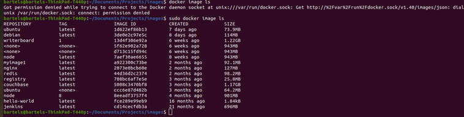
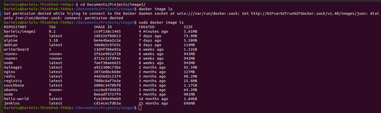

In this article, I’d like to talk to you about working with container images. If you’ve read my previous article on containers, you know that a container is made up of a few different things. We have a set of namespaces that isolate the process from other processes on the system. We have C groups or control groups to control resource utilization by that process. And finally, we have a container image which contains the binary that we want to run as well as any associated files where dependency is needed.

It’s that last part, the container image that I want to focus on in this article. And we’re going to look at using prebuilt images, creating custom images, and also working with continuing registries. Let’s start with using a prebuilt image that someone else has created and pulling that from a public registry. A registry is simply a collection or a repository of images and a public one is one that’s made available to people over the internet. So to pull an image from a registry, whether that be a public registry or a private registry, we simply use the Docker command along with the pull sub command.

But first I want to show you that I have a few images already pulled down. These are images that I have pulled down from the Docker Hub, which is a public image registry and we’re going to add to that. So I’m just going to run Docker pull, and I’ll specify the name of the image. And because I’m not specifying a particular registry here, Docker is going to default to Docker Hub, which is their public registry. If I had a private registry then I could specify the address of the private registry here, and Docker would pull it from that private registry. When it’s done, it pulls it down and when I run that image LS command again, you see that it’s here and so now I could easily run a container based on this image.

Notice it’s not necessary to pull down an image before you can run a container based on that image. If you try to run a container based on an image that doesn’t exist on your system, Docker will simply pull it automatically. The one problem with prebuilt images  is that we really don’t know how that image was created. It’s entirely possible that this image might contain some malicious software or other files that we don’t want or don’t need. Now in some cases, it’s reasonably easy to verify what this image contains and how it was built. Let’s see how that’s done.

So I’m in a directory here that is a copy of the Alpine 310 source repository. There are two files here, a Docker file, which is a set of instructions, and then this Alpine mini root FS file. If I take a look at the Docker file, you can see that the Docker file is instructing Docker when it goes to build this image, to start from scratch, which is a blank image, add in this mini root FS file, and then specify a default command. So it’s a simple set of instructions. All I would need to do to verify that this image is safe to use is to look inside this Alpine mini root FS file and be sure that there’s nothing there that I don’t want, no malicious software, no vulnerable software, nothing like that.

For more complex images where the Docker file may be lots and lots of lines, it probably is going to be necessary or recommended for you to use some sort of software that will scan your container images and be sure there’s nothing wrong with the container image before you run it in your production environment. You don’t want to damage your systems or destroy any data because you missed a security vulnerability or missed some malicious software someone had embedded in a prebuilt image.

Now, while using prebuilt images is useful and can be used as a base starting point as I’ll show you in just a moment, the real power of container images comes in creating custom images that you can use to distribute your own software or to customize prebuilt images for your specific needs. Let’s take a look at how that works. I’ll start by first switching into a different directory where I have prepared files for a custom image. We’ll start out with the Docker file, which has a set of instructions. You can see that this looks just like the one we used for the Alpine 310 image, but I’ve added a copy command which copies in an os-release file into the Etsy directory.

And if I look at that os-release file, you can see I’ve customized it to say that it’s Bartels' Alpine Linux. And so what I’m doing here is I’m recreating the Alpine 310 image with an additional step of adding this custom os-release file. 

Now to build this image, I would simply use the Docker build command. I would need to specify a tag. So I’ll add my name and an image and a version, and then I’ll tell it in the current directory. It will build the image according to the instructions. 

And when I now run the Docker image LS command, you can see that it’s here, it’s been created. Notice the image ID is unique, which means even though the size is the same as the Alpine 310 image, I have created my own custom image.

Now there’s an easier way to do what I just showed you. So instead of recreating the base image using the same set of instructions that were used to create the base image, once I verify that the base image is safe to use, I can use a Docker file that simply tells Docker to start with that base image and then perform the additional steps on there instead of recreating the base image and then performing the additional steps. Let’s see what that looks like. 

So here in this directory you can see I no longer have the Alpine mini root FS and when I cat the Docker file, you’ll see that it is saying from Alpine 310. 

So now that I understand how that base image was created and I believe it’s safe to use, I can just specify that on the front line.

And then all I have to do is tell Docker what changes I want to make to that base image, instead of recreating the base image all over again. 

To build it I will use the same Docker build command. I’ll specify a different tag this time it will build the image. 

And when I run my Docker image LS command, you can see that I’ve created this additional image. It does have its own unique image ID. 

If I wanted to verify that I indeed did create this custom image, I’ll just use Docker run and I will run the image that I just created. It will drop me into the file system, which is the contents of that Alpine mini root FS that we saw was used to create the Alpine 310, and when I cat the Etsy os-release file that I cut in there, you can see that it’s the custom version that I created.

So I’ve shown you how to pull down prebuilt images and also cautioned you against the use of prebuilt images until you’ve verified that there’s no malicious software in there. And we’ve seen how to create custom images that are either based on scratch images, blank images, or using some other image as a base or a starting point. Now there’s one more thing I want to show you and that’s distributing your image using a registry. Typically when you build a custom image, you’re going to want to use that on more than just the system that you built it on. You’re gonna want to distribute it to other systems in your environment so that they can all run that image.

And that’s part of what makes using containers to distribute software so useful, as it’s easy to distribute these images which are also typically very small. Let’s take a look at pushing this image up to a registry. Now I have a registry running on my local system and while a registry normally would be on the network so that multiple systems can access this, this local registry that I’m running, which you can see when I run Docker container LS is sufficient for what we’re going to show you. So you’ve seen that I have some  images,  two that I’ve created, I want to push that up to this registry.

To do that, I need to add a tag which is a pointer to the image. And I’m going to do that using the Docker tag command. I’ll specify the source that I’m going to use and then I’ll add the additional tag that I need. In this case, I’m going to tell it that it’s local host 5000 and it’s the same image and version. 

Now when I run Docker image LS, again, you’ll see that it looks like a new image has been created, but pay attention to the image ID. You’ll see it’s exactly the same as the image that I had. Tags are just pointers to an image. So in this case it’s the same image, but I have two different tags pointing to it. 
 

Now that I have this local host tag, I can use the Docker push command to push this image to the registry running on my system.

 

And you can see it’ll push it up to the registry and now it’s there. And if this registry were networked, then I could go to another system and I could use the Docker pull command that I showed you earlier to pull the image down for use on that system. Or I could simply run a container based on this image. And as I mentioned earlier, Docker would pull it automatically. So I’ve shown you how to build images, how to pull images from registries, and how to push images up to registries. That’s all for this article. Thanks for reading.