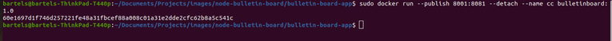

In this article, I’d like to talk about why container orchestration platform is a necessity as you move into running containers in production. The answer to the question of why you need a container orchestration, lies in scale. When you’re running containers locally on your own machine, it’s pretty straight forward, and there aren’t a lot of additional considerations, but when you move into running containers in production, there are additional considerations that need to be taken into account. We’ll look at a couple of those in this article. But first, let’s review what’s involved in running a container locally, on our laptop or desktop.

Running a container locally, on our own laptop is just a matter of using the docker container run command, and I’m just going to look into my history. I’ve already run this command before, and we’re going to run a command here. We’re statically assigning or mapping, port 8888 to container port 8080, and then running the Kubernetes: Up and Running Demo container. 
And when I run a docker container LS, we’ll see that it’s running here. 

And if I wanted to verify that this is working, I can simply connect to local host, because this is running on my system, on the exposed port. And I get back some HTML, which tells me that the Kubernetes: Up and Running Demo application is indeed working.

So, running containers locally is easy, and that’s part of what it makes containers so attractive to many developers, but as we move into running containers in production, there are, as I mentioned, additional considerations. For example, let’s say we wanted to run an application with a little more resilience. Typically, we would do that by running multiple copies of the container or the application, across multiple different systems, so that if one of them failed, one of the others could pick up the load. So let’s take a look at how we would do that, and the considerations that result from that sort of approach.

So, I have two systems that I have configured running in AWS and I’m using Docker Machine, to simplify or enable the connectivity to those systems. 

So first, I’m just going to connect to one of those systems, and then I’ll run docker container LS, so you can see there are no containers running. We’re going to run the same command as we used before. So okay, great. We’ve run the command. Here it is, it’s running. So far, so good. 

Right? Now we need to connect to the other system, and then we can use the same command again to run our container, and verify that it is running using docker container LS.

So, you might be looking at that thinking that doesn’t seem so hard, and it wasn’t really hard, just to some additional complexity we had to connect to the systems. In this case, I’m using Docker Machine, but you could also log in via SSH, and then run the Docker commands locally. And then you had to repeat that process for each system where you wanted to run the container. So we couldn’t just issue the command once, and have it run in multiple places.

And then, what we haven’t seen yet, is we’ve also exposed a couple of different problems with this approach. As soon as we moved beyond a single container on a single machine, to containers on multiple machines. Now we need something that actually is going to help us direct traffic to where these containers are running. We need some sort of external load balancing solution. These systems are running in AWS, so ideally, I would use an ELB, and I would configure that ELB to point to these containers running on these systems.

If you’re running on premises, this might be in genetics or HE Proxy, or maybe load balancing provided by something like NSXT. Now, in this case, we’re using static port mapping. 

As you can see on the screen, we’re mapping port 8888 to container port 8080, on both of those, and so with the ports being known in advance, we could potentially use some sort of infrastructure as code tool, Terraform, Ansible, something of the like, to then automatically set that up, set up the ELB and set up the instances, and that’s will take care of part of it. The other part of it though is, we haven’t enabled the instances to actually receive that traffic.

So at AWS, we have security groups. And if I were to log into one of these systems and actually try and connect to the container running on the other system, you’d see the security group is blocking that, because it hasn’t been allowed. So not only would I need something to automate the process of setting up an ELB, or other load balancing solution, I would also need something to automate the configuration of the security group, or other firewall security tool that you might be running in your environment.

So, we’ve seen there’s some additional complexity, as we move into production here, and running containers on multiple systems. There’s also another problem. And that is what if I wanted to scale up this particular application? Right now, I have one instance of the container, the application, running on each system. While we’re still connected here to AWS2, let’s try to run another copy of the container and see what happens.

So I’ll use the same command again, and you’ll notice this time I get an error message. And it says the port is already allocated, and that’s because we already have a container running, and listening on this particular external port, the port 8888. And operating systems generally only allow you to have one process or container, in this case, listening to a port. We can’t have multiple processes listening, on the same port. And so, in order to have multiple copies of this container running on a single system, so that I could address additional scale or demands from traffic coming in, I actually have to switch from static port mapping, to dynamic port mapping.

So to do that, I run the same command again, but I just remove the part in front. And it’ll run. 

And now, if we run docker container LS, you’ll see that I have the original one that I started, which is listening on port 8888, and then I have another one that I just ran, that’s been assigned a random high port. And this random high port, is where it’s listening and then being mapped to container port 8080. 

And I could run additional ones and you can see, I can just keep doing that.

And when I run container LS, it will show you that each of these is assigned a unique port. 

Now, the move from static port mappings to dynamic port mappings introduces a problem, when we’re trying to automate, because we don’t know what the ports are going to be in advance. Either that, or we have to manually assign these ports, rather than letting the container runtime assign the ports. And if we start manually assigning ports, well then, you and I both know what’s going to happen. We’re going end up with a Microsoft Excel spreadsheet that shows the systems, and the containers running on them and the ports that are allocated to them. Right? So instead, now we find that we can’t pre-configure our security groups, or pre-configure our load balancing solution, we have to wait until after we run the application, and then configure our security groups and our load balancing solution to allow that traffic.

And if one of these containers stops, or if a user stops the container and then restarts it, that port number is going to change. And then we have to go reconfigure our load balancer, and reconfigure our security groups, in order to allow that traffic. All of these things add up to a lot of administrative overhead, and the way to address that administrative overhead is to have a system, an external tool, something that can listen and understand what the environment is doing. Know how to make changes to the environment, so that as you, the operator, ask it to run containers or exposed containers on a port, it knows what to do.

And this thing that we’re talking about, is a container orchestration platform. Container orchestration platform is specifically designed to address some of the operational concerns that I’ve shown you, as well as many more that I don’t have time to show you in this article. It knows how to understand the current environment, knows what containers are running on what systems, what images those containers are using, what ports those containers are listening on, and it knows how to respond to requests from the operator to say, “Well, instead of having three copies of this container running, I want to have five copies running.” It knows that means I only need to add two more, instead of adding five more for a total of eight. Or, if you wanted to switch from the AMD 64 blue image to the AMD 64 green image, it knows that it would need to step down the containers one at a time, and then spin them back up again. You’re using the new image until they’re all migrated over.

These are all the functions, and many more that a container orchestration platform provides. And Kubernetes is an example of a container orchestration platform that was again, specifically designed to address the operational concerns of running containers in production. Now, we don’t have time to get into some of the specifics of our Kubernetes works in this article, but we have other articles that we’ll talk about those concepts, as well as articles that we’ll dive into the specifics of how some of these things work in your Kubernetes environment. Thanks for articles.