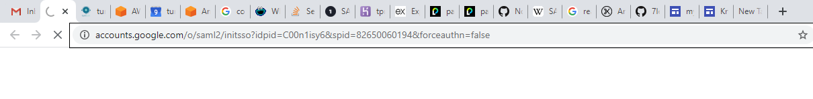
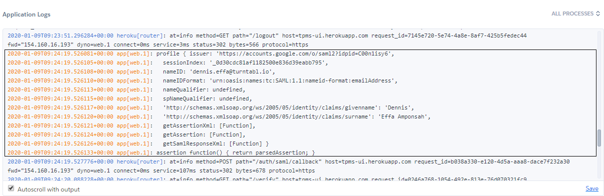
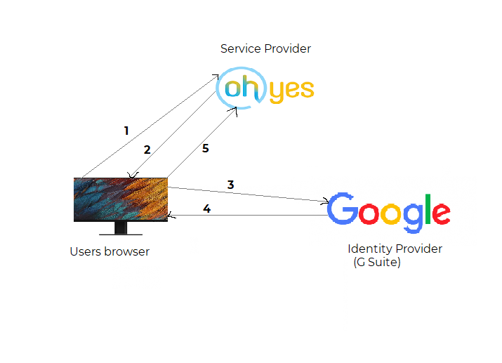

---
date: 2020-01-16
title: 'How to integrate gsuite saml with angular'
template: post
thumbnail: '../thumbnails/gsuite.png'
slug: how-to-integrate-gsuite-saml-with-angular
categories:
  - Code
tags:
  - gsuite
  - saml
 
--- 
 
 
 
 SAML: Security Assertion Markup Language is a means exchanging authorization and authentication information between entities which is the Service Provider(SP) and the Identity Provider(IdP).

### Some Terminologies

Authentication is validating the credentials of an entity by verifying his user name and password to prove his identity. Authentication systems in a nutshell determines whether you are what you say you are using your credentials provided.

Authorization which is normally done after authentication and it grants an entity permission to access certain resources on a system. This could be databases or simple files. 

Service provider(SP) is a services that are requesting  authentication and identity information about user. In our case this is our node(angular) application Service providers take authentication responses received from  identity providers and use that information to create and configure sessions.

Identity Provider(IdP) is a service that serves as the source of identity information and authentication decision. Identity providers authenticate users and return identity information to service providers. In our case this is Google.

HTTP Bindings are the means by which data is exchanged between the SP and the IdP. The usual ones our application will use HTTP POST and HTTP redirect bindings.

### Authentication flows.
Lets say we have an angular application called ``Oh yes`` which is owned by a company, successfully deployed and must be used by  its employees only.

To begin the login process,

``The user tries to log in to ```Oh yes``` from a browser.``
`` ```Oh yes``` responds by generating a SAML Authentication Request. The ```Authentication Request``` is often sent using HTTP Redirect Binding, and ends up looking something like this``



``The IdP(Google) parses the SAML request, authenticates the user and generates a SAML response.``
``The IdP(Google) returns the encoded SAMLResponse to the browser if everything goes well as expected. A simplified SAMLResponse would look like this:``



``The browser sends the SAML response to Oh yes for verification.``
``If the verification is successful, the user will be logged in to Oh yes and granted access to all the various resources.``

### Authentication flows diagram.



To start with the integration, contact the G suite admin to create a SAML application. In order for him or her to create the application, you must provide ``ACS URL path``. In return you would receive an ``SSO URL``, an ``ISSUER ID`` and ``certificate`` to use in our node entry point file.

In order for the above to work for in our application, we employ the use of some node dependencies such as.

1. [passport - Saml](https://github.com/bergie/passport-saml): Authentication provider for Passport 
2. [body-parser](https://github.com/expressjs/body-parser#readme): Node js body parsing middleware.
3. [cookie-parser](https://github.com/expressjs/cookie-parser#readme): Parsing Cookie headers in our application.

Take a look at the below code  for more :)

```
server.js
//Install express server
const express = require("express");
const path = require("path");
const SamlStrategy = require("passport-saml").Strategy;
const passport = require("passport");
const bodyParser = require("body-parser");
const cookieSession = require("cookie-session");
const cookieParser = require("cookie-parser");
let userEmail = "";
const app = express();
// Serve only the static files form the dist directory
app.use(express.static(__dirname + "/dist/tpms"));

app.use(cookieParser());
app.use(
  cookieSession({
    name: "dummySession",
    keys: ["super secret"],
    maxAge: 2 * 24 * 60 * 60 * 1000 // 2 days
  })
);
app.use(bodyParser.json());
app.use(passport.initialize());
app.use(passport.session());

passport.use(
  new SamlStrategy(
    {
      protocol: "https://",
      entryPoint: process.env.ENTRY_POINT, // SSO URL (Step 2)
      issuer: process.env.ISSUER, // Entity ID (Step 4)
      path: "/auth/saml/callback", // ACS URL path (Step 4)
      cert: process.env.CERT
    },
    function (profile, done) {
      // Parse user profile data
      userEmail = profile.nameID;
      return done(null, {
        email: profile.email,
        name: profile.name
      });
    }
  )
);
passport.serializeUser(function (user, done) {
  done(null, user);
});

passport.deserializeUser(function (user, done) {
  done(null, user);
});

app.get(
  "/login",
  passport.authenticate("saml", {
    successRedirect: "/",
    failureRedirect: "/login"
  })
);

app.get("/logout", function (req, res) {
  res.clearCookie('ttemail')
  req.logout();
  res.redirect("https://turntabl.io");
  // res.end("You have logged out.");
});

app.post(
  "/auth/saml/callback",
  bodyParser.urlencoded({ extended: false }),
  passport.authenticate("saml", {
    failureRedirect: "/error",
    failureFlash: false
  }),
  function (req, res) {
    // sets a cookie called ttemail and sets its max age to 1 day
    res.cookie('ttemail', userEmail, { maxAge: 1 * 24 * 60 * 60 * 1000, secure: true, httpOnly: false })
    res.redirect("https://tpms-ui.herokuapp.com/verify");
  }
);

app.all("*", function (req, res, next) {
  if (req.isAuthenticated() || process.env.NODE_ENV !== "production") {
    next();
  } else {
    res.redirect("/login");
  }
});
app.get("/*", function (req, res) {
  res.sendFile(path.join(__dirname + "/dist/tpms/index.html"));
});

// Start the app by listening on the default Heroku port
app.listen(process.env.PORT || 8080);
```