To continue with article you will need  a AWS account ( there is a free-tier account) , then visit the Beanstalk service page,  https://console.aws.amazon.com/elasticbeanstalk  this where our focus will be. We will be deploying a  Spring boot web application, though there are services for other platforms such as  .NET,  PHP,  Node.js,  Python,  Ruby,  Go, etc More:  https://docs.aws.amazon.com/elasticbeanstalk/latest/dg/GettingStarted.CreateApp.html

``NB: You might need permissions if you're using a company aws account``

When you've signed-in onto your AWS beanstalk console, click the Create New Application  to get started and fill the pop form with your app name and it's description.

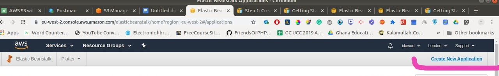

This will create an app instance but without an environment, so you create one by clicking on the `Create one now` 

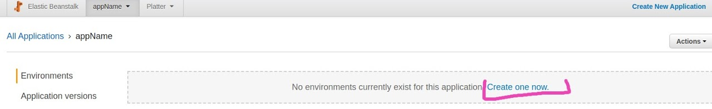

The next page ask for the environment tier either Web server or Worker, in our case what we want is a `Web server`

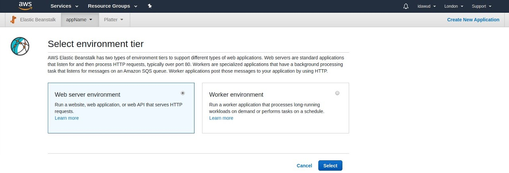

The next page ask for the type Web server  environment we want to create and the domain to route through in our case we'll leave it as default. To start with,  we are going to launch the app with the AWS sample project, but we'll setup a CI/CD later to auto deploy.


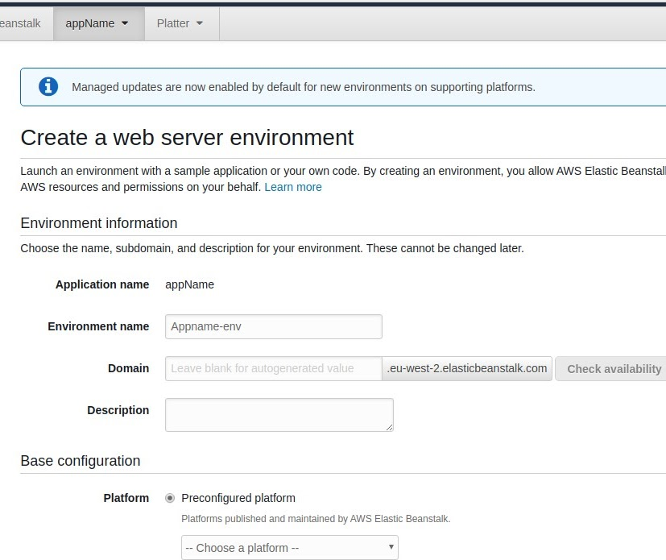
Enter env name and leave the Domain Default


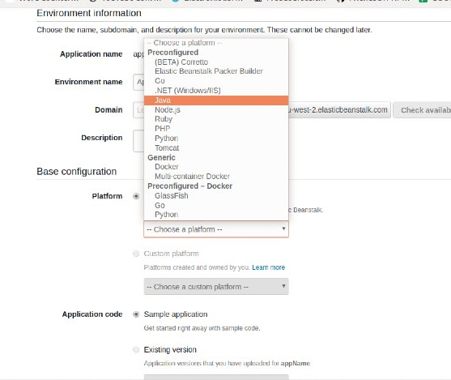
Select Platform as Java and Select Sample application

After clicking the ```Create environment button```,  it should create one for you as below and then show your the env dashboard which has the URL for your application in the second image below.

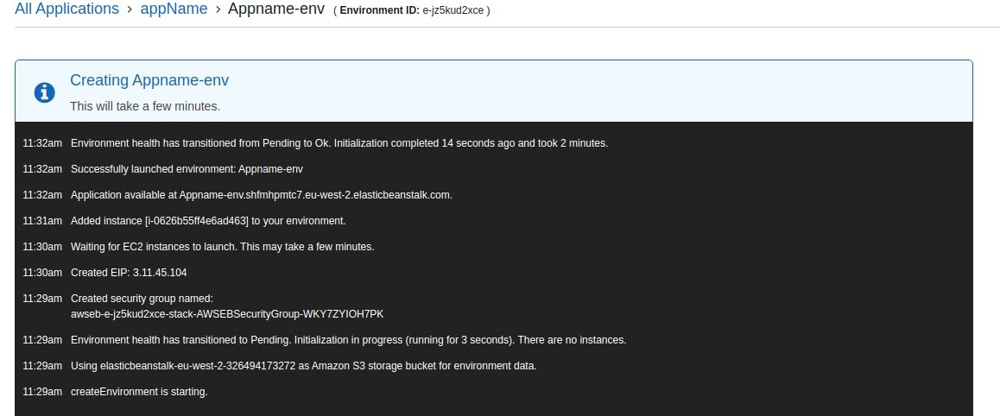

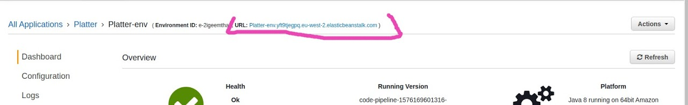

If everything goes well, your URL should have a sample page like this.               ``NB: The page may change at the time of your reading``


```HURRAY! You've got an application deployed on aws```

We're not done yet! 

We  have to setup a ``code pipeline`` for Continuous Integration and Continuous Deployment using [AWS CodePipeline](https://aws.amazon.com/codepipeline/)  

We start by creating on the ``Create pipeline button`` to get started

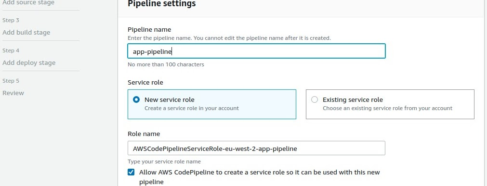
Fill out the name you want to give the pipeline and  leave everything default


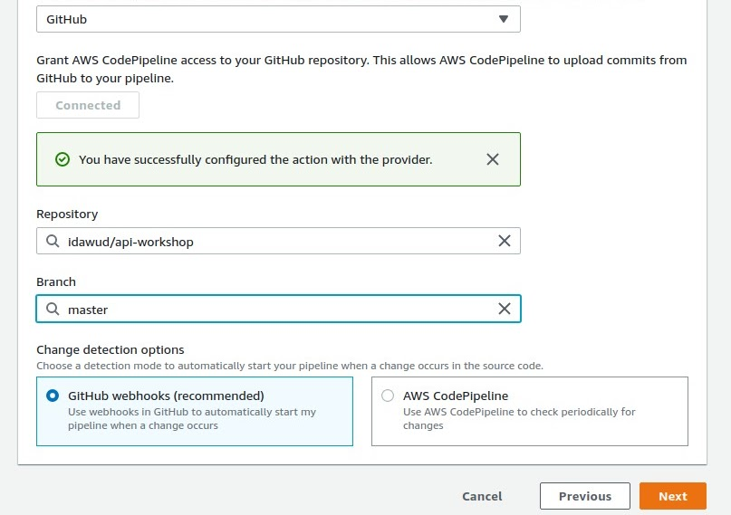
Select ``GitHub`` from the code source which will ask you to authenticate GitHub with OAuth. Select the Repository and the Branch you want to build. Leave any other stuffs default and click ``Next``


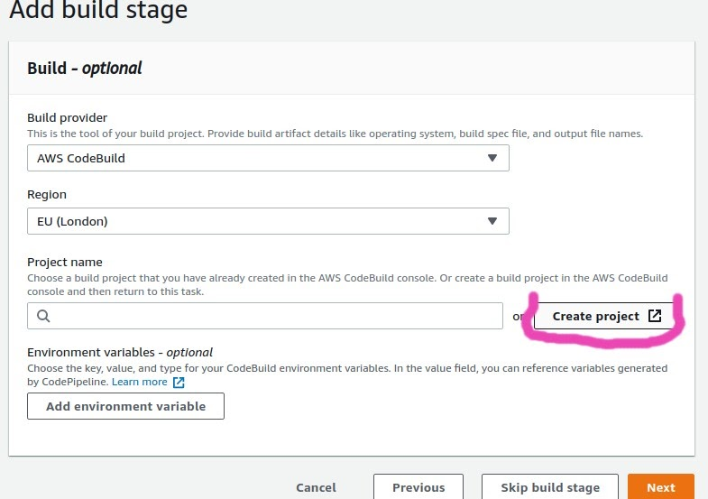
Select the CodeBuild provider  and Click The ``create project`` which will  redirect you to the codebuild page


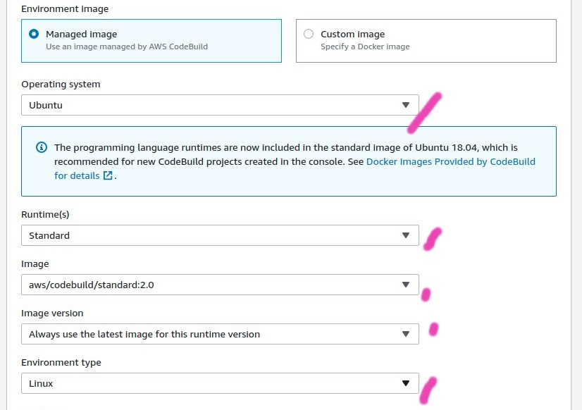
Leave everything to default, except these marked fields above

Click on the Next button  and select Elastic Beanstalk in the deployment section followed by the application name and the application environment.  That's all. The pipeline will try to clone from the source, build and deploy, but it will fail at the build  stage because it's lacking a buildspec file which we selected to be used for build. So we have to include a ``buildspec.yml`` file with the content below in the root directory of our project and push code to github. The change will be picked by your pipeline and it will be built by running your test, if they pass then your application will be bundled into a jar file and deployed for you automatically.

NB: This buildspec is for a spring boot application with a gradle build tool. The build instruction will change based on the build too you're using . 

Remember:  Change the ``appname`` to your application name settings.gradle file and the ``0.0.1-SNAPSHOT`` to the version specified in your build.gradle file

````version: 0.2

phases:
  install:
    runtime-versions:
      java: openjdk11
  pre_build:
    commands:
      - echo Run Unit tests on `date`
      - ./gradlew test
  build:
    commands:
      - echo Build started on `date`
      - ./gradlew bootJar
  post_build:
    commands:
      - echo Build completed on `date`
      - mv build/libs/appname-0.0.1-SNAPSHOT.jar application.jar
artifacts:
  files:
    - application.jar````


HURRAY! You've now setup CI/CD for your application on aws 