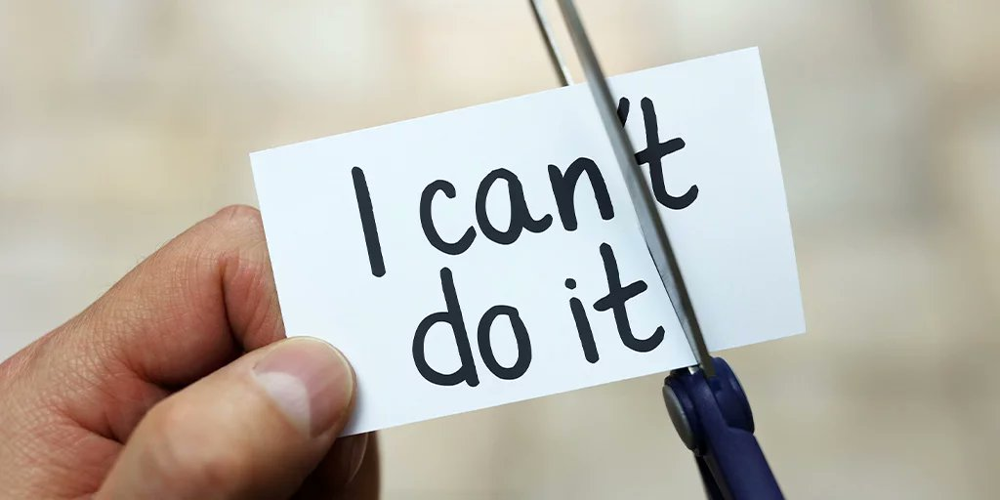
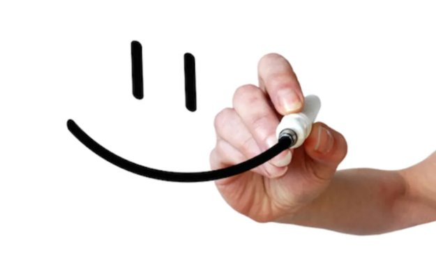
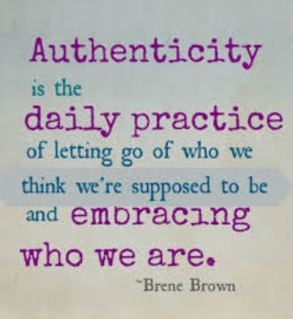
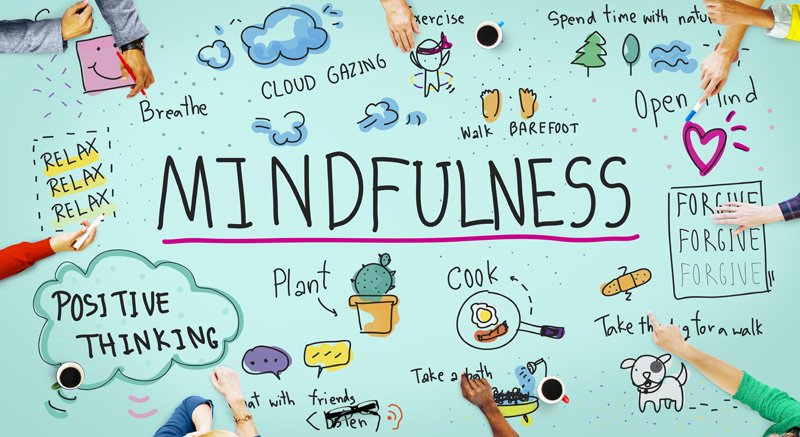
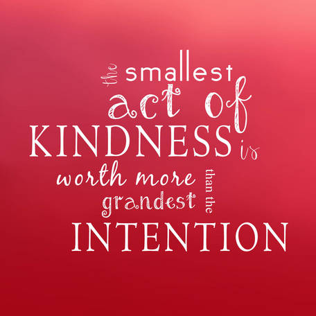
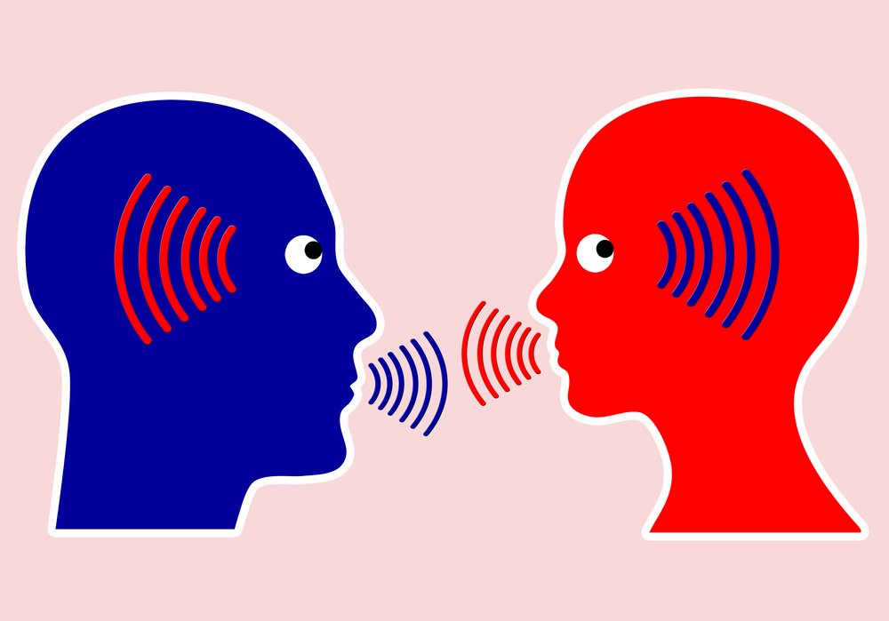

Happiness is a range of feelings from positive emotions to great joy.

Happiness changes the way we see ourselves and situations. Our happiness affects how we react in situations and interact with others.

#Happiness is a choice.

#Happiness is infectious.

😀 

Researchers have found that happiness supports: a stronger immune system, stronger resilience in the face of stress, a stronger heart and less risk of cardiovascular disease, alongside quicker recovery times when overcoming illness or surgery.

Happiness maximises our ability to look after ourselves. Happiness supports more exercise, better socializing, healthy eating, good sleep hygiene.

#happiness is a beautiful thing 😀👍🖐️ 

And you might think that happiness comes from money, status, power.

Well...think again.... 

Happiness is a deep emotion...usually originating from:

1) deep satisfaction in ourselves
2) sharing life with other happy individuals
3) good #values.

#kindness #care #compassiom #authenticity 

So are we #happy?

Well a survey in 2017 found that only 46% of us are happy.

But #happiness is so good. 🖐️👍😀 

So can we feel satisfied in ourselves?

It's good to get to know who we are, what motivates us and be ourselves. So much happiness and freedom originates from feeling we can accept who we are and be comfortable with #Authenticity.

It's ok to be ourselves 😍🖐️😀 

Also helps if others around us are sensitive, #kind, #compassionate and #caring. 😀 

Care breeds happiness.

Compassion breeds happiness.

Love breeds happiness.

Gratitude breeds happiness.

Authenticity breeds happiness.

Teamwork (well spirited) breeds happiness.

Respect breeds happiness.

Civility breeds happiness.

Forgiveness breeds happiness.

Giving breeds happiness.

Gratitude and being thankful for all we have and in all we do can be a conduit for happiness. 😍👍 

Be confident: Be happy 😍

Believe in yourself....just for a second imagine that you CAN make a positive impact 😍👍😀

You can inspire.

You can motivate.

You can be successful.

You can make an impact 😍

Smile: be happy 😀

Even if you don't feel happy right now, a smile can make all the difference.

One smile.....will lead to someone else smiling back at you...now even if it's for a moment it'll lead to a close of happiness

Smile to the world and it will smile back 😀😍👍

Be yourself: be happy 😍👍😀

You are great as you are 😍👍😀
It's ok to be you....totally you 😀😍

You can make a difference 😀

Value others : Be happy 😍

Every relationship is valuable. 

Value and cherish every moment and every moment

#happiness

It's ok to focus on the now : be happy
Live in the moment 😀👍

#mindfulness

Above all #giving and being #kind breeds happiness 😀🖐️😍

Giving time to listen, encourage and support is just as valuable as coffee 😍

Happiness is contagious and we can bring it about through how we choose to act.

#forgiveness breeds happiness.

Realising our weaknesses and imperfections and accepting these will help us to be #happy.

We are all #humans. None of us are free from mistakes. 😀

😍🖐️😀

Supporting each other and #listening to one another can plant a seed for happiness

Remember actions speak louder than words 😍

We can choose to change

Resentment to Support.

Unkindness to Kindness.

Bullying to friendship.

Distance to collaboration.

Hate to love.

Anger to forgiveness.

Frowning to smiling.

War to peace.

Receiving to giving.

Talking to listening.

Imagine the impact 😀

In summary #happiness is a beautiful thing.

Each one of us can #choose to be happiness and #inspire happiness.

Happiness is truly contagious 😍

We can make the biggest impact together when we are happy 😍

It really is a choice 😀🖐️😍  