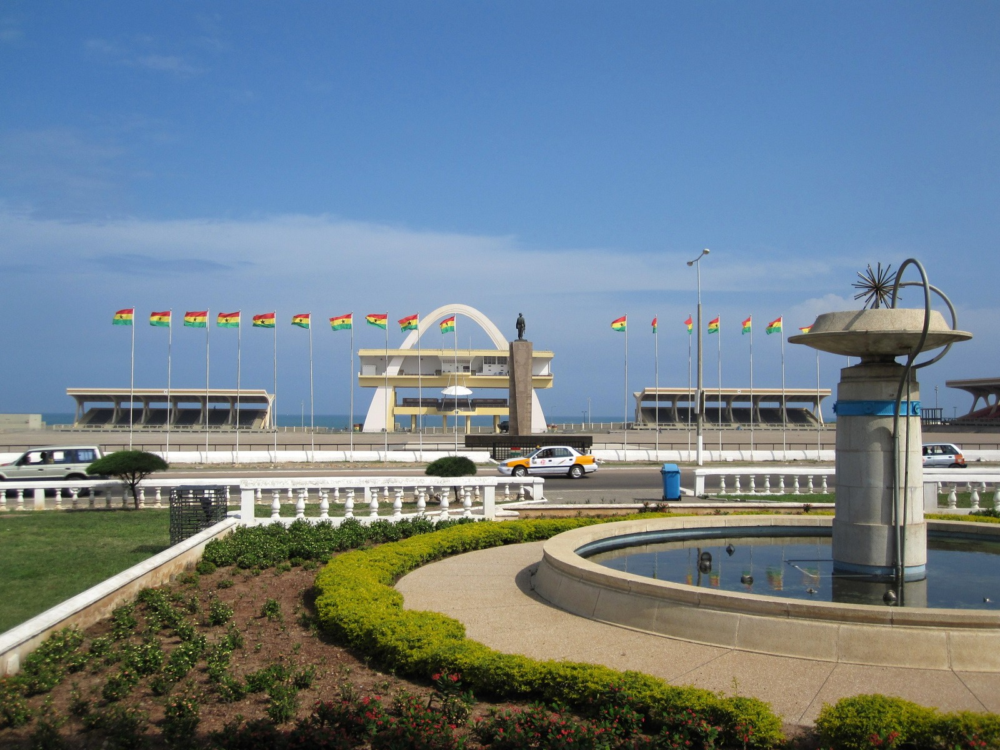
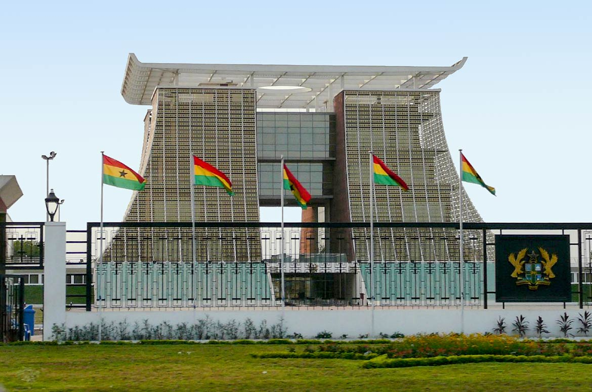
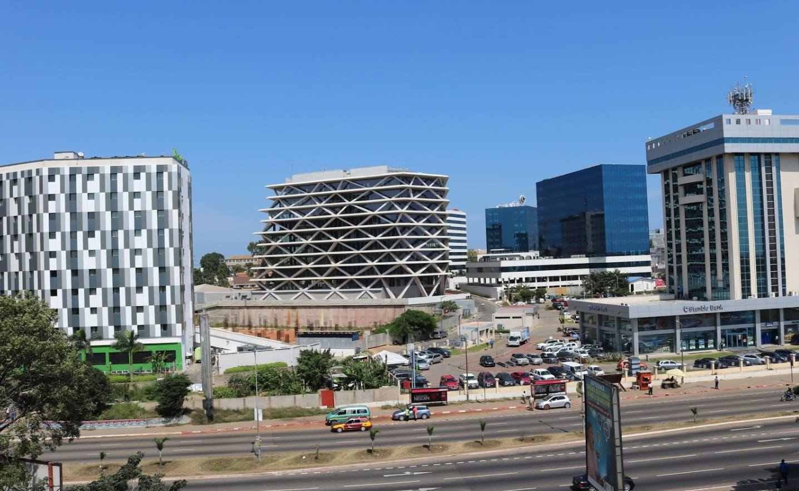

Born & raised in #Accra #Ghana, a tiny country in the West Africa with a lot to offer. I always had a positive outlook on life maybe because of the culture or values🤷‍♀️.
If you don't know #Ghana or a #Ghanaian then you should start mingling 🤣

  

I grew up surrounded by a loving, joking & tough type of friends that always support each other even amidst fighting. You can imagine being 4 friends in different age groups can cause a lot of fights growing up 😂

I have my issues🤷‍♀️! I always wanted to prove myself & make my friends proud. A pressure that was just in my head; they were always proud of us. I wanted to grow up to be a pilot or an army officer. Let's just say I changed my mind!

The literacy rate & level of #education in #Ghana is high, and like most cultures, most people end up following popular jobs & studies either as an #engineer, a #doctor (#physician) or as #officers. I wanted something different in #biology or #science!

It is hard to keep up with society's #expectations & #judgement; I am sure most of you understand.
No matter what you do, someone is going to complain; shout out to my one friend for telling me this everytime 🙌 , so follow YOUR path!

I went to the same JHS school for 10 yrs. It was excellent! It taught 4 languages: English(main) & Ga + French. My senior year, I chose Life&Earth Sciences (SVT) to do the gov. official exams to enter uni. That is how my journey began.

After passing the official exams, the search started. Which undergrad scientific program should I take🤔? Back then, a new BSc in sciences was offered @ucc so after doing my research, I thought I'd dive in & take the risk💪😊

Keep in mind, I am not an A+ student, on each exam, my brain goes through a nervous cycle by overthinking details ; I learned to channel it. What's the next step?

Job opportunities & growth are difficult in #Ghana. You will be used, underpaid, unappreciated & unable to secure a stable future. I started looking for a way out but that is a challenge by itself. There are a lot of obstacles, especially financially, to overcome.

In #Ghana, if you don't know the right people, you will not get really far. I got accepted into an architectural apprenticeship, a dream come true! I went to my friends, shared the news but for them I must have paid my way in so they didn't believe I got an apprenticeship. Haters gonna hate🤷‍♀️

Started my apprenticeship, everything was going great, smoothly, experiments&results were ➕. I completed 90% of the project in the 1st 4 months ✔. My superior asked me if I'd like to fast track, I declined to apply for PR so instead they gave me the green light to start my own design works.

Guess what happened during the following year?

The Kraken was loose🌬️🌊!
Another student was a fav. in the company & I guess they didn't like the fact my projects was going well & theirs wasn't. They started spreading rumors to my superior so he treated me as if I was invisible...no guidance,no help, other priorities!

I was stuck repeating 1 design for almost a 3 months because my results contradicted previous ones. In design meetings, my superior would skip over me or cut me short. 

I decided to send a first mini draft to my superior of the design intro; the feedback was bad (worse draft ever). I decided enough is enough! I took charge&with help from friends, I wrote the entire draft, demanded to be heard& had a design submission deadline

It wasn't all bad. That year I started realizing maybe I didn't want to do a Architecture, maybe I should look for options, maybe I am good at something else. Many architects that I met were great&advised me to think it through. What were the options outside of Architecture?

I am #sociable & I 💜 #science & #research. #Lost, I started applying to any #job outside #achitecture 😅..went to #interviews, felt great but never got the job(no #workexperience). I was reading #advice from #CareerCoaches & it hit me! My #apprenticeship was experience!

After learning from my #interviews #mistakes & not giving up, I found a #job in #design. #Why? Because it has the #skills I wanted to land a #job in #architecture plus I needed it

Overall I have being doing well! #Advancing on both #personal & #professional levels. I am always #challenging myself & trying to overcome the #challenges & #obstacles in my #path! Every year is better than the one before! 

I know how most #job #candidates feel! You #apply & apply...pass #interviews that went great but never get a #callback...you feel #down, #frustrated, #demotivated so it is #important to know you are #notalone, find your #niche, #support, #group 

If I had to offer one #advice, it's #Dontgiveup! It is #easier #said than #done I know😅 but what is the worse thing that could happen? #noreply #nocall, so what? You #learn from #Your #Mistakes, #Interviews, #peoplesadvice. Any #experience is #goodexperience!

I wouldn't have made it to where I am #today without the #support & #love from my  #friends so #ThankYouAll! 

