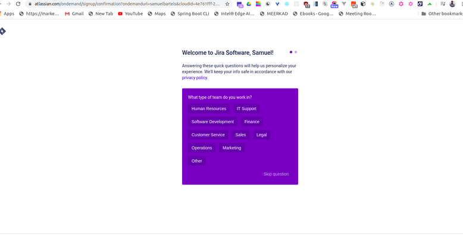
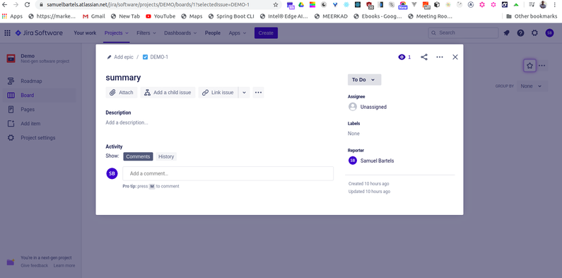

Jira is the leading project management software across multiple industries today, and for good reason. 

Jira allows you to view, track, and report on tasks you're currently working on, while providing full transparency to management in terms of what is being accomplished on a large scale. 

Once you have the basics down, setting up and configuring Jira is a breeze. 

In this article, we'll be discussing the basics of Jira from a user point of view. I'm a huge advocate for digital process management and reporting. Together, we'll explore the basics of Jira use, and by the end of this article, you'll have a great foundational understanding of Jira and how to navigate between its different features without getting lost. Ready to get started? Let's go.

You should have a basic familiarity using web-based software such as Gmail or Amazon. While access to an existing Jira instance is nice, the exercises we're performing in this article may cause damage to it. 

I'll provide you with full instructions on how to create a demo environment for this exercise.

I don't want you to risk damaging anything in your company's instance. Which is why i suggest you follow these installation instructions to ensure you are working in closed sandbox environment where mistakes are encouraged. 

Be sure to pay close attention to the following process so that your instance will be configured correctly for this article. 

First, let's head over to the [signup page](https://atlassian.com/software/jira/try). 

You'll see three different packages to choose from. Jira Software is the core Jira platform with agile tracking tools. Software and Documentation is Jira with Confluence. A documentation tool that Atlassian offers. 

Software and Help Desk is Jira with Service Desk. We want the basic Jira Software. So on the left most option, click try it free. This will direct you to the account signup page. 

Choose your site name which will be affixed to the Atlassian.net website as we're creating a cloud site. Fill in your name, email, and password information. 

If you sign in with an email address that's been used previously you'll be directed to a different sign in page. For this demo I suggest registering with a newly created email address which you can dispose of after this course. Click agree and sign up. After agreeing, you'll be presented with a confirmation screen asking you to check your email. If you don't see a verification email in your inbox after a few minutes be sure to check your junk mail. After clicking the verification link in your email, you'll be asked to select options to personalize your Atlassian experience. We're approaching this demo from a generic perspective so we'll skip these customization questions for now. After the spin up is complete, you should then see a welcome screen asking a few more questions. These serve to customize your Jira experience. 

Let's follow together carefully to ensure your environment matches mine. If one of these is selected incorrectly, you might find yourself looking at a different environment than mine when we begin. If that happens, simply sign up for a new demo instance. Select, "I am new to Jira." Select, "My team is new to agile methodologies." Select, "We spend our time working on features." Select, "We have a flexible schedule to finish our work." Now select next. Jira will recommend a Kanban environment to start with. 

Don't worry about Kanban versus Scrum just yet, we'll be going over those more in the future. Choose the blue select button near Kanban. 

First click the advanced dropdown. We will use the text "demo" for both the name and key of the project. Keep accesses open, now select create. 

You should notice an option to take a tour as a purple bar at the top of the screen. Dismiss that first. 

You're currently on the Kanban board, but we actually want to start on the homepage. So go ahead and click the Jira software icon at the top left of the screen, to return to the main system dashboard. You should now be on the main system dashboard, and we are ready to begin.

So what is Jira, you might ask? 

Well, at its core, Jira is software that assists with planning, tracking, reporting, and releasing of projects. It started primarily as a tool for software development, but over the last few years, it's been adopted by customers in all sorts of industries, from manufacturing to insurance to e-commerce to the military, almost every industry has a need for the process-monitoring tools available in Jira and its compatible software. 

By digitally copying your various work-based processes into what are called workflows in Jira, you can open tickets or issues and push them through various statuses in your processes, entering in relevant information along the way. In your work with Jira, you may find you were working in rather simple workflows or more complicated ones, depending on the level and complexity of the process itself. 

Each project may contain many different issue types, each with its own workflow and customer default fields meant to carry different sets of data, depending on the issue types themselves. 

All of these different elements are completely customizable, and we'll be touching on these elements and more in the upcoming chapters. Whatever route your company chooses, Jira is a great tool for transparency and progress reporting.

Let's take a look at the main UI. This may look different on your company's instance, as the overall color scheme and art can be adjusted and customized. If you followed the setup artilce, your demo instance should look very similar to what I'm looking at now. 

So starting from the left, we have the following elements. The first button is the Jira navigation button. By default, it's simply a Jira image that returns you to your selected dashboard, which is the system dashboard by default. Any time you find yourself lost, just click this button to return to the home screen and restart the chapter, as we'll always start here. 

Let's jump a little to the right. Projects are special containers that store a variety of elements for a team. Don't think of a project in the sense of one team, but rather a team container. 

For example, if you had a construction contracting company using Jira, you wouldn't create a project for one home painting assignment. Rather, you would have a painting project and the home assignment would be one of many tickets contained in it. Older tickets might be for finished assignments. Other tickets could contain equipment requests, and even others could detail upcoming assignments. 

In your initial setup of this instance, you created the demo project, but as a user, you'll most likely be assigned to already-existing projects created by your Jira administrator. However, Jira also has a new feature to create your own simplified projects as a user, which we'll go over in just a bit. Now this feature allows you to look at all the projects you have access to. 

Just because a project is in the system doesn't mean you'll see it here. Projects can be hidden or revealed to specific users or groups by an administrator. We'll be primarily working with our previously-created demo project for this lesson, but we'll use this feature a few times. The next section is Dashboards. 

This is an option that just reloads our system dashboard for now. Dashboards are user-customizable interfaces that display data in a variety of different ways. We'll get more into this later. 

The next selection is Issues and Filters, a feature which contains a few options for searching for issues and accessing previously-created issues or tickets. 

In Jira, some of us use the term issues and tickets interchangeably. This element is an individual entry within a specific project. You'll also see some filter and importing options, which we'll go over in more detail in the next section. 

Click the back arrow at the top to return to the main menu. The next object is the Settings feature. As a standard user in your company's instance, you'll see this option but find most of its features locked, but if you set up this environment yourself, you are its system administrator. 

To prevent any accidental changes, you should stay away from this feature for the duration of this lesson. Click the Back button again. On the far-left, we have a few more options. The star allows you to quickly return to previously-viewed or favorited filters, issues, and boards. Click the Back button again. The magnifying glass is for multiple searching options. The first selection is a quick view search, and you can also see recently viewed issues directly underneath it. The next link brings you to Advanced Search. This is great for quickly returning to something you recently viewed. 

We'll go over searching in greater detail in the next chapter. Click the Back button again. Down on the bottom, we have notifications. All notifications sent to you by team members, tickets assigned to you, tickets you are watching, or comments will be shown here. 

Below, we have the Application Selection button. Jira is just one component of the Atlassian Suite. If you install other items like Bitbucket, Confluence, etc., they will be selectable here. 

For this demo, we will just be focusing on Jira, so don't worry about this today. After that, we have the Help section. Now this is a documentation drop-down link filled with valuable information. 

As you become more acquainted with Jira, you will soon realize the UI does change a bit in small iterations. If something is changed or you need help using a feature, you can always use this drop-down to access all the documentation, which is regularly updated when features are updated. 

The next object is the Administration cog. Again, as you set up the instance, you have access to its administrative features, but you should avoid using this feature for the purposes of this lesson. 

Click the Back button again. At the bottom-left is your Account Settings drop-down, so let's click the first option in this drop-down to bring up our user's profile. On this profile, we see our name, email, and some information about us. We can also click Manage Our Account to change personal details and reset our password. 

Let's go ahead and click the Application Selection button again, and then select Jira to return to Jira. This plus button in the middle-left of the screen is the Create button, and as a Jira user, you'll be using it quite a bit. Go ahead and give it a click to bring up the Create screen. This is the screen you will be using to create and assign tickets, and depending on the project or issue type, the fields contained in it may vary. The red star denotes a required field. Go ahead and cancel or close this popup. 

So let's click the Home button again to return to our main screen. Get used to that motion, as any time you want to reset your view, you can click that button to return home. 

So now, let's get into using Jira. We'll start by creating an issue, the most common action taken in Jira. But before we do that, I want you to be aware of two basic screens that you will see in Jira: the Create screen and the View screen. So the Create button is the big plus sign at the far left of the screen here. It's hard to miss. It's important to note that these bars and UI may look different for you color-wise. When the administrator customizes an instance for a company, they also choose a color scheme. Based on the scheme selection, the bars color may change, but the placement will not. 

The screen we'll be working on in this segment, the Create screen, is displayed immediately after clicking the Create button. After you click this button, you will be presented with this screen with various options to input and select values. 

The first you'll notice is Project, with the project we've already created being selected by default. Now if you have multiple projects, you want to make sure the project that you want to create the issue in is selected. The next drop down is issue type. Your different issue types within the project represents different types of tickets like bugs, epics, suggestions, et cetera. Issue types are completely customizable by your Jira administrator to fit your projects unique needs and may look different than mine. Let's take a quick look at the rest of the create screen. Based on your companies customization of the Jira instance, your Create screen may look a little different, but that's okay. The overall functionality of creating a ticket and what happens behind the scenes remains the same. 

Create screens aren't limited to fields you'll see in this video or on your own instance. Jira system administrators can create custom fields and place them on issue-specific Create screens, which means based on the project and the issue type you select, a different Create screen with different values can be displayed. So you see, when I change the issue type, the page reloads. 

In our demo instance, there won't be much, if any change between the screens. Also, you may notice that certain fields have a star next to them. That's because in this project's field configuration, these fields are listed as required by the administrator. 

Now if I attempt to create an issue without filling out the required fields, the function will not be completed. Take note of this error right here. As you can see, the summary is required to fill out this issue. So let's make sure to fill out the required summary. Now we can successfully create the issue. 

Now if I wanted, I could easily create another issue by clicking this button. This would allow me to create another issue immediately after this issue, but we won't do that now. So once more, we'll hit the Create button at the bottom of the screen and the pop-up disappears. 

Our issue has now been created. You'll notice a link at the top of the screen. If you do miss it, you can find the issue by selecting the issues option on the left of the screen and then select Created Recently. Your most recent ticket created will be displayed at the top of this list. 

You'll see the identifier of the issue, known as the key, listed a few times here. Click the center-most version of this key and you'll be brought to the View screen of this ticket. And creating an issue is as simple as that.

Now that we know how to create an issue, we have one of the most basic actions in JIRA down. Now we're going to move onto the next section: Viewing a Ticket. 

After creating, the ticket is accessible in many ways. Once the created ticket is accessed, you'll be looking at the view screen. So, let's talk about viewing an issue. So I'll find my previously created ticket by clicking the magnifying glass. Then, under "recent issues" I'll click my ticket: Demo One. 

This is the view screen of any ticket, or as it's commonly referred to: The Main Screen The main and most basic report of any ticket is it's status. 

The status is driven by workflows, which are designed by your Jura administrator. As users, we push the ticket through the workflow by changing its status. The dropdown here pushes the ticket into another status. You may have multiple statuses to push the ticket through, like this one does, or you may only have one choice for a transition, indicating what is a linear workflow. Liner workflows can only go way. 

If you feel you are missing statuses, contact your administrator to discuss a workflow modification. So I'm going to go ahead and select the "status" dropdown, then hit the "in-progress" transition button.

Now, as you can see, there's a small change to the status. We've transitioned this issue into its next status. Statuses are searchable. For example, you may want to search for all tickets in progress, and one of the many results that would return is this ticket, because this ticket is currently in progress. We'll get more into that later. 

For a standard user, statuses are a universal tracking point of data, meant to report where a ticket currently is in its life cycle. 

Now, on this view screen we have a lot of important info. As you can see, the field that required a value, the summary, is listed here. Along the top of the view screen, there are a few other important buttons. The ellipses here is an add-application button that is configured by an administrator. 

Also, another ellipses is at the top-right corner of the screen, and contains other administrative options not needed here. The next button is the link button. Go ahead and click it. 

This allows you to connect a relationship with this ticket to another. We'll go over this in more detail in our next section. 

Go ahead and click cancel here. The next button is the child button. A child lives under your created ticket. Sort of a related task that needs to be completed as a result of this ticket. 

Let's cancel this now. The last button is add attachment. Here, you can add files, images, or items from your GIPHY, Dropbox, or Google Drive accounts. 

I can also simply add a file from my browser here. I simply click upload a file, drag the file onto the box, cancel this out, and then click "insert a file." As you can see, the image is now attached. 

I can click inside the comment box to add a comment. I click the box, I add the comment, and then I select 'Save.' As you can see, my comment is now added to the view screen of the ticket.

As you can see, this blue eye indicates that there is one watcher of this issue. As the creator of this issue, I am automatically designated as the watcher. 

As a watcher, I will receive email notifications whenever this issue is updated or commented on. I can click this to see more watcher options. 

You can go to any issue you have access to, and if you aren't already watcher, you can start watching that issue, at which point you will receive email notifications even if you aren't directly tied to that specific issue so you can easily monitor it's progress. I can select watchers to see who else is watching the issue. As you can see right now, it's only me. I can also add other watchers myself from that screen. Next up we'll be going over sub tasks and other additional features.

Let's take a look at Edit feature. In previous versions of Jira, this was covered by a button, but the new design allows for editing directly through the view screen. There may be certain situations where the fields you saw in the create screen are no longer editable on the same issue. 

Certain fields can be locked from editing by your administrator and that information cannot be edited later. This is by design. So from the main screen, we're going to click the magnifying glass, select our demo one issue again, and enter into that issue's view screen. Any fields that are on this screen should be editable on the view screen by hovering over them. 

You'll notice a gray bar under each section, indicating that it's editable. And as you can see, editing is a simple, painless process that allows you to make easy changes to issues already created, whether it's a value that requires a change at some point in your process, or you simply made a mistake that you'd like to fix after issue creation. 

As you can see, this ticket is currently unassigned. That is easily remedied by simply hovering over the assignees, clicking the gray bar, and choosing a new assignee. In this case, I'll assign it to me. 

Labels are an arbitrary way to add keywords to your tickets. Anyone in the system can add labels by default, but they need to be consistent to be of any value. If you and a group of team members add labels to a group of tickets, then you can search for those labels later in the search feature. 

In this case, I'll add a Linkedin label. As you can see, I'm prompted that it's a new label, so I'll click it to confirm. I then select the check mark to add it. 

Now I have a Linkedin label. The start date allows you to designate a date in which the ticket will be started and allows for easier planning against a group of tickets. As you can see, I've given this ticket a start date of June 4th, 2020, and now I'll edit it to August 1st, 2020. 

The due date is also fairly self explanatory, as you choose a date in which this ticket is due by. In this case, I will set a date of September 16th, 2020. 

Now you'll notice I can also edit the reporter here. Again, this is because I'm the system administrator of this instance. Usually as a standard user, you won't be able to edit who reported the issue for transparency reasons. One last thing, you can easily edit your previous comment by clicking edit. Let's say I want to tag Samuel Bartels on the comment. I can merely hit the @ symbol and then type his name. 

This will send him an E-mail notification after I've saved the comment that he is mentioned on this ticket. 

Also, take quick note of the options presented in the comments. There are many options present similar to your standard word processor programs like headers, quotations, and even E-notes. If you are in your company's instance and you feel like you're missing any or all the edit features I've described, talk to your system administrator. 

So in this portion we're going to discuss the issue functionality in Jira. 

Searching in Jira is very powerful with quite a few different options, and there are a few things you can do with this data after you are seeing exactly what you want. 

In the latest update to Jira, searching issues, projects, boards, and filters is all done in one place. For the purpose of this chapter we are focusing on searching for issues. Let's go ahead and start by creating a few more tickets. So I'll click the create button. Then on my issue create screen, I'll select the issue type Story and name it Green in the summary. I'll also add a description of Green. Let's go ahead and make sure we have the create another box at the bottom of the screen checked, and then we'll select create. 

Let's create another issue also a Story, and name it Blue. In the description box, we'll also add the description of Blue. Making sure the create another box is still checked, we'll select create again. 

Let's add one more ticket, and this time let's make it an epic and name it Red. We'll also add a description of Red. We'll uncheck the create another box and then select create. 

Now we've added a few more tickets to our sample size. To begin we click on the magnifying glass here. The first thing you'll notice at the top is the ability to click in here and search via keyword. So how about I type in Blue here. As you can see our ticket with Blue comes up. 

I can delete the word Blue, type in Green, and now the list dynamically updates. 

We'll do this one more time for Red, and now you're beginning to see just how easy quick searching is in Jira. I can click on the Red ticket to be brought to that issues view screen. 

I'll click on the magnifying glass to return to the quick search function, and notice below all these other tickets. These are my recently viewed tickets. This is a handy way to return to a ticket you looked at recently without getting lost or having to search too much. There are two types of search options in Jira, basic and advanced. 

This is the where the UI gets a little tricky from previous Jira versions. Right now you are in the new quick search feature, not the standard Jira search of before. Before you would click the search button to bring you to basic search mode. Now you actually have to click in the link marked advanced which first brings you to basic search mode. 

You'll start in basic mode, and before we go into that I'll point out that you have this advanced link here. This does not mean that you are in advanced mode, rather this is a link to open up advanced searching. We'll cover advanced searching in the next section. So let's start with a fresh search, by first clicking this quick filter of all issues on the left-hand side. 

What you are seeing here is with starting with a fresh search all tickets in the system are displayed. As you adjust some options the ticket count will raise or lower and that number is displayed here. As you can see by default, Jira provides some system fields to select against. For example, I can adjust the projects field to only display one project. There's a search box here to enter in any keywords, and there's also the more dropdown. 

This dropdown contains some more uncommon system fields, and all custom fields that currently exist in your Jira instance. You can also change issue type, issue status, etc. So what we're going to do is select our project from the project's dropdown. Make sure it's clicked, and let's change our assignee to current user. 

Of course I could change the assignee to my name but as you'll see in the future there are a few ways to share your search parameters. If you share a search with someone, and it's using the current user parameter instead of the actual user's name. Then the search will dynamically adjust for that other user to display issues only assigned to him or her as opposed to a specific user. 

Obviously there would be situations where you actually want to share a search with your name as the assignee parameter. Just make sure you are aware on the differences in the values for this field. And that in a nutshell is basic searching.

let's touch on the advanced search. Advanced search uses what is known as JQL, short for JIRA Query Language. 

This is very similar to SQL. Advanced search is done via a text entry field, where you type in JQL commands such as search parameters instead of the basic field UI selection. 

This allows you to add more robust options to your search such as returning issues completed within a certain time window, or showing issues that have only been resolved by a specific user. 

So what we're going to do from our main screen is select the magnifying glass, then click advanced search for issues. 

I then click all issues under the other section in filters.

Now on this basic search page, we're going to click the advanced link located here. This replaces all the field drop-downs with a simple text box. The great thing about JQL searching is you don't have to have a knowledge of database query language, but it does help. 

If you've never searched like this before, JIRA is a great place to start. So I'm going to start with something simple. I'm going to clear this out, and then I'll type project. 

As you can see as I type, JIRA will try and guess what I am typing before I'm even done. This can be helpful as you learn. Project is a field like anything else. Signed, created, date, et cetera. 

So I'll finish typing project, and now I'll type the equals sign. 

Equals is what is known as one of the operators in JQL. This combines your original command with the actual value. So I'm going to go ahead and type the project that I actually want to limit my search to. In this case, because we only have demo project, I will simply type in demo. 

After I'm done typing in my query, I press enter to run it. 

As you can see, I now have filtered results that have just returned all the issues that are available in my demo project. 

So we could stop here, or we could add another operator, such as and. 

And then I can add another field, such as issue type. 

Remember that I have to type the equals after that and select what issue type I want to search, in this case, story. 

As you can see, JQL recognizes that this is a successful query by this green check mark. So I hit enter again to run it, and now you can see it returns everything in the demo project that matches the issue type of story. 

Now if I change this and operator to something incorrect, like by, you'll notice that the green check mark turns into a red x. This means the query isn't recognized. 

If you'd like more specific information regarding operators and other helpful JQL commands, they can be found inside the Atlassian documentation by clicking this question mark in the lower left hand side of the tool panel. 

As we read before, searching is a powerful tool that really allows you a lot of options to return data, but searching with complex parameters and having to constantly return to input those same parameters again and again would be pretty tiresome, wouldn't it? If we are searching day after day against the same set of options, wouldn't it be great if we could simply load those searching parameters and get updated results each morning? Well you can, it's called filters. 

Filters are great because they can be reloaded with new tickets matching your search parameters. Plus, they can be shared and utilized in Dashboard and Agile Board creation. Let's see how it works. We're back on the main screen, so what we're going to do is click the magnifying glass, then the Advanced Searching link here, which brings us to our search feature.

Make sure to click All Issues under Other on the left-hand side. 

Let's set up some simple parameters to return just Epics within our demo project. 

Now, underneath the main navigation bar, we see the text Save As. Notice how it says Edited here? That's because we have edited the All Issues filter to just return Epics within the demo project. 

We'll click this Save As to save this as a filter. 

After clicking this button, we are presented with a simple popup asking us to provide a name for this filter. We'll call this Demo Filter 1. We then click Submit. The popup disappears, and the search text is now replaced with the name of the filter. 

If you look at the side of the screen, you'll see your filter listed here. This is your Starred Filters section. Any new filter you create will be added here. If you don't want quick access to this filter, you can click the star on the left panel, then click this star here to deselect it, which would remove it from your starred section.

I'm going to reselect it, and then click outside of this screen to return to my previous screen. 

Let's go ahead and click Details. This brings up the Filter Setting popup. 

Let's click Edit Permissions. From this Edit screen, we can change the name of the filter, add an optional description so that when other people view it, they have a better idea of what's in it, and also reselect or deselect the favorite star. 

Underneath these options, we see the Share settings. By default, it won't be shared with anybody, which means anybody trying to load or search it won't be able to see it. The Group drop-down can be selected and you can either edit it to Regroup, Project, Any Logged In User, or Public. 

Groups are something that are configured and added by administrators. They're basically buckets of users that can be grouped together with names like Management, QA, Contractors, etc. Groups can be used to share items like filters or restrict viewings of certain content, like projects within Jira by the administrator. If you select Projects, then adjust the drop-down to the right, you can share this filter with anyone who has access to the project you choose. Selecting any logged in user should be self-explanatory. If you choose to share this with these people, anyone logged in to Jira can load your filter. 

The last option, Public, means anyone with access to your Jira instance can see this filter. It's important to note that this won't function if your Jira instance is behind an authentication system, which the vast majority of instances are. 

As you can see, there is no one way to share a filter with an individual, and no real reason to only share a filter with one person anyway. If you desire this, simply share with a project that the person has access to, one of their groups, or choose the Any Logged In User option. We're going to choose Any Logged In User. So after choosing who you'd like to share your filter with, you need to remember to take two more additional steps. 

First, we click the Add button, which adds your selection to the sharing configuration of the filter. Next, you have to click Save or the changes won't be saved. After clicking Save, you'll be brought back to the Search Results screen, and now my filter is searchable to any logged in user. Up next, I'll show you how to adjust these filters and search for them yourself.

Now that we know how to create and share filters, let's go into editing and searching for them. 

So I'm back at the main screen. I click the magnifying glass. I then click "Advanced Search for Issues." I make sure under Starred, my Demo Filter 1 is selected. I'm going to change the issue type to only display Story Issue types instead of epics. This is a great filter to save when I only want to bring up one type of issue on a daily or weekly basis. But what's happened here? As you can see, next to the filter name text, there's text that says Edited. This means the parameters that were driving this filter have now been edited. Does this mean this filter was automatically saved based on those new parameters? No, but you can make slight tweaks to filters after you have saved them. Now, if I select this drop down next to the edited text, I can select Save As which allows me to create a new filter based on the updated parameters. If I select Discard Changes, it removes the updated parameters and returns the filter to it's default state. If I close the drop down, and simply select the Save button, my filter is updated with my updated parameters. On the left, beneath Other, you'll see some system filters that are loaded into the instance by default. These quick links are great to load commonly searched parameters without needing to save a new filter. Beneath these, there is a View All Filters link. Clinking this brings up a search function for all filters you have access to, be it filters you have created, or filters other users have created and shared with you. Remember, regardless of what filters are in the system, if the author hasn't taken the additional step to share them with you, you won't be able to search for it. Another important thing to remember: Filter sharing permissions are not the only thing needed to display data in this filter. Remember, projects can be hidden from certain users or groups. If a user doesn't have permission to view a project, but has permission to view a Filter Only containing issues within that project, her filter results would come up empty. This is because both sets of permissions need to be properly configured for this feature to work. If you're having trouble viewing certain issues or filters on your company's instance, talk to your Jira administrator. The other option on Details is called Subscriptions. So I will click Demo Filter 1 again. Next, I'll click Details. Once we see the pop up, click New Subscription. After clicking New Subscription, it gives you the option to set up a subscription. As you can see, I have some settings to send this out. With Subscriptions, an email is sent out to the recipient you specify with a list of all new matching issues matching your search filter parameters. An administrator can add new groups of recipients here for you to choose from, but we have some default groups already, or you can choose this for yourself. You can choose Daily, or specify certain days of the week, or month that you'd like this sent to you. This is a great tool for you to get daily, or weekly, or monthly email reminders of your work, or if you have a manager that doesn't want to log in to Jira all the time, but would like to stay updated with these issues. One more thing: I'm going to go ahead and go back to my current search, and as you can see at the top, after saving a Filter, it gets it's own unique URL. You can easily share this filter URL, once the filter is loaded, with anyone you want, provided they have permission to view it. Remember, as new issues are created that match your saved filter parameters, these new issues will be displayed dynamically when the filter is loaded. As you can see, filters are a simple yet powerful tool to get easily updated info whenever you need it.