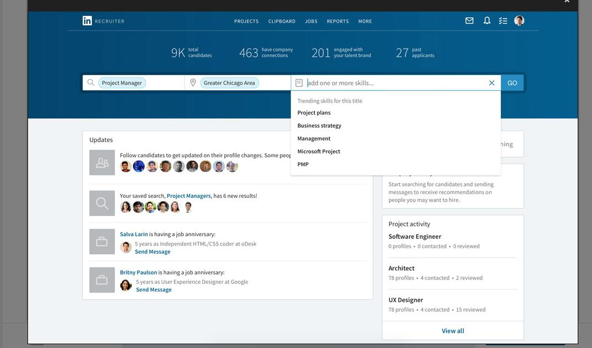
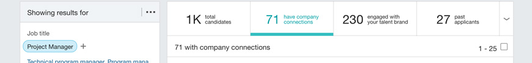
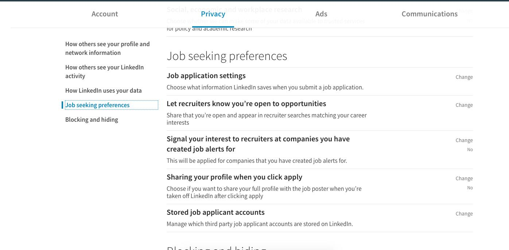
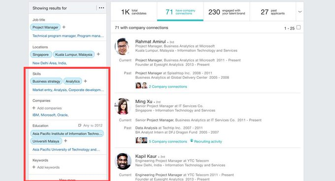
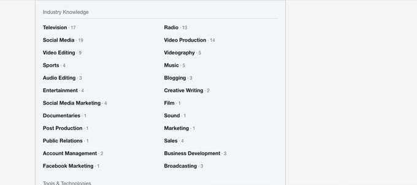

A short but necessary article on how to Maximize your LinkedIn profile for success and visibility.

LinkedIn works best when you realize that its a tool that most Recruiters, Talent Acquisition and HR Personnel use to find and recruit new potential employees. 

You might not be aware but Recruiters have a different view on LinkedIn, this is by design to allow them to parse, narrow and target specific people based on the information provided. For recruiters it starts at this screen. Where they start the search off.

The searches usually begin with Profile Job title, Location and a few different skills. The first opportunity you have to improve your profile's visibility and show up on a Recruiter's search is to put the Job title you have/want in your Headline caption.

If you're open to relocating, in addition to selecting the options through LinkedIn's drop down menu Put in the BODY of your profile the words OPEN TO RELOCATING TO and list the cities/countries you're willing to move to and what your employment status is (International only)

After the initial search screen, Recruiters are greeted by a LinkedIn screen that gives them a comprehensive view of candidates that most likely fit that search criteria. As you can see the tabs at the top Enables Recruiters to see Who is open to opportunities.

This is the next Area of opportunity for you to attract the attention of a Recruiter. On your profile go to your settings and head down to the Job Seeker Preferences, here is where you can let Recruiters know you're open to opportunities increasing your exposure to them

Back to the search Screen. Recruiters are also reliant on what People list as their skills but also what keywords pop up throughout someone's profile. This is why it is important to make sure your Key skills appear frequently the body of your profile. You're more visible to them.

Finally, pay close attention to your skills you've highlighted on your profile. My advice? Only list things you're proficient enough to use on day 1 on a new job. The more refined your profile is, the more visible it is.

TLDR version: 

Put the Job you want/have in your Profile Headline.

Select Open To Opportunities in Profile Settings.

Litter your Job descriptions with Relevant key words.

Attach Key Skills to profile.

Hope this helps. Please reachout to  me via https://twitter.com/bartelssamuel20 if you want any more tips!