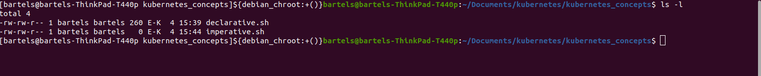
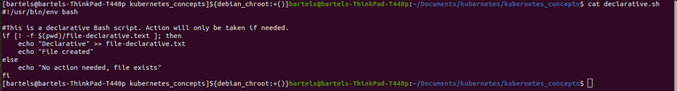
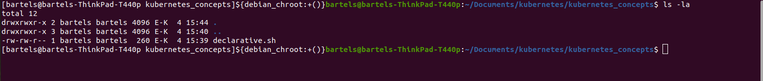
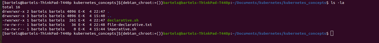
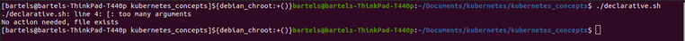
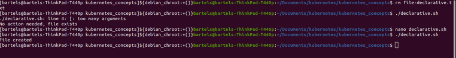
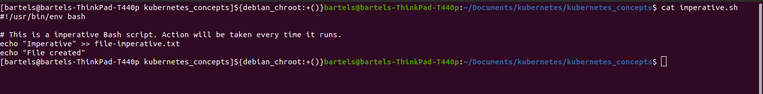
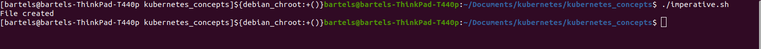
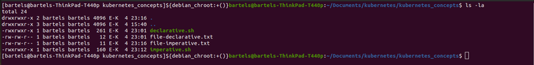
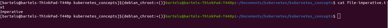

In this article, I’d like to spend a few minutes talking to you about some of the concepts that exist behind Kubernetes. In particular, I want to cover three concepts with you. First, I want to talk about the idea of declarative versus imperative. Then move on to the topic of control loops, and finally close out with reconciliation, and we’ll wrap all this together for what it means for Kubernetes.

First, let’s talk about declarative versus imperative. Declarative versus imperative is a pretty easy concept to understand. In a declarative model, we would say to someone, “Please be seated.” This describes their desired state. We desire for them to be seated. In the imperative model. We would give them a command. We would tell them the actions to take, “Sit down.” Telling them that we want them to sit down. You can think of many other examples of this sort of thing as well, but this is a simple example that shows you that in the declarative model we’re talking about our desired state. We don’t describe how we get to the desired state. We don’t tell the actions required to reach the desired state. We simply describe the desired state. “Please be seated.” In the imperative model, we provided an explicit list of actions that we anticipate will create the desired state that we want.

Now as another example, let me show you a couple of bash scripts that can further illustrate the idea of declarative versus imperative. 

So here in this directory I have a couple of bash scripts that I’ve written, and they are named quite uniquely declarative and imperative. 

Let’s take a look first at the declarative bash script. You can see in here that what I’m doing is I am checking for the presence of a file, and if that file doesn’t exist, then I will echo some text to the file. Otherwise I will say no action needed. 

Now let’s list the directory again. You can see that the file mentioned in this script is not there. 

So if I run this, then it will tell me the file is created, and now I can list and I see the file is created. What happens when I run it again? It says no action is needed. The file already exists. If I remove the file and then run it again, you can see it knows the file is no longer there and it creates the file again, which we can see as this.

Now how does this compare to the imperative document? In the imperative file, we simply say, take this step. Notice we’re not checking to see whether the file already exists or anything else of that nature. We’re simply saying, do this. So let’s run the imperative script and it says, “Okay, I created a file.” We list it. Sure enough, the file is there. If we CAT the contents of that, we see the text is in there. 

Now what happens when I run this again? Well, it says file is created, and sure enough, the file does exist, right? But what happens now when I CAT that file again? You can see it’s echoed the text again. So instead of describing the desire state, an imperative script as used in this example actually just says, take these steps and it doesn’t matter whether the steps have already been taken. It just says take these steps again. And so again, you can see the illustration between declarative where we described the desired state and imperative where we simply provide a list of actions.

Hopefully those simple bash scripts gave you a good idea of what the differences are between declarative and imperative. You’ve probably heard the term declarative used in conjunction with a lot of configuration management systems like Ansible, Chef, Salt or Puppet, which typically use a declarative model to enforce a particular configuration on a target system.

Now, let’s talk about control loops. A very popular or well-known control loop is the OODA loop created by John Boyd, who was a Colonel in the US Air Force. Observe, orient, decide and act. Now for Kubernetes, we can simplify that to a three stage control loop, observe, diff or analyze, and act. And if you’re wondering what we are observing and diffing or analyzing, we are comparing in the diff stage, the desired state, how the operator wants Kubernetes to look with the actual state, how Kubernetes actually is. For example, as a cluster operator, you may say, “I want you to run five pods,” and then it’s the responsibility of Kubernetes to ensure that five pods are running.

Notice we have given it a declared declarative statement. “Please make sure there are five pods running.” We did not give it an imperative statement as in “Run this pod and then run this pod and then run this pod,” and so on until you have five pods running. The control loop is essential. It’s core to how Kubernetes works. Kubernetes consists of an entire series of control loops all responsible for walking through this process of observing the environment, determining what’s already there, analyzing that environment and comparing what’s there to what is desired to be there, and then taking action to ensure that the desired state meets the actual state, that those two are a match, that those two are properly reconciled.

Which brings us to our last topic here, and that is reconciliation. Reconciliation is simply the process of making the actual state look like the desired state via that observe, dif or analyze, and act control loop, and this occurs everywhere throughout Kubernetes. So almost every structure or construct in Kubernetes uses a control loop in some fashion. When you schedule a pod, there’s a series of control loops that are used to create the API object, write that data into etcd, schedule the pod onto a node, than the cubit recognizes that it’s been assigned a node, and it has to then run the pod and then report that the pod is running. All these comparisons between the desired state and what the actual state is.

Similarly, you can look at deployments or replica sets or services. All of these are objects that we’ll talk about in other articles. All of these are implemented via control loops that exist within the Kubernetes control plane.

So as you can see, the ideas of declarative versus imperative, describing how you want the system to be, not the steps taken to get there, the use of control loops throughout Kubernetes via controllers and operators, and the use of reconciliation to reconcile the desired state against the actual state using the control loop, they’re all core essential concepts behind Kubernetes. In another article in the kubernetes series, we’ll take these concepts and actually describe how they are used to create the Kubernetes architecture. Thanks for reading.