We are now going to learn how to standup a database in the cloud. We will be using Amazon's RDS or relational database service; a cloud based data service and a local program called [postbird](https://github.com/Paxa/postbird) to interface with this service. 

Let's get started by opening our AWS console.

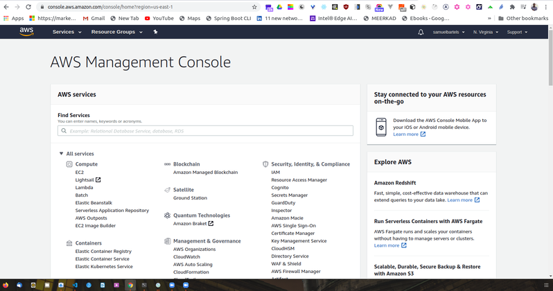

So once we load, our AWS console will be our main page and we are going to search for RDS. 

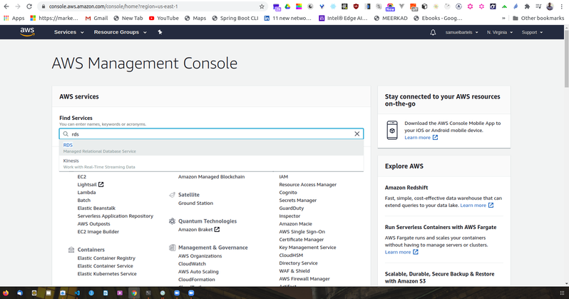

This will take us to the main RDS dashboard.

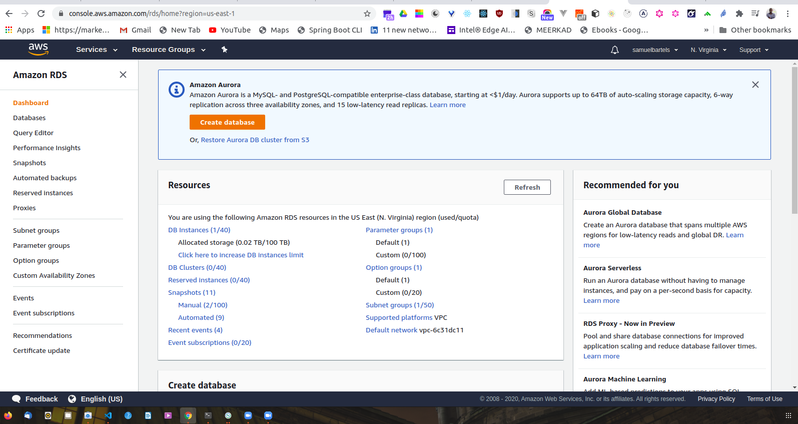

which prompt us to create a new database.

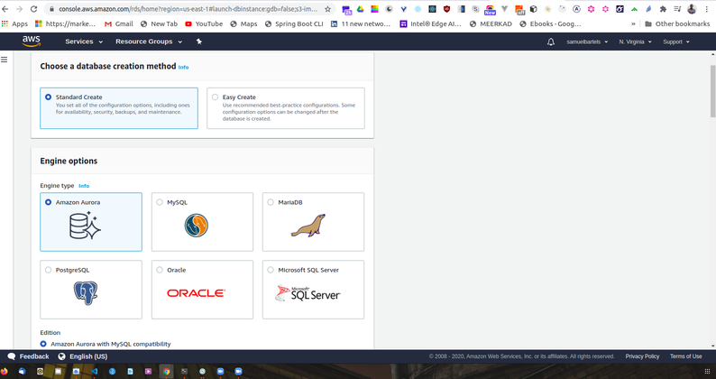

This is going to start to give us some options. SEQUEL is more about framework or a concept than a specific piece of software. For our article, we will be using Postgres. This is a very commonly used system without some support but you sould keep in mind that all of the other systems are not necessarily compatible and each SEQUEL syntax as it own dialect so any kind of queries that you might learn, you might have to tweak a little to make work on a different platform. 

So let's go ahead and get started. Select PostgreSQL. We will ignore those prompts but we will check off that we will only enable options for our free RDS usage tier. If we do not select this option, we might have things like complex logging and complex scaling groups that might end up costing us money. 

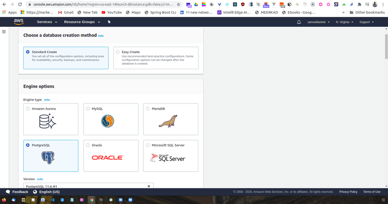

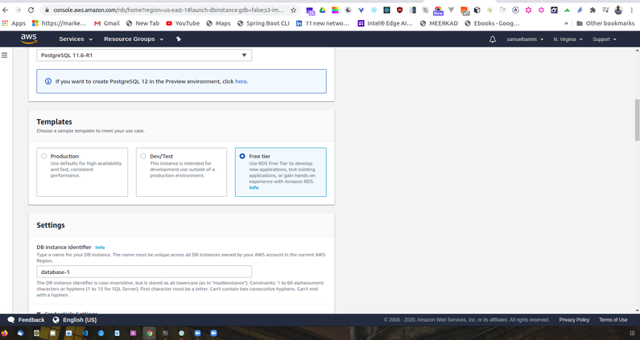

We are going to go ahead now and specify some details for this database. Our standard license should be fine and our standard database engine should be fine as well. Now since we are running on the free tier, we want to select the only option available which is t2.micro. Amazon resources are classed by the type of resource that you are using. 

RDS will be running on a server EC2 instance which all you need to know right now is computer that has a virtualised CPU and some allocation of RAM. The micro instance will give us 1 virtual CPU and 1 Gigabite of RAM. This will be fine for our current needs but as we build a larger system we probably will want to move to a larger instance class. 

Again since we are on a free tier, we can't use multiple zone but this will allow us to deploy our data in different places. As it says, we can have redundancy to eliminate some kinds of freezes if the load is too high at a certain place and generally provide a more better experience. 

We will be using standard SSDs and there will be 20 Gigabites allocated to our server. Now we are going to get into some specific settings that will allow us to connect to our database instance. We will be giving our instance a name. We will call it ```kojobartelsdatabasedev```. This is what we will be calling our main instance. We will use the same value for our username and you can go ahead and select a password. 

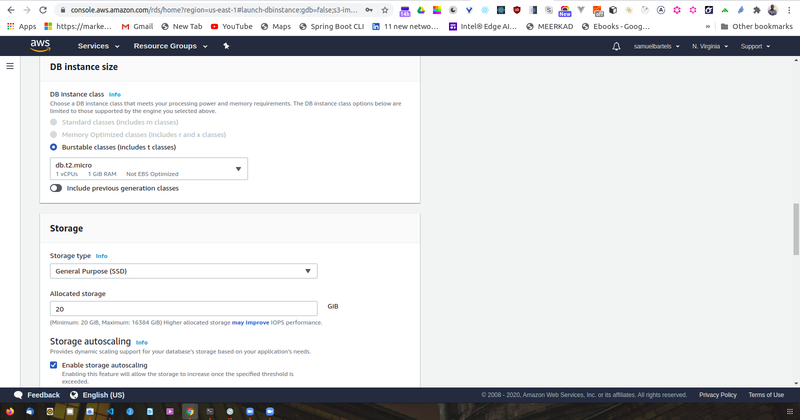

Continuing through our setup, for now we are not going to cover through virtual private cloud and subnet groups. They are essentially a set of computers that are within one virtual network. It will b very important to learn this later on as you advance within your understanding of cloud but it's beyond the scope of what we will cover in this article. 

We do want our database to be accessible. We will be connecting from our local instance using the assigned URL. But keep in mind as well, it might not be what you want in production. Instead you might want to connect only within Amazon infrastructure. 

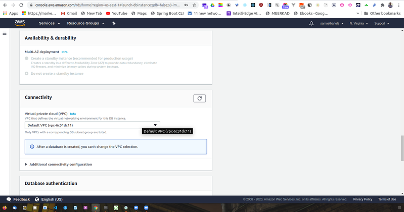

We don't really care what availability zone we are in but you should keep note just mentally that what region you are working. Most availability zones have fall overs so ``a``, ``b``, ``c``, are different data centers within that region of AWS. 

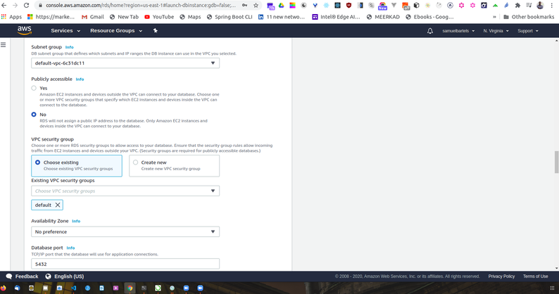

We are now going to give our database a name. I am going to give it the same name as all of other parameters i have specified. And we will use the default network port. We are going to keep the rest of the settings as our defaults. And unfortunately since we are in the free tier we can't use encryption but encryption at rest is important and we will talk a little more about security. 

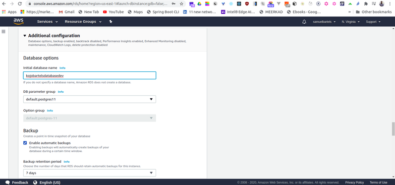

Backing up your data is also very important so that you can provide consistent experiences for your users, the duration that you retain these kinds of information is really dependent on your needs. If you have very sensitive important critical data, you might want to keep it longer. If you have stuff that you don't really care about, but you just have some basic usage logs, you don't really need to keep that much longer. This is a design consideration. Keeping your data longer costs more money, essentially you will have more multiple copies of your backups going back in time from when you are starting. You can also select additional options around backing up. Finally, we are going to enable enhance monitoring which will allow us to watch the health and  performance of our platform. And continue with the defaults on the performance insights as well. And let's export the logs that might come in handy later. This will be the logging of our postgres server. This will be useful if we are trying to debug and understand what we are doing wrong and if we have broken something in the process which is not very unlikely in development. 

We will also keep our default set for maintenance. This will be useful if you have a specific peak usage time you won't want your server to go down during that time. 

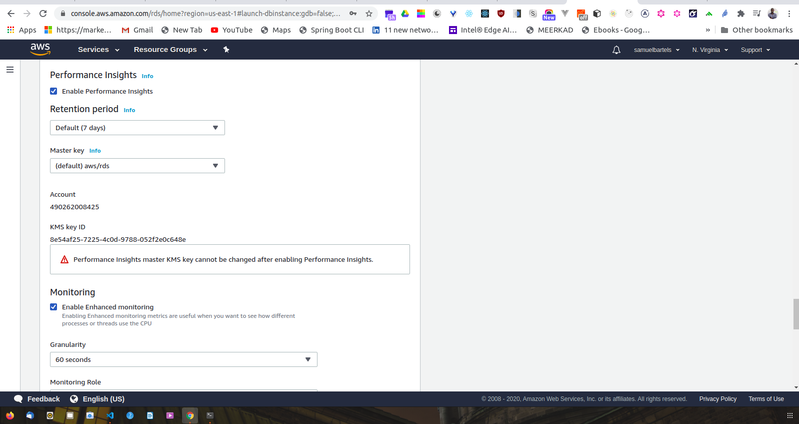

And finally deletion protection. This will protect us from accidentally destroying our database. 

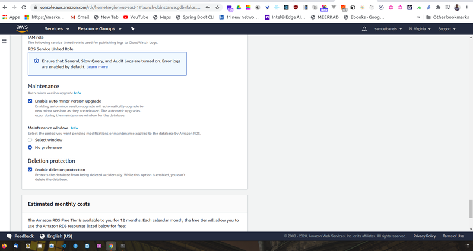

Go ahead and click on create database. 

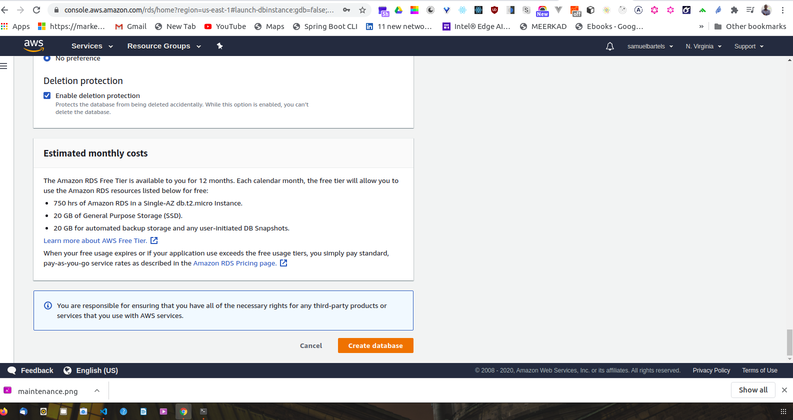

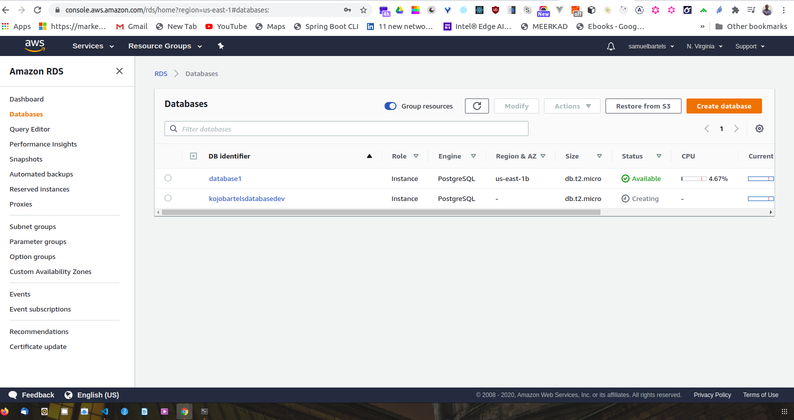

Now that we have provisioned our RDS instances, one last thing we need to do to make our instance accessible from outside of the Amazon infrastructure, there is a concept called a virtual private cloud and security groups which is essentially a firewall that prevents certain types of connections from accessing our services. By default this will provision our infrastructure to essentially try to limit as much public connections as possible. When we first setup our RDS instance, this will only allow inbound connection and the RDS port and the Postgres port from within the IP address that we stood up this infrastructure. 
That's not what we want. We want this to be publicly accessible for now. Keep in mind, it's good practice to limit the inbound connections so that only trusted infrastructure can access this server. Having open ports is something that could cost things to be slightly risky, slightly more vulnerable. Other people can connect directly to the database but for now we are going to change the settings so that we can access this database. 

So we will start off in our database within our RDS console on AWS.

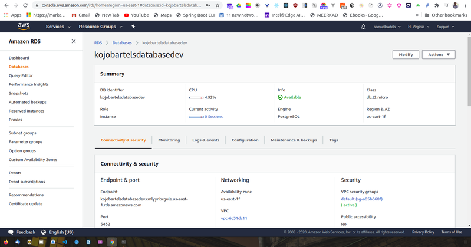

We will scroll down to our security section where we have our VPC security groups. And we are going to click on the security groups. 


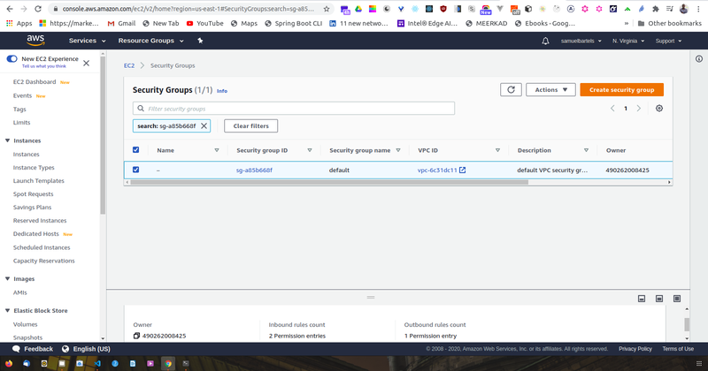

Now the security group acts as a sort of firewall and will have inbound and outbound policies that allows for a certain types of traffic to be either blocked or allowed. In our case, when we provision this system, we are connecting on port 5432. This is our Postgres port within that server instance and we are only allowing a specific IP address. 

we will edit the inbound policy. 

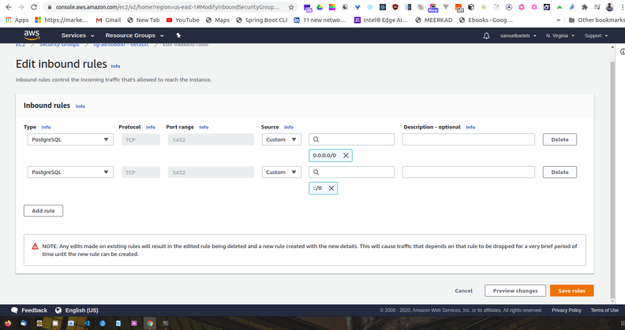

We will go to our source and we are going to say Anywhere. This will change our source to include two new IP addresses, these are basically anything and this will allow our 5432 to be publicly accessible. 

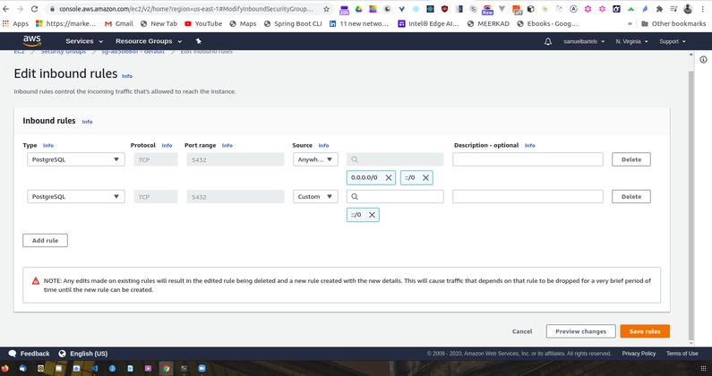

Going ahead and saving this, our policy is now live and those ports are now open to the public. Now we need to make sure our database has a secure password and username.  Inorder for this to be all secured, there are better ways to handle this and we can use IAM profiles to essentially manage this connection for us.  

It might take a little time for your RDS instance to spin up. What it's doing under the hood is creating a new computer instance, installing the software and instantiating the database. Once this is complete, we can now interface with our system. Let's go back to our management console and search for RDS to access that service. 

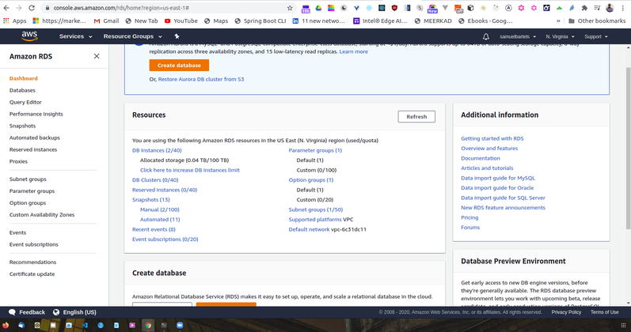

We now see our kojobartelsdatabasedev database which we can click on to bring us into the main panel. 

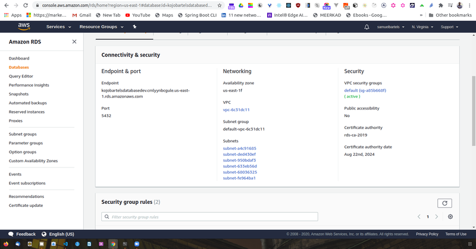

We now have some new information that will allow us to connect. We have an endpoint and we have a port. Let's copy that endpoint and we are going to open a new piece of software called [postbird](https://github.com/Paxa/postbird). We will be using postbird to interface with our database. It's important to not confuse postbird and postman. Postbird is to interface with postgres, postman is to create things like post requests. They are both really useful tools and sometimes, you might confuse the two because the names are so similar. 

Opening postbird, we see a few options. In the center, we have GUI that will allow us to connect to our database. 

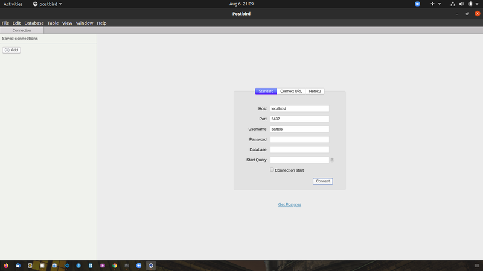

We will copy and paste our enpoint from our database. Our port is the default 5432, enter our password and lets go ahead and test this connection. 

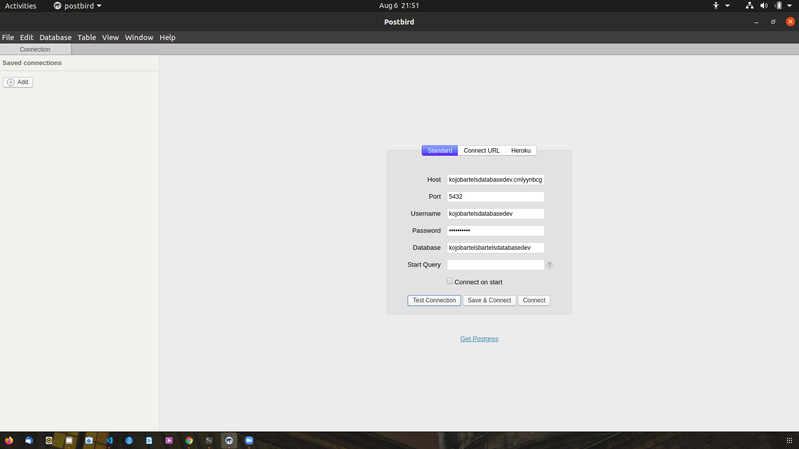

