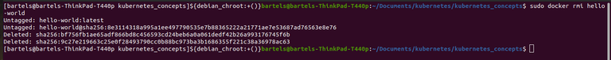

This article is for developers building applications for deployment to kubernetes.

In this article, you will learn how to set up your workstation with tools you will need to work with containers and kubernetes. The first of these tools is [docker](https://www.docker.com/) which we use to build container images and run container images on your workstation.

If you are using Linux, you will install the docker CE-Engine using the below steps:
 1. Update the ``apt`` package index and install packages to allow apt to use a repository over HTTPS:

   ```
   $ sudo apt-get update
   $ sudo apt-get install \
        apt-transport-https \
        ca-certificates \
        curl \
        gnupg-agent \
        software-properties-common
  ```
 2. Add Docker’s official GPG key:

    ```$ curl -fsSL https://download.docker.com/linux/ubuntu/gpg | sudo apt-key add -```
   
    Verify that you now have the key with the fingerprint ```9DC8 5822 9FC7 DD38 854A  E2D8 8D81 803C 0CD88```, 
    by searching for the last 8 characters of the fingerprint.

    ```
    $ sudo apt-key fingerprint 0EBFCD88
    pub   rsa4096 2017-02-22 [SCEA]
              9DC8 5822 9FC7 DD38 854A  E2D8 8D81 803C 0EBF CD88
    uid   [ unknown] Docker Release (CE deb) <docker@docker.com>
    sub   rsa4096 2017-02-22 [S]

    ```
  3. Update the ``apt`` package index, and install the latest version of Docker Engine and containerd, or go to the next step to install a specific version:

  ```
   $ sudo apt-get update
   $ sudo apt-get install docker-ce docker-ce-cli containerd.io
  ```

  4. Verify that Docker Engine is installed correctly by running the hello-world image.

  ```
    $ sudo docker run hello-world
  ```

If you are using MAC or Windows, you will install docker desktop.

Links below will take you to the installation documentation for your operating system:

```
https://docs.docker.com/docker-for-mac/install/
https://docs.docker.com/docker-for-windows/install/
https://docs.docker.com/engine/install/ubuntu/
```

Docker desktop is available through [docker hub](https://hub.docker.com/). You will need to login to dockerhub with an account. If you do not have an account, go ahead and build one. Go ahead and login to dockerhub  after building an account. After login you will taken to a page to download. On MAC, it will be a .dmg file or on windows, it will be an installer. For the MAC, you will copy the file into applications. For windows, you will double click the installer. And you are going to run docker and as it comes up, you will see a note on some popups. On MAC, you will need to enter your credentials so that it can setup networking. On windows, just take the default install and answer YES to the security popup.

Let's test out docker installation. You will go and open your favorite terminal program and type:

```
docker version
```


If you not see this, go back to the installation guideline to make sure you did not miss anything. 

We are going to run another test

```
docker run --rm -it hello-world
```

That is an image out on dockerhub that when you run this, docker will go get that image and run the content of it. This will test to make sure that everything is working correctly. And sure enough, there we go.


There is a command calld ``rmi`` which will remove that image that we just downloaded.

```
docker rmi hello-world
```



If you got to this stage and saw similar output to this, your docker installation is setup correctly.

Next is [kind](https://kind.sigs.k8s.io/docs/user/quick-start) which stands for ``kubernetes in docker``. In a production environment, kubernetes nodes are physical or virtual servers that run the container workloads. On our local workstation, we will actually use docker containers as kubernetes nodes. That sounds complicated, that's because of kind of it but we have ``kind`` to simplify it for us. If you take a look at the install screen, there is section for each operating system and package manager. I am on a linux, so i am going to follow the instruction to do that. So we will go ahead and run the below command:

```
curl -Lo ./kind https://kind.sigs.k8s.io/dl/v0.8.0/kind-$(uname)-amd64
chmod +x ./kind
mv ./kind /some-dir-in-your-PATH/kind

```


Once the command is done, i can type ``kind`` to verify if installation was successful.

Now that we have ``docker`` and ``kind``, we need `kubectl` which is the standard cli tool for interacting with kubernetes. Kubectl translates commands you give it into API calls to the kubernetes API. You will install [kubectl](https://kubernetes.io/docs/tasks/tools/install-kubectl/) locally and give it a config file which provides connection info and credentials to the kubernetes API. 
For MAC and Windows users, take note that docker desktop may have already installed kubectl for you but the version that they installed may not be the one you need for your cluster. For instance, in this example, i know that i want to use kubernetes version 1.18. 


To install kubectl, from the installation page, choose the section for your operating system.
Another tool we will use is [kustomize](https://github.com/kubernetes-sigs/kustomize). In an upcoming article, you will learn how to write to manifest to define how your application will be deployed in a kubernetes cluster. However, not all kubernetes clusters are created equal. There are port differences between your local ``kind`` cluster and a production cluster for example. And ``kustomize`` will help us manage changes that need to be made to those manifest. 

Many organizations use a tool called [Helm](https://helm.sh/docs/intro/install/) to package their applications for kubernetes. Installation for this also very simple.

The final tool we are going to install is [skaffold](https://skaffold.dev/docs/install/). It helps stream the process of building and pushing container images as well as deploying your applications so that you can focus on your development work. 

Well that's it, you've got all the tools needed to start deploying your applications to kubernetes. Thanks for reading.