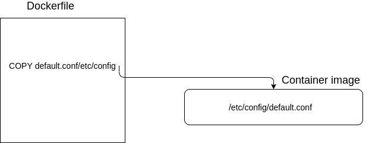
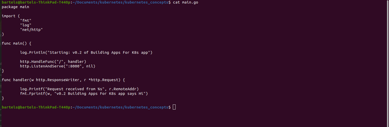
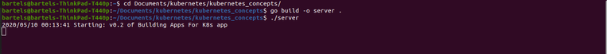
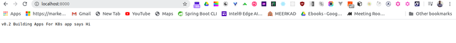
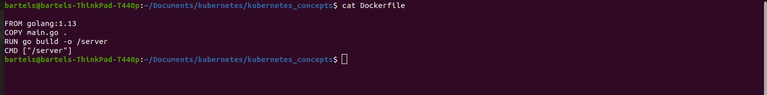
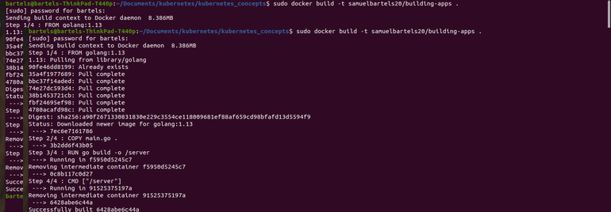
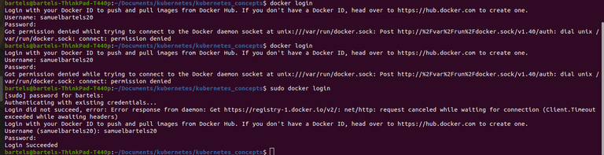

In this article, we cover building container images. 

So in this article, we will go through the process of writing a basic docker file, building container image based on that docker file and finally pushing that image to a public repository. But before we get started, let's touch just a couple of basic concepts on the subject. 



So a dockerfile consist of a set of instructions that docker will use to build a container image. And most instructions will result in a layer bin added to the container image. Therefore a container image consist of a series of file system layers stacked on top of one another. These layers contain the files that will be used to run the application. When a container is run, it will contain the files built into the image and will run the processes instructed to run. The container will share the host kernel with all other containers on that virtual or physical host but will be isolated and will not have access to  assets or processes in other containers.

When a container spins up, an extra rodable layer is added on top of the image but it's important to keep in mind that when the container is deleted so is that rodable layer so don't store anything there that you want to keep. 

With that context, let's jump into building a container image. In order to build a container image, you need something to build into that image and here is the source code for a very simple Go program that we will use to build and install into a container image. 



All this Go program does is that when it starts up, it logs that it is starting up, it listens on port 8000 and when it receives a request, it logs that event and it returns a message back. 

In order to understand what happens when you perform a ``docker build`` to build a container image, it helps to just build and run that app locally and see what that looks like.
So if we run ``go build -o server .`` and we ouput to an executable binary code server, and then we run that server program, we see that it outputs a starting log message.


And then if we go to our browser and we visit `localhost:8000` we see that we get back that message that we expected.



Now that we have seen what that looks like building and running it locally, let's open up Dockerfile



And so in this case, first of all we start with the `FROM` instruction and we are building it from the Golang base image which has all the files to install the Golang programming language and the reason we do that is because we are going to compile this from source code so we need the Go programming language installed.

So then the next instruction is to actually copy the source code into the container which in this simple case is just the `main.go` file.

Next we are going to run that `go build -o server .` command just the same as when we were building it locally. We are now doing that with wrong instruction inside of our container and that's going to output to an executable code server.

And then the final instruction is to actually just run that same way we did on our local machine to when the container starts. Every time the container starts, that will get run.

So now we have our dockerfile, let's go ahead and build that image. In order to do so, we simply use the `docker build` command. We are going to add the tag `-t` to give it a name and i am going to use my dockerhub repo name and we will give it a name called `building-apps`. we also have to give it a build context which is just the path to build context which is the directory that i am in which is which is where my dockerfile is.

```
docker build -t samuelbartels20/building-apps .
```
So when we issue that command, docker goes through the process of building that image based on the dockerfile that it found in this build context and you see that it successfully built.


You also that by default, it gave it the lastest tag and it's not a good practice to use the latest tag. So we will give it our own tag and we will use ``docker tag`` command for this, put in the image ID and then we give it a version of 0.1

```
docker tag 6428abe6c44a samuelbartels20/building-apps:0.1

```

Now, it's ready to be pushed. In order to push to your repository, you need to be logged in to docker and in order to do that, you can just issue the ``docker login`` command. When you issue that command, it will propmt you for your username and password and then once you login, you can go ahead and push.



Now, i would like to point out that in this particular example, well, it's a working example and it just fine. It does contain the Go programming language and the source code for our program which is actually not necessary for the final container image in order to run. All that is necessary is binary file in order to run. In order to accomplish that, you can use what's called a ``multi stage build`` whereby you use a golang based image in your source code and build that as executable and then the final step copies that executable into another container that contains just that binary file. But that's for another article, we are not going to cover that in this particular article.

But what i would like to touch on really quick is the [documentation for a docker file](https://docs.docker.com) because though this is a working example, it only touches on allowing users a small subset of the instructions that you can use in a docker file. So if you go to [docker docs](https://docs.docker.com), click on the ```reference``` link and then at on the top left, you will see a ```file formats``` dropdown with a ``dockerfile reference`` under it. Visit that page and you will find extensive documentation on all of the various instructions that you can use in a dockerfile.