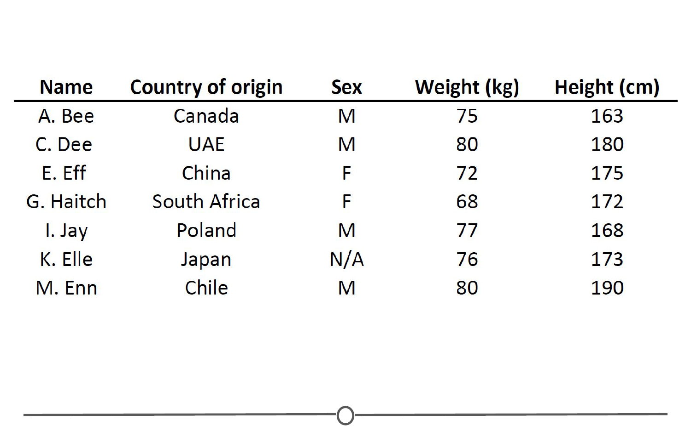
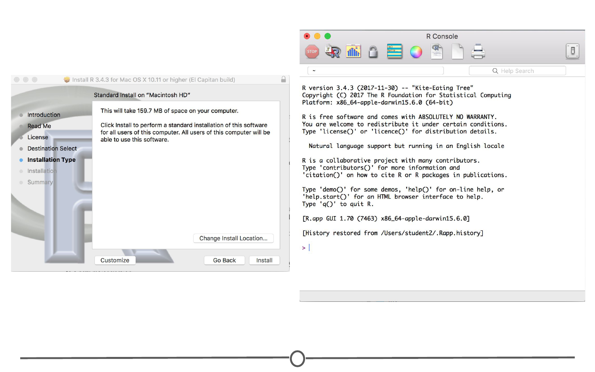
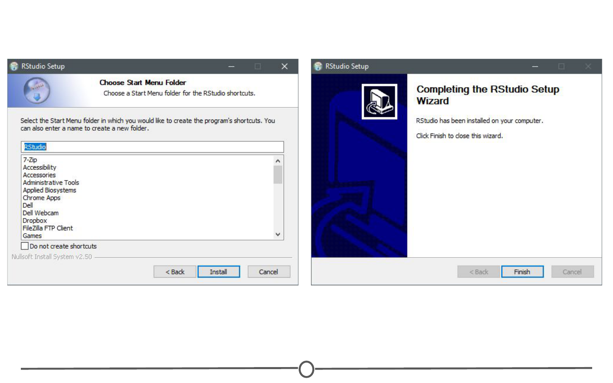
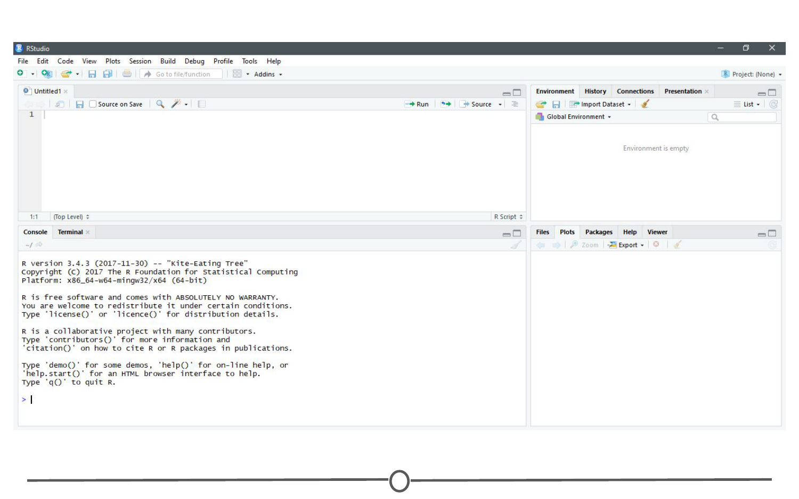
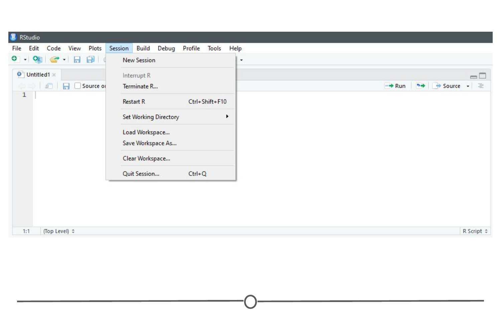
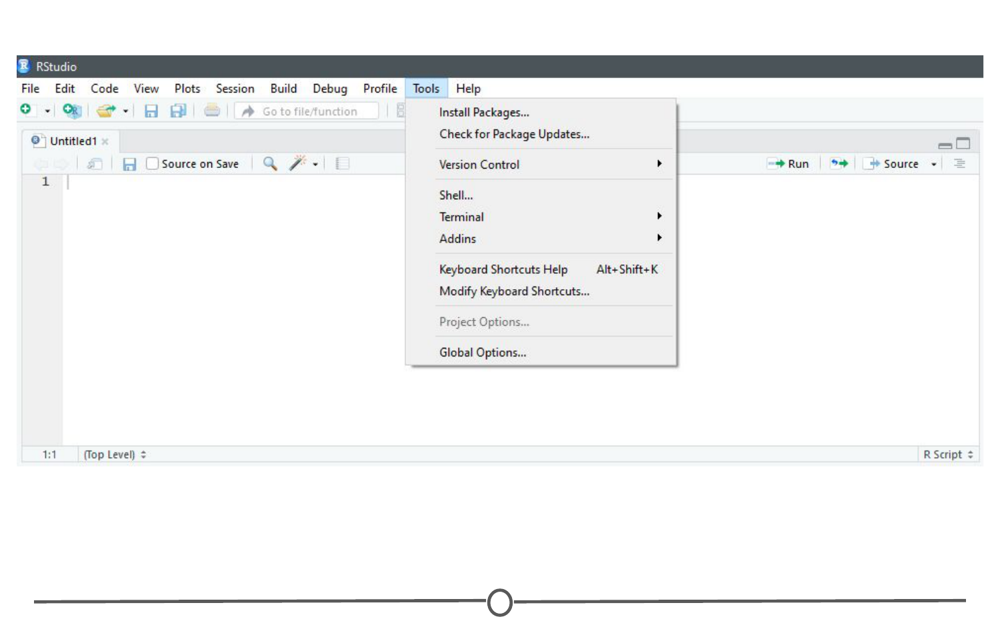
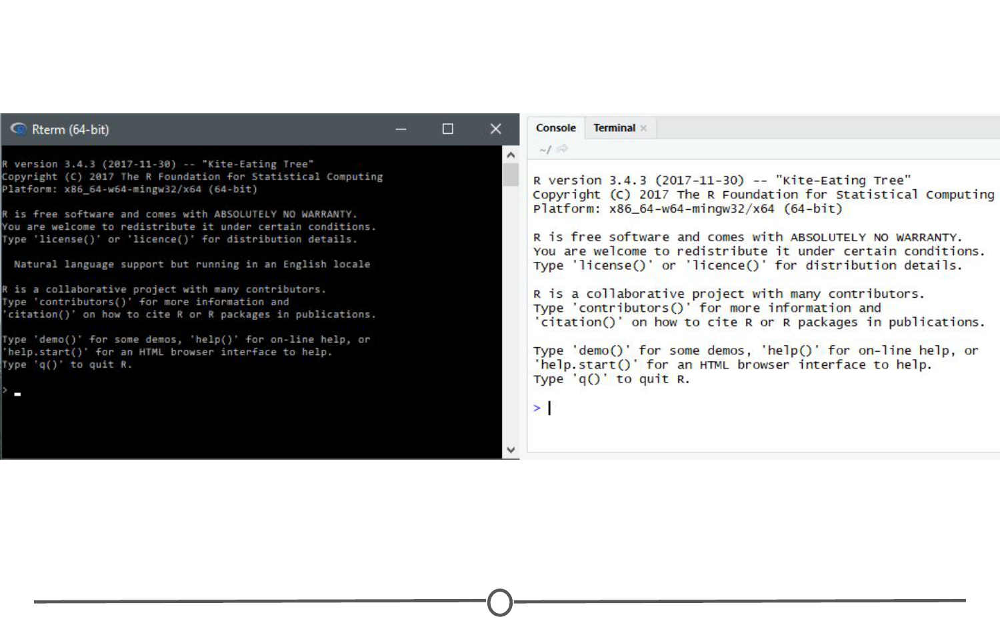
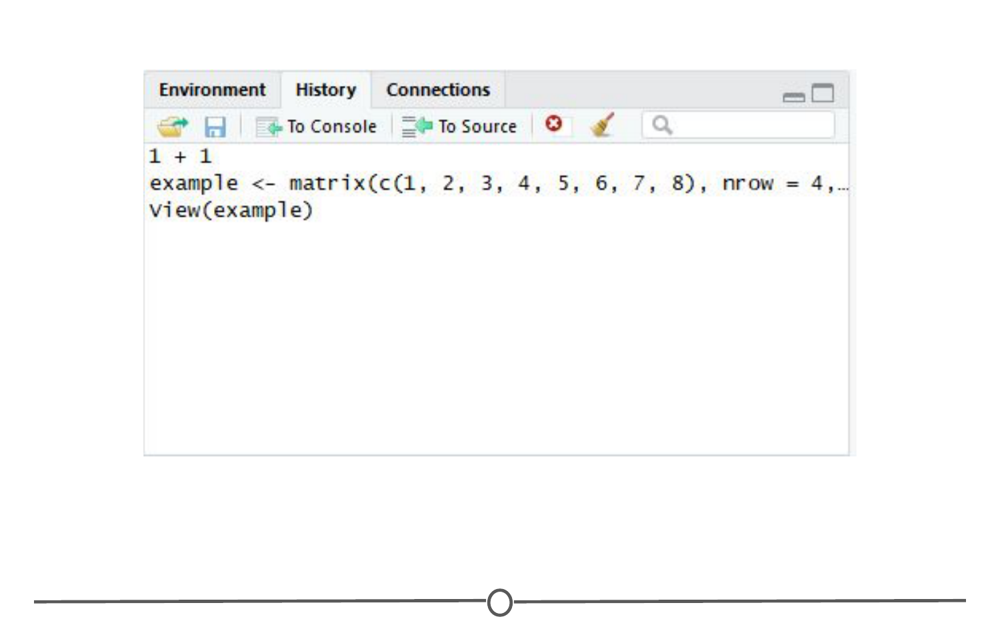
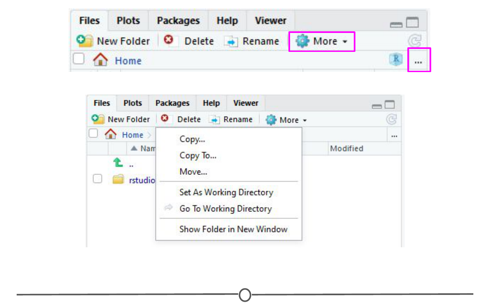
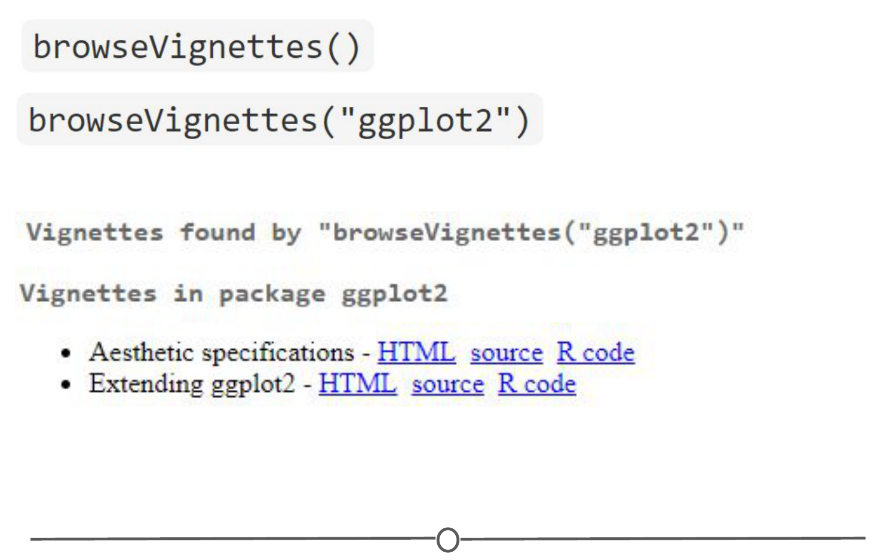

In this article, we'll introduce and define data science and data itself. We'll also go over some of the resources that data scientists use to get help when they're stuck....

## Key Concepts
- Define data science
- Define data
- Use resources to get help with problems

Hello and welcome to the Data Scientist's Toolbox. Here, we will be going over the basics of data science and introducing you to the tools that will be used throughout the article. 

So, the first question you probably need answered going into this article is, what is data science? That is a great question. To different people this means different things, but at its core, data science is using data to answer questions. This is a pretty broad definition and that's because it's a pretty broad field. 

Data science can involve:
- statistics 
- computer science 
- mathematics
- data cleaning and formatting 
- and data visualization.

[An Economist Special Report](https://www.economist.com/special-report/2010/02/27/data-data-everywhere) sums up this melange of skills well. They state that a data scientist is broadly defined as 

```
someone who combines the skills of software programmer, statistician, and storyteller/artists to extract the nuggets of gold hidden under mountains of data. 

```

By the end of this article, hopefully you will feel equipped to do just that. 

One of the reasons for the [rise of data science](https://www.forbes.com/sites/gilpress/2013/05/28/a-very-short-history-of-data-science/#68b8908c55cf) in recent years is the vast amount of data currently available and being generated. Not only are massive amounts of data being collected about many aspects of the world and our lives, but we simultaneously have the rise of inexpensive computing. This has created the perfect storm in which we enrich data and the tools to analyze it, rising computer memory capabilities, better processors, more software and now, more data scientists with the skills to put this to use and answer questions using this data. There is a little anecdote that describes the truly exponential growth of data generation we are experiencing. 

In the third century BC, the Library of Alexandria was believed to house the sum of human knowledge. Today, there is enough information in the world to give every person alive 320 times as much of it as historians think was stored in Alexandria's entire collection, and that is still growing. 

We'll talk a little bit more about big data in a later chapter. But it deserves an introduction here since it has been so integral to the [rise of data science](https://www.foreignaffairs.com/articles/2013-04-03/rise-big-data). There are a [few qualities that characterize big data](https://www.forbes.com/sites/oreillymedia/2012/01/19/volume-velocity-variety-what-you-need-to-know-about-big-data/#a2b7b541b6d2). 

The first is volume. As the name implies, big data involves large datasets. These large datasets are becoming more and more routine. For example, say you had a question about online video. Well, YouTube has approximately 300 hours of video uploaded every minute. You would definitely have a lot of data available to you to analyze. But you can see how this might be a difficult problem to wrangle all of that data. This brings us to the second quality of Big Data, velocity. Data is being generated and collected faster than ever before. In our YouTube example, new data is coming at you every minute. In a completely different example, say you have a question about shipping times of rats. Well, most transport trucks have real-time GPS data available. You could in real time analyze the trucks movements if you have the tools and skills to do so. The third quality of big data is variety. 

In the examples I've mentioned so far, you have different types of data available to you. In the YouTube example, you could be analyzing video or audio, which is a very unstructured dataset, or you could have a database of video lengths, views or comments, which is a much more structured data set to analyze. 


So, we've talked about what data science is and what sorts of data it deals with, but something else we need to discuss is what exactly a data scientist is. 

The most basic of definitions would be that a data scientist is somebody who uses data to answer questions. But more importantly to you, what skills does a data scientist embody? 


To answer this, we have this [illustrative Venn diagram](http://drewconway.com/zia/2013/3/26/the-data-science-venn-diagram) in which data science is the intersection of three sectors, substantive expertise, hacking skills, and math and statistics. To explain a little on what i mean by this, we know that we use data science to answer questions. 

So first, we need to have enough expertise in the area that we want to ask about in order to formulate our questions, and to know what sorts of data are appropriate to answer that question. Once we have our question and appropriate data, we know from the sorts of data that data science works with. Oftentimes it needs to undergo significant cleaning and formatting. This often takes computer programming/hacking skills. 

Finally, once we have our data, we need to analyze it. This often takes math and stats knowledge. In this specialization, we'll spend a bit of time focusing on each of these three sectors. But we'll primarily focus on math and statistics knowledge and hacking skills. For hacking skills, we'll focus on teaching two different components, computer programming or at least computer programming with R which will allow you to access data, play around with it, analyze it, and plot it. Additionally, we'll focus on having you learn how to go out and get answers to your programming questions. 

One reason data scientists are in such demand is that most of the answers are not already outlined in textbooks. A data scientist needs to be somebody who knows how to find answers to novel problems. 

Speaking of that demand, there is a huge need for individuals with data science skills. Not only are machine-learning engineers, data scientists, and big data engineers among the top emerging jobs in 2017 [according to LinkedIn](https://economicgraph.linkedin.com/research/LinkedIns-2017-US-Emerging-Jobs-Report), the demand far exceeds the supply. They state, 

```
Data scientists roles have grown over 650 percent since 2012. But currently, 35,000 people in the US have data science skills while hundreds of companies are hiring for those roles - even those you may not expect in sectors like retail and finance. 
Supply of candidates for these roles cannot keep up with demand.
``` 

This is a great time to be getting into data science. Not only do we have more and more data, and more and more tools for collecting, storing, and analyzing it, but the demand for data scientists is becoming increasingly recognized as important in many diverse sectors, not just business and academia. 

Additionally, according to [Glassdoor](https://www.glassdoor.com/List/Best-Jobs-in-America-LST_KQ0,20.htm), in which they ranked the top 50 best jobs in America, data scientist is THE top job in the US in 2017, based on job satisfaction, salary, and demand. The diversity of sectors in which data science is being used is exemplified by looking at examples of data scientists. 

One place we might not immediately recognize the demand for data science is in sports. Daryl Morey is the general manager of a US basketball team, the Houston Rockets. [Despite not having a strong background in basketball](https://www.nytimes.com/2008/01/28/sports/basketball/28morey.html), Morey was awarded the job as GM on the basis of his bachelor's degree in computer science and his MBA from MIT. He was chosen for his ability to collect and analyze data and use that to make informed hiring decisions. 

Another data scientists that you may have heard of is Hilary Mason. She is a co-founder of FastForward Labs, a machine learning company recently acquired by Cloudera, a data science company, and is the Data Scientist in Residence at Accel. Broadly, she uses data to answer questions about mining the web and understanding the way that humans interact with each other through social media. 

Finally, Nate Silver is one of the most famous data scientists or statisticians in the world today. He is founder and editor in chief at [FiveThirtyEight](https://fivethirtyeight.com/), a website that 
```
uses statistical analysis - hard numbers - to tell compelling stories about elections, politics, sports, science, economics, and lifestyle
```
He uses large amounts of totally free public data to make predictions about a variety of topics. Most notably, he makes predictions about who will win elections in the United States, and has a remarkable track record for accuracy doing so. 

One great example of data science in action is from 2009 in which researchers at Google analyzed 50 million commonly searched terms over a five-year period and compared them against CDC data on flu outbreaks. Their goal was to see if certain searches coincided with outbreaks of the flu. 

One of the benefits of data science and using big data is that it can identify correlations. In this case, they identified 45 words that had a strong correlation with the CDC flu outbreak data. With this data, they have been able to predict flu outbreaks based solely off of common Google searches. Without this mass amounts of data, these 45 words could not have been predicted beforehand. 

Now that you have had this introduction into data science, all that really remains to cover here is a summary of what it is that i will be teaching you throughout this article. 

To start, we'll go over the basics of R. R is the main programming language that we will be working with in this article. So, a solid understanding of what it is, how it works, and getting it installed on your computer is a must. 

We'll then transition into RStudio, which is a very nice graphical interface to R, that should make your life easier. We'll then talk about version control, why it is important, and how to integrate it into your work. Once you have all of these basics down, you'll be all set to apply these tools to answering your very own data science questions. Looking forward to learning with you. Let's get to it.

Since we’ve spent some time discussing what data science is, we should spend some time looking at what exactly data is.

First, let’s look at what a few trusted sources consider data to be. 

First up, we’ll look at the [Cambridge English Dictionary](https://dictionary.cambridge.org/dictionary/english/data), which states that data is:
```
Information, especially facts or numbers, collected to be examined and considered and used to help decision-making
```

Second, we’ll look at the definition provided by [Wikipedia](https://en.wikipedia.org/wiki/Data), which is:
```
A set of values of qualitative or quantitative variables
```

These are slightly different definitions and they get at different components of what data is. Both agree that data is values or numbers or facts, but the Cambridge definition focuses on the actions that surround data - data is collected, examined and most importantly, used to inform decisions. We’ve focused on this aspect before - we’ve talked about how the most important part of data science is the question and how all we are doing is using data to answer the question. The Cambridge definition focuses on this.

The Wikipedia definition focuses more on what data entails. And although it is a fairly short definition, we’ll take a second to parse this and focus on each component individually.

So, the first thing to focus on is “a set of values” - to have data, you need a set of items to measure from. In statistics, this set of items is often called the population. The set as a whole is what you are trying to discover something about. For example, that set of items required to answer your question might be all websites or it might be the set of all people coming to websites, or it might be a set of all people getting a particular drug. But in general, it’s a set of things that you’re going to make measurements on.

The next thing to focus on is “variables” - variables are measurements or characteristics of an item. For example, you could be measuring the height of a person, or you are measuring the amount of time a person stays on a website. On the other hand, it might be a more qualitative characteristic you are trying to measure, like what a person clicks on on a website, or whether you think the person visiting is male or female.

Finally, we have both qualitative and quantitative variables. Qualitative variables are, unsurprisingly, information about qualities. They are things like country of origin, sex, or treatment group. They’re usually described by words, not numbers, and they are not necessarily ordered. Quantitative variables on the other hand, are information about quantities. Quantitative measurements are usually described by numbers and are measured on a continuous, ordered scale; they’re things like height, weight and blood pressure.


So, taking this whole definition into consideration we have measurements (either qualitative or quantitative) on a set of items making up data - not a bad definition.

When we were going over the definitions, our examples of variables and measurements (country of origin, sex, height, weight) are pretty basic examples; you can easily envision them in a nice looking spreadsheet, with individuals along one side of the table, and the information for those variables along the other side.



Unfortunately, this is rarely how data is presented to you. The data sets we commonly encounter are much messier, and it is our job to extract the information we want, corral it into something tidy like the imagined table above, analyse it appropriately, and often, visualize our results.

Here are just some of the data sources you might encounter and we’ll briefly look at what a few of these data sets often look like or how they can be interpreted, but one thing they have in common is the messiness of the data - you have to work to extract the information you need to answer your question.

- Sequencing data

- Population census data

- Electronic medical records (EMR), other large databases

- Geographic information system (GIS) data (mapping)

- Image analysis and image extrapolation

- Language and translations

- Website traffic

- Personal/Ad data (eg: Facebook, Netflix predictions, etc)

One type of data, that I work with regularly, is [sequencing data](https://www.ncbi.nlm.nih.gov/sra). This data is generally first encountered in the FASTQ format, the raw file format produced by sequencing machines. These files are often hundreds of millions of lines long, and it is our job to parse this into an understandable and interpretable format and infer something about that individual’s genome. In this case, this data was interpreted into expression data, and produced a plot called a “volcano plot”.


One rich source of information is country wide censuses. In these, almost all members of a country answer a set of standardized questions and submit these answers to the government. When you have that many respondants, the data is large and messy; but once this large database is ready to be queried, the answers embedded are important.Here we have a very basic result of the last US census - in which all respondants are divided by sex and age, and this distribution is plotted in this population pyramid plot.


[Here](https://www.census.gov/popclock/) is the US census website and [some tools to help you examine it](https://guides.library.ucla.edu/c.php?g=180339&p=1189478), but if you aren’t from the US, I urge you to check out your home country’s census bureau (if available) and look at some of the data there!

Electronic medical records are increasingly prevalent as a way to store health information, and more and more population based studies are using this data to answer questions and make inferences about populations at large, or as a method to identify ways to improve medical care. For example, if you are asking about a population’s common allergies, you will have to extract many individuals’ allergy information, and put that into an easily interpretable table format where you will then perform your analysis.

A more complex data source to analyse are images/videos. There is a wealth of information coded in an image or video, and it is just waiting to be extracted. An example of image analysis that you may be familiar with is when you upload a picture to Facebook and not only does it automatically recognize faces in the picture, but then suggests who they may be. A fun example you can play with is the [DeepDream software](https://deepdreamgenerator.com/) that was originally designed to detect faces in an image, but has since moved on to more artistic pursuits.


There is another fun Google initiative involving image analysis, where you help provide data to Google’s machine learning algorithm… by [doodling](https://quickdraw.withgoogle.com/)!

Recognizing that we’ve spent a lot of time going over what data is, we need to reiterate - Data is important, but it is secondary to your question. A good data scientist asks questions first and seeks out relevant data second.

Admittedly, often the data available will limit, or perhaps even enable, certain questions you are trying to ask. In these cases, you may have to reframe your question or answer a related question, but the data itself does not drive the question asking.

## The data science process

we discuss what data and data science are. What we haven't yet covered is what an actual data science project looks like. To do so, we'll first step through an actual data science project, breaking down the parts of a typical project and then provide a number of links to other interesting data science projects. 

Our goal in this lesson is to expose you to the process one goes through as they carry out data science projects. Every data science project starts with a question that is to be answered with data. That means that forming the question is an important first step in the process. 

The second step, is finding or generating the data you're going to use to answer that question. With the question solidified and data in hand, the data are then analyzed first by exploring the data and then often by modeling the data, which means using some statistical or machine-learning techniques to analyze the data and answer your question. 

After drawing conclusions from this analysis, the project has to be communicated to others. Sometimes this is the report you send to your boss or team at work, other times it's a blog post. Often it's a presentation to a group of colleagues. Regardless, a data science project almost always involve some form of communication of the project's findings. 

We'll walk through these steps using a data science project example below. 

For this example, we're going to use an example analysis from a data scientist named Hilary Parker. Her work can be found on her [blog](https://hilaryparker.com/2013/01/30/hilary-the-most-poisoned-baby-name-in-us-history/) and the specific project we'll be working through here is from 2013 entitled, Hilary: The most poison baby name in US history. 

To get the most out of this article, click on that link and read through Hilary's post. Once you're done, come on back to this article and read through the breakdown of this post. 

When setting out on a data science project, it's always great to have your question well-defined. Additional questions may pop up as you do the analysis. But knowing what you want to answer with your analysis is a really important first step. Hilary Parker's question is included in bold in her post. 

Highlighting this makes it clear that she's interested and answer the following question; is Hilary/Hillary really the most rapidly poison naming recorded American history? 

To answer this question, Hilary collected data from the Social Security website. This data set included 1,000 most popular baby names from 1880 until 2011. As explained in the blog post, Hilary was interested in calculating the relative risk for each of the 4,110 different names in her data set from one year to the next, from 1880-2011. 

By hand, this would be a nightmare. Thankfully, by writing code in R, all of which is available on [GitHub](https://github.com/hilaryparker/names), Hilary was able to generate these values for all these names across all these years. It's not important at this point in time to fully understand what a relative risk calculation is. 

Although, Hilary does a great job breaking it down in her post. But it is important to know that after getting the data together, the next step is figuring out what you need to do with that data in order to answer your question. For Hilary's question, calculating the relative risk for each name from one year to the next from 1880-2011, and looking at the percentage of babies named each name in a particular year would be what she needed to do to answer her question. What you don't see in the blog post is all of the code Hilary wrote to get the data from the Social Security website, to get it in the format she needed to do the analysis and to generate the figures. 

As mentioned above, she made all this code available on GitHub so that others could see what she did and repeat her steps if they wanted. In addition to this code, data science projects often involve writing a lot of code and generating a lot of figures that aren't included in your final results. This is part of the data science process to figuring out how to do what you want to do to answer your question of interest. It's part of the process. It doesn't always show up in your final project and can be very time consuming. 

That said, given that Hilary now had the necessary values calculated, she began to analyze the data. The first thing she did was look at the names with the biggest drop in percentage from one year to the next. By this preliminary analysis, Hilary was sixth on the list. Meaning there were five other names that had had a single year drop in popularity larger than the one the name Hilary experienced from 1992-1993. 

In looking at the results of this analysis, the first five years appeared peculiar to Hilary Parker. It's always good to consider whether or not the results were what you were expecting from many analysis. None of them seemed to be names that were popular for long periods of time. To see if this hunch was true, Hilary plotted the percent of babies born each year with each of the names. 

What she found was that among these poisoned names, names that experienced a big drop from one year to the next in popularity, all of the names other than Hilary became popular all of a sudden and then dropped off in popularity. Hilary Parker was able to figure out why most of these other names became popular. So definitely read that section of her post. The name, Hilary, however, was different. It was popular for a while and then completely dropped off in popularity. 

To figure out what was specifically going on with the name Hilary, she removed names that became popular for short periods of time before dropping off and only looked at names that were in the top 1,000 for more than 20 years. The results from this analysis definitively showed that Hilary had the quickest fall from popularity in 1992 of any female baby named between 1880 and 2011. Marian's decline was gradual over many years. 

For the final step in this data analysis process, once Hilary Parker had answered her question, it was time to share it with the world. An important part of any data science project is effectively communicating the results of the project. Hilary did so by writing a wonderful blog post that communicated the results of her analysis. Answered the question she set out to answer, and did so in an entertaining way. 

Additionally, it's important to note that most projects build off someone else's work. It's really important to give those people credit. Hilary accomplishes this by linking to a blog post where someone had asked a similar question previously, to the Social Security website where she got the data and where she learned about web scraping. Hilary's work was carried out using the R programming language. 

Throughout the article, you'll learn the basics of programming in R, exploring and analyzing data, and how to build reports and web applications that allow you to effectively communicate your results. 

To give you an example of the types of things that can be built using the R programming and suite of available tools that use R, below are a few examples of the types of things that have been built using the data science process and the R programming language. The types of things that you'll be able to generate by the end of this article. 

Masters students at the University of Pennsylvania set out to predict the risk of opioid overdoses in Providence, Rhode Island. They include details on the data they used. The steps they took to clean their data, their visualization process, and their final results. While the details aren't important now, seeing the process and what types of reports can be generated is important. 

Additionally, they've created a Shiny app, which is an interactive web application. This means that you can choose what neighborhood in Providence you want to focus on. All of this was built using R programming. The following are smaller projects than the example above, but data science projects nonetheless. 

In each project, the author had a question they wanted to answer and use data to answer that question. They explored, visualized, and analyzed the data. Then, they wrote blog posts to communicate their findings. Take a look to learn more about the topics listed and to see how others work through the data science project process and communicate their results. Maelle Samuel looked to use data to see where one should live in the US given their weather preferences. 

David Robinson carried out an analysis of Trump's tweets to show that Trump only writes the angrier ones himself. Charlotte Galvin used open data available from the City of Toronto to build a map with information about sexual health clinics. In this lesson, we hope we've conveyed that sometimes data science projects are tackling difficult questions. Can we predict the risk of opioid overdose? While other times the goal of the project is to answer a question you're interested in personally; is Hilary the most rapidly poisoned baby name in recorded American history? In either case, the process is similar. 

You have to form your question, get data, explore and analyze your data, and communicate your results. With the tools you will learn in this article, you will be able to set out and carry out your own data science projects like the examples included in this article.

## Installing R

Now that we’ve got a handle on what a data scientist is, how to find answers, and then spent some time going over a data science example, it’s time to get you set up to start exploring on your own. And the first step of that is installing R.

First, let’s remind ourselves exactly what R is and why we might want to use it.

[R](https://www.r-project.org/) is both a programming language and an environment, focused mainly on statistical analysis and graphics. It will be one of the main tools you use in this article.

R is downloaded from the [Comprehensive R Archive Network](https://cran.r-project.org/), or CRAN, and while this might be your first brush with it, we will be returning to CRAN time and time again, when we install packages - so keep an eye out!

Outside of this article, you may be asking yourself - [why should I use R?](https://www.r-bloggers.com/why-use-r-five-reasons/)

The reasons for using R are myriad, but some big ones are:
1.  Its popularity
      R is quickly becoming the standard language for statistical analysis. This makes R a great language to learn as the more popular a software is, the quicker new functionality is developed, the more powerful it becomes, and the better the support there is! Additionally, as you can see in the [graph below](http://r4stats.com/articles/popularity/), knowing R is one of the top five languages asked for in data scientist job postings!

    

2. Its cost
    FREE!

    This one is pretty self-explanatory - every aspect of R is free to use, unlike some other stats packages you may have heard of (eg: SAS, SPSS), so there is no cost barrier to using R!

3. Its extensive functionality
    R is a very versatile language - we’ve talked about its use in stats and in graphing, but its use can be expanded to many different functions - from making [websites](https://bookdown.org/yihui/rmarkdown/rmarkdown-site.html), making maps using [GIS data](http://www.nickeubank.com/gis-in-r/), analysing [language](https://cran.r-project.org/web/views/NaturalLanguageProcessing.html)… and even making these [lectures and videos](https://cran.r-project.org/web/packages/ari/index.html)! For whatever task you have in mind, there is often a package available for download that does exactly that!

4. Its community
    And the reason that the functionality of R is so extensive is the community that has been built around R. Individuals have come together to make “packages” that add to the functionality of R - and more are being developed every day!

    Particularly for people just getting started out with R, its community is a huge benefit - due to its popularity, there are multiple forums that have pages and pages dedicated to solving R problems. We talked about this in the Getting Help lesson; these forums are great both for finding other people who have had the same problem as you, and posting your own new problems.

Now that we’ve spent some time looking at the benefits of R, it is time to install it! We’ll go over installation for both Windows and Mac below, but know that these are general guidelines and small details are likely to change subsequent to the making of this lecture - use this as a scaffold.

For both Windows, Linux and Mac machines, we start at the CRAN homepage: https://cran.r-project.org/

### Installation - for Windows

If you are on a Windows computer, follow the link [Download R for Windows](https://cran.r-project.org/bin/windows/), and follow the directions there - if this is your first time installing R, go to the [base distribution](https://cran.r-project.org/bin/windows/base/) and click on the link at the top of the page that should say something like “Download R [version number] for Windows.” This will download an executable file for installation.


Open the executable, and if prompted by a security warning, allow it to run. Select the language you prefer during installation and agree to the licensing information. You will next be prompted for a destination location - this will likely be defaulted to Program Files, in a subfolder called R, followed by another directory of the version number. Unless you have any issues with this, the default location is perfect.


You will then be prompted to select which components should be installed. Unless you are running short on memory, installing all of the components is desireable. Next you’ll be asked about startup options, and again, the defaults are fine for this. You will then be asked where Setup should place shortcuts - this is completely up to you, you can allow it to add the program to the start menu, or you can click the box at the bottom that says to not create a start menu link. Finally, you will be asked whether you want a desktop or Quick Launch icon - up to you! I do not recommend changing the defaults for the registry entries though.

After this window, the installation should begin. Test that the installation worked by opening R for the first time!


### Installation - for Macs
If you are on a Mac computer, follow the link [Download R for (Mac) OS X](https://cran.r-project.org/bin/macosx/). There you can find the various R versions for download. Note: If your Mac is older than OS X 10.6 (“Snow Leopard”), you will need to follow the directions on this page for downloading older versions of R that are compatible with those operating systems.


Open the pkg file and follow the prompts as provided by the installer. First, click continue on the welcome page and again on the important information window page. Next you will be presented with the software license agreement, again, continue. Next you may be asked to select a destination for R, either available to all users or to a specific disk - select whichever you feel is best suited to your setup. Finally, you will be at the “Standard Install” page; R selects a default directory and if you are happy with that location, go ahead and click install. At this point, you may be prompted to type in the admin password, do so, and the install will begin!



Once the installation is finished, go to your Applications and find R. Test that the installation worked by opening R for the first time!

### Installation - for Linux

The following commands needs to be run to install R

```

sudo apt-get update
sudo apt-get install r-base

```

## Installing RStudio
We’ve installed R and can open the R interface to input code, but there are other ways to interface with R - and one of those ways is using RStudio. In this lesson, we’ll get RStudio installed on your computer.

[RStudio](https://rstudio.com/products/rstudio/) is a graphical user interface for R, that allows you to write, edit and store code, generate, view and store plots, manage files, objects and dataframes, and integrate with version control systems – to name a few of its functions. We will be exploring exactly what RStudio can do for you in future lessons, but for anybody just starting out with R coding, the visual nature of this program as an interface for R is a huge benefit.

Thankfully, installation of RStudio is fairly straightforward. First, you go to the [RStudio download page](https://rstudio.com/products/rstudio/download/). We want to download the RStudio Desktop version of the software, so click on the appropriate “Download” , under that heading and you will see a list of [“Installers for supported platforms”](https://rstudio.com/products/rstudio/download/#download).


At this point the installation process diverges for Macs and Windows, so follow the instructions for the appropriate OS.

### Installing RStudio - Windows

For Windows, select the RStudio installer for the various Windows editions (Vista, 7, 8, 10). This will initiate the download process. When the download is complete, open this executable file to access the installation wizard. You may be presented with a security warning at this time - allow it to make changes to your computer.

Following this, the installation wizard will open. Following the defaults on each of the windows of the wizard is appropriate for installation. In brief, on the welcome screen, click next. If you want RStudio installed elsewhere, “Browse” through your file system. Otherwise, it will likely default to the “Program Files” folder - this is appropriate. Click next. On this final page, allow RStudio to create a Start menu shortcut. Click Install. RStudio is now being installed. Wait for this process to finish; RStudio is now installed on your computer. Click Finish.

Check that RStudio is working appropriately by opening it from your Start menu.





### Installing RStudio - Macs

For Macs, select the Macs OS X RStudio installer (Mac OS X 10.6+ (64-bit)). This will initiate the download process. When the download is complete, click on the downloaded file and it will begin to install. When this is finished, the applications window will open. Drag the RStudio icon into the Applications directory. Test the installation by opening your applications folder and opening the RStudio software.


### Installing RStudio - Linux

In order to install RStudio on Ubuntu 18.04 we will first need to install the r-base package. Open up terminal and enter:
```
$ sudo apt update
$ sudo apt -y install r-base
```

RStudio for Ubuntu system comes as the *.deb install-able package. The easiest way to install DEB file on Ubuntu Linux is by using the gdebi command. In case gdebi is not available on your system you can install it by executing the bellow command:

```
sudo apt install gdebi-core
```

Next, navigate your browser to the official [RStudio download page](https://rstudio.com/products/rstudio/download/) and download the latest Ubuntu/Debian RStudio *.deb package available.

At this stage we are ready to install RStudio on our Ubuntu 18.04 system. Run the below gdebi command from the location of your downloaded RStudio package while replacing the package name where appropriate. When prompted, answer ``y`` to proceed with the installation:

```
sudo gdebi rstudio-xenial-1.1.442-amd64.deb
```
We have to check if we have Java installed
```
java --version
```
If Java is not installed, Open terminal and use the following command to install JRE:

```
sudo apt install default-jre
```

In a terminal, use the following command to install OpenJDK Java Development Kit:
```
sudo apt install default-jdk
```
Finally, open your terminal and run the below code:
```
sudo apt-get install libcurl4-openssl-dev libssl-dev libxml2-dev
```

### RStudio Tour

Now that we have RStudio installed, we should familiarize ourselves with the various components and functionality of it! RStudio provides a cheatsheet of the [RStudio environment](https://github.com/rstudio/cheatsheets/raw/master/rstudio-ide.pdf) - warning: this link initiates a download of a PDF from the RStudio GitHub.

Rstudio can be roughly divided into four quadrants, each with specific and varied functions, plus a main menu bar. When you first open RStudio, you should see a window that looks roughly like this:



You may be missing the upper left quadrant and instead have the left side of the screen with just one region, “Console” - if this is the case, go to File > New File > R Script and now it should more closely resemble the image. You can change the sizes of each of the various quadrants by hovering your mouse over the spaces between quadrants and click-dragging the divider to resize the sections.

We will go through each of the regions and describe some of their main functions. It would be impossible to cover everything that RStudio can do, so we urge you to explore RStudio on your own too!


The menu bar runs across the top of your screen and should have two rows. The first row should be a fairly standard menu, starting with “File” and “Edit.” Below that, there is a row of icons that are shortcuts for functions that you’ll frequently use.


To start, let’s explore the main sections of the menu bar that you will use. The first being the File menu. Here we can open new or saved files, open new or saved projects (we’ll have an entire lesson in the future about R Projects, so stay tuned!), save our current document or close RStudio. If you mouse over “New File”, a new menu will appear that suggests the various file formats available to you. R Script and R Markdown files are the most common file types for use, but you can also generate R notebooks, web apps, websites, or slide presentations. If you click on any one of these, a new tab in the “Source” quadrant will open. We’ll spend more time in a future lesson on R Markdown files and their use.


The Session menu has some R specific functions, in which you can restart, interrupt or terminate R - these can be helpful if R isn’t behaving or is stuck and you want to stop what it is doing and start from scratch.



The Tools menu is a treasure trove of functions for you to explore. For now, you should know that this is where you can go to install new packages (see next lecture), set up your version control software (see future lesson: Linking GitHub and RStudio), and set your options and preferences for how RStudio looks and functions. For now, we will leave this alone, but be sure to explore these menus on your own once you have a bit more experience with RStudio and see what you can change to best suit your preferences!



#### The console

This region should look familiar to you - when you opened R, you were presented with the console. This is where you type and execute commands, and where the output of said command is displayed.



To execute your first command, try typing ```1 + 1``` then enter at the > prompt. You should see the output ```[1] 2``` below your command.


Now copy and paste the following into your console and hit enter
```
example <- matrix(c(1, 2, 3, 4, 5, 6, 7, 8), nrow = 4, ncol = 2)
```
This creates a matrix with four rows and two columns, with the numbers 1 through 8.

To view this matrix, first look to the Environment quadrant, where you should see the following:


Click anywhere on the “example” line, and a new tab on the Source quadrant should appear, showing the matrix you created. Any dataframe or matrix that you create in R can be viewed this way in RStudio.


RStudio also tells you some information about the object in the environment, like whether it is a list or a dataframe or if it contains numbers, integers or characters. This is very helpful information to have as some functions only work with certain classes of data. And knowing what kind of data you have is the first step to that.

The quadrant has two other tabs running across the top of it. We’ll just look at the History tab now. Your history tab should look something like this:



#### History tab
Here you will see the commands that we have run in this session of R. If you click on any one of them, you can click “To Console” or “To Source” and this will either rerun the command in the console, or will move the command to the source, respectively. Do so now for your example matrix and send it to Source.


The Source panel is where you will be spending most of your time in RStudio. This is where you store the R commands that you want to save for later, either as a record of what you did or as a way to rerun code. We’ll spend a lot of time in this quadrant when we discuss R Markdown, but for now, click the save icon along the top of this quadrant and save the script as my_first_R_script.R Now you will always have a record of creating this matrix.


The final region we’ll look at occupies the bottom right of the RStudio window. In this quadrant, five tabs run across the top: Files, Plots, Packages, Help, and Viewer.

In Files, you can see all of the files in your current working directory. If this isn’t where you want to save or retrieve files from, you can also change the current working directory in this tab using the ellipsis at the far right, finding the desired folder, and then under the “More” cogwheel, setting this new folder as the working directory.



In the Plots tab, if you generate a plot with your code, it will appear here. You can use the arrows to navigate to previously generated plots. The Zoom function will open the plot in a new window, that is much larger than the quadrant. Export is how you save the plot. You can either save it as an image or as a PDF. The broom icon clears all plots from memory.


The Packages tab will be explored more in depth in the next lesson on R packages. Here you can see all the packages you have installed, load and unload these packages, and update them.


The Help tab is where you find the documentation for your R packages and various functions. In the upper right of this panel there is a search function for when you have a specific function or package in question.


## R Packages
Now that we’ve installed R and RStudio and have a basic understanding of how they work together, we can get at what makes R so special: packages.

So far, anything we’ve played around with in R uses the “base” R system. Base R, or everything included in R when you download it, has rather basic functionality for statistics and plotting but it can sometimes be limiting. To expand upon R’s basic functionality, people have developed packages. A package is a collection of functions, data, and code conveniently provided in a nice, complete format for you. At the time of writing, there are just over 14,300 packages available to download - each with their own specialized functions and code, all for some different purpose. For a really in depth look at R Packages (what they are, how to develop them), check out Hadley Wickham’s book from O’Reilly, [“R Packages.”](http://r-pkgs.had.co.nz/)

*Side note*: A package is not to be confused with a library (these two terms are often conflated in colloquial speech about R). A library is the place where the package is located on your computer. To think of an analogy, a library is, well, a library… and a package is a book within the library. The library is where the books/packages are located.

Packages are what make R so unique. Not only does base R have some great functionality but these packages greatly expand its functionality. And perhaps most special of all, each package is developed and published by the R community at large and deposited in **repositories**.

A repository is a central location where many developed packages are located and available for download.

There are three big repositories:
1. [ CRAN (Comprehensive R Archive Network)](https://cran.r-project.org/web/packages/): R’s main repository (>12,100 packages available!)
2. [ BioConductor](https://bioconductor.org/packages/release/BiocViews.html#___Software): A repository mainly for bioinformatic-focused packages
3. [Github](https://github.com/collections): A very popular, open source repository (not R specific!)

Take a second to explore the links above and check out the various packages that are out there!


##### How do you know what package is right for you?
So you know where to find packages… but there are so many of them, how can you find a package that will do what you are trying to do in R? There are a few different avenues for exploring packages.

First, CRAN groups all of its packages by their functionality/topic into 35 “themes.” It calls this its [“Task view.”](https://cran.r-project.org/web/views/) This at least allows you to narrow the packages you can look through to a topic relevant to your interests.


Second, there is a great website, [RDocumentation](https://www.rdocumentation.org/), which is a search engine for packages and functions from CRAN, BioConductor, and GitHub (ie: the big three repositories). If you have a task in mind, this is a great way to search for specific packages to help you accomplish that task! It also has a [“task” view](https://www.rdocumentation.org/taskviews#Bayesian)  like CRAN, that allows you to browse themes.

More often, if you have a specific task in mind, Googling that task followed by “R package” is a great place to start! From there, looking at tutorials, vignettes, and forums for people already doing what you want to do is a great way to find relevant packages.

##### How do you install packages?
Great! You’ve found a package you want… How do you install it?

If you are installing from the CRAN repository, use the ```install.packages()``` function, with the name of the package you want to install in quotes between the parentheses (note: you can use either single or double quotes). For example, if you want to install the package “ggplot2”, you would use: ```install.packages("ggplot2")```

Try doing so in your R console! This command downloads the “ggplot2” package from CRAN and installs it onto your computer.

If you want to install multiple packages at once, you can do so by using a character vector, like: ```install.packages(c("ggplot2", "devtools", "lme4"))```

If you want to use RStudio’s graphical interface to install packages, go to the Tools menu, and the first option should be “Install packages…” If installing from CRAN, select it as the repository and type the desired packages in the appropriate box.


**Various methods to install packages within R/RStudio**

**Installing from Bioconductor**

The BioConductor repository uses their own method to [install packages](https://www.bioconductor.org/install/). First, to get the basic functions required to install through BioConductor, use: ``source("https://bioconductor.org/biocLite.R")``

This makes the main install function of BioConductor, ``biocLite()``, available to you. Following this, you call the package you want to install in quotes, between the parentheses of the ``biocLite`` command, like so: ``biocLite("GenomicFeatures")``


##### Installing from GitHub

This is a more specific case that you probably won’t run into too often. In the event you want to do this, you first must find the package you want on GitHub and take note of both the package name AND the author of the package. Check out this guide for installing from GitHub, but the general workflow is:

1. ```install.packages("devtools")``` - only run this if you don’t already have devtools installed. If you’ve been following along with this lesson, you may have installed it when we were practicing installations using the R console
2. ```library(devtools)``` - more on what this command is doing immediately below this
3. ```install_github("author/package")``` replacing “author” and “package” with their GitHub username and the name of the package.


#### Loading Packages
Installing a package does not make its functions immediately available to you. First you must **load** the package into R; to do so, use the ```library()``` function. Think of this like any other software you install on your computer. Just because you’ve installed a program, doesn’t mean it’s automatically running - you have to open the program. Same with R. You’ve installed it, but now you have to “open” it. For example, to “open” the “ggplot2” package, you would run:```library(ggplot2)```

**NOTE**: Do **not** put the package name in quotes! Unlike when you are installing the packages, the ```library()``` command does not accept package names in quotes!


**Step one of getting a package is installing it, but to use it, you must load it using library(); similar to installing R and then loading it by opening the .exe file**

There is an order to loading packages - some packages require other packages to be loaded first (**dependencies**). That package’s manual/help pages will help you out in finding that order, if they are picky.

If you want to load a package using the RStudio interface, in the lower right quadrant there is a tab called “Packages” that lists out all of the packages and a brief description, as well as the version number, of all of the packages you have installed. To load a package just click on the checkbox beside the package name.


#### Updating, removing, unloading packages

Once you’ve got a package, there are a few things you might need to know how to do:

If you aren’t sure if you’ve already installed a package, or want to check what packages are installed, you can use either of: ```installed.packages()``` or ```library()``` with nothing between the parentheses to check!

In RStudio, that package tab introduced earlier is another way to look at all of the packages you have installed.

You can check what packages need an update with a call to the function ``old.packages()`` This will identify all packages that have been updated since you installed them/last updated them.

To update all packages, use ``update.packages()``. If you only want to update a specific package, just use once again ``install.packages("packagename")``


Within the RStudio interface, still in that Packages tab, you can click “Update,” which will list all of the packages that are not up to date. It gives you the option to update all of your packages, or allows you to select specific packages.


You will want to periodically check in on your packages and check if you’ve fallen out of date - be careful though! Sometimes an update can change the functionality of certain functions, so if you re-run some old code, the command may be changed or perhaps even outright gone and you will need to update your code too!

Sometimes you want to unload a package in the middle of a script - the package you have loaded may not play nicely with another package you want to use.

To unload a given package you can use the ``detach()`` function. For example, ``detach("package:ggplot2", unload=TRUE)`` would unload the ggplot2 package (that we loaded earlier). Within the RStudio interface, in the Packages tab, you can simply unload a package by unchecking the box beside the package name.


If you no longer want to have a package installed, you can simply uninstall it using the function ``remove.packages()``. For example, ``remove.packages("ggplot2")``

(Try that, but then actually re-install the ggplot2 package - it’s a super useful plotting package!)

Within RStudio, in the Packages tab, clicking on the “X” at the end of a package’s row will uninstall that package.


**Sidenote: How do you know what version of R you have?**
Sometimes, when you are looking at a package that you might want to install, you will see that it requires a certain version of R to run. To know if you can use that package, you need to know what version of R you are running!

One way to know your R version is to check when you first open R/RStudio - the first thing it outputs in the console tells you what version of R is currently running. If you didn’t pay attention at the beginning, you can type version into the console and it will output information on the R version you are running. Another helpful command is sessionInfo() - it will tell you what version of R you are running along with a listing of all of the packages you have loaded. The output of this command is a great detail to include when posting a question to forums - it tells potential helpers a lot of information about your OS, R, and the packages (plus their version numbers!) that you are using.


In all of this information about packages, we haven’t actually discussed how to use a package’s functions!

First, you need to know what functions are included within a package. To do this, you can look at the man/help pages included in all (well-made) packages. In the console, you can use the ``help()`` function to access a package’s help files. Try ``help(package = "ggplot2")`` and you will see all of the many functions that ggplot2 provides. Within the RStudio interface, you can access the help files through the Packages tab (again) - clicking on any package name should open up the associated help files in the “Help” tab, found in that same quadrant, beside the Packages tab. Clicking on any one of these help pages will take you to that functions help page, that tells you what that function is for and how to use it.


Once you know what function within a package you want to use, you simply call it in the console like any other function we’ve been using throughout this lesson. Once a package has been loaded, it is as if it were a part of the base R functionality.

If you still have questions about what functions within a package are right for you or how to use them, many packages include **“vignettes.”** These are extended help files, that include an overview of the package and its functions, but often they go the extra mile and include detailed examples of how to use the functions in plain words that you can follow along with to see how to use the package. To see the vignettes included in a package, you can use the ``browseVignettes()`` function. For example, let’s look at the vignettes included in ggplot2:``browseVignettes("ggplot2")`` . You should see that there are two included vignettes: “Extending ggplot2” and “Aesthetic specifications.” Exploring the Aesthetic specifications vignette is a great example of how vignettes can be helpful, clear instructions on how to use the included functions.



## R Projects
One of the ways people organize their work in R is through the use of R Projects, a built in functionality of RStudio that helps to keep all your related files together. RStudio provides a great guide on how to use Projects so definitely check that out!

When you make a Project, it creates a folder where all files will be kept, which is helpful for organizing yourself and keeping multiple projects separate from each other. When you re-open a project, RStudio remembers what files were open and will restore the work environment as if you had never left - which is very helpful when you are starting back up on a project after some time off! Functionally, creating a Project in R will create a new folder and assign that as the working directory so that all files generated will be assigned to the same directory.

The main benefit of using Projects is that it starts the organization process off right! It creates a folder for you and now you have a place to store all of your input data, your code, and the output of your code. Everything you are working on within a Project is self-contained; which often means finding things is much easier - there’s only one place to look!

Also, since everything related to one project is all in the same place, it is much easier to share your work with others - either by directly sharing the folder/files, or by associating it with version control software. We’ll talk more about linking Projects in R with version control systems in a future lesson entirely dedicated to the topic!

Finally, since RStudio remembers what documents you had open when you closed the session, it is easier to pick a project up after a break - everything is set-up just as you left it!

#### Creating a Project
There are three ways to make a Project:
1. From scratch - this will create a new directory for all your files to go in
2. From an existing folder - this will link an existing directory with RStudio
3. From version control - this will “clone” an existing project onto your computer (Don’t worry too much about this one, you’ll get more familiar with it in the next few lessons)

Let’s create a Project from scratch, which is often what you will be doing!

Open RStudio, and under File, select “New Project”. You can also create a new Project by using the Projects toolbar and selecting “New Project” in the drop down menu, or there is a “New Project” shortcut in the toolbar.


Since we are starting from scratch, select “New Project” and a window will appear. Select “New Directory” and when prompted about the Project type, select “New Project”


Pick a name for your project and for this time, save it to your Desktop. This will create a folder on your Desktop where all of the files associated with this Project will be kept. Click “Create Project.”


A blank RStudio session should open.


A few things to note:
1.  In the “Files” quadrant of the screen, you can see that RStudio has made this new directory your working directory and generated a single file with the extension “.Rproj”
2.  In the upper-right of the window, there is a Projects toolbar that states the name of your current Project and has a drop down menu with a few different options that we’ll talk about in a second.


Opening an existing Project is as simple as double clicking the .Rproj file on your computer. You can accomplish the same from within RStudio by opening RStudio and going to File > Open Project. You can also use the Project toolbar and open the drop down menu and select “Open Project…”


Quitting a project is as simple as closing your RStudio window. You can also go to File > Close Project, and this will do the same. Finally, you can use the Project toolbar by clicking on the drop down menu and choosing “Close Project”.


All of these options will quit a Project and doing so will cause RStudio to write which documents are currently open (so they can be restored when you start back up again) and it then closes the R session. When you set up your Project, you can tell it to save environment (so, for example, all of your variables and data tables will be preloaded when you reopen the project), but this is not the default behaviour.

The Projects toolbar is also an easy way to switch between Projects - click on the drop down menu and choose “Open Project” and find your new Project you want to open - this will save the current Project, close it, and then open the new Project within the same window. If you want multiple Projects open at the same time, do the same but instead select “Open Project in New Session”. This can also be accomplished through the File menu, where those same options are available.


When you are setting up a project, it can be helpful to start out creating a few directories. Try a few strategies and see what works best for you, but most file structures are set-up around having a directory containing the raw data, a directory that you keep scripts/R files in, and a directory for the output of your code.

For example:


If you set up these folders before you start, it can save you organizational headaches later on in a project when you can’t quite remember where something is!

## Version Control
Now that we’ve got a handle on R, RStudio, and projects, there are a few more things we want to set you up with before moving on to the other courses - understanding version control, installing Git, and linking Git with RStudio. In this lesson, we’ll give you a basic understanding of version control.

First things first: What is version control? Version control is a system that records changes that are made to a file or a set of files over time. As you make edits, the version control system takes snapshots of your files and the changes, and then saves those snapshots so you can refer or revert back to previous versions later if need be! If you’ve ever used the “Track changes” feature in Microsoft Word, you have seen a rudimentary type of version control, in which the changes to a file are tracked, and you can either choose to keep those edits or revert to the original format. Version control systems, like [Git](https://git-scm.com/), are like a more sophisticated “Track changes” - in that they are far more powerful and are capable of meticulously tracking successive changes on many files, with potentially many people working simultaneously on the same groups of files.

If you’ve ever worked collaboratively on a document before, this [comic](http://phdcomics.com/comics/archive.php?comicid=1531) from PHD Comics might resonate with you.

Hopefully, once you’ve mastered version control software, Paper_Final_FINAL2_actually_FINAL.docx will be a thing of the past for you!

As we’ve seen in the example, without version control, you might be keeping multiple, very similar copies of a file. And this could be dangerous - you might start editing the wrong version, not recognizing that the document labelled “FINAL” has been further edited to “FINAL2” - and now all your new changes have been applied to the wrong file! Version control systems help to solve this problem by keeping a single, updated version of each file, with a record of all previous versions AND a record of exactly what changed between the versions.

Which brings us to the next major benefit of version control: It keeps a record of all changes made to the files. This can be of great help when you are collaborating with many people on the same files - the version control software keeps track of who, when, and why those specific changes were made. It’s like “Track changes” to the extreme!


This record is also helpful when developing code, if you realize after some time that you made a mistake and introduced an error. You can find the last time you edited that particular bit of code, see the changes you made, and revert back to that original, unbroken code, leaving everything else you’ve done in the meanwhile untouched!

Finally, when working with a group of people on the same set of files, version control is helpful for ensuring that you aren’t making changes to files that conflict with other changes. If you’ve ever shared a document with another person for editing, you know the frustration of integrating their edits with a document that has changed since you sent the original file - now you have two versions of that same original document. Version control allows multiple people to work on the same file and then helps merge all of the versions of the file and all of their edits into one cohesive file.

#### What is Git? Why should you use it?
it is a free and open source version control system. It was developed in 2005 and has since become the most commonly used version control system around! StackOverflow, which should sound familiar from our Getting Help lesson, surveyed over 60,000 respondents on which version control system they use, and as you can tell from the chart below, [Git is by far the winner](https://insights.stackoverflow.com/survey/2017#work-version-control).


And as you become more familiar with Git and how it works and interfaces with your projects, you’ll begin to see why is has risen to the height of popularity. One of the main benefits of Git is that it keeps a local copy of your work and revisions, which you can then edit offline, and then once you return to internet service, you can sync your copy of the work, with all of your new edits and tracked changes to the main repository online. Additionally, since all collaborators on a project have their own local copy of the code, everybody can simultaneously work on their own parts of the code, without disturbing that common repository.

Another big benefit that we’ll definitely be taking advantage of is the ease with which RStudio and Git interface with each other. In the next lesson, we’ll work on getting Git installed and linked with RStudio and making a GitHub account.

#### What is GitHub?
GitHub is an online interface for Git. Git is software used locally on your computer to record changes. GitHub is a host for your files and the records of the changes made. You can sort of think of it as being similar to DropBox - the files are on your computer, but they are also hosted online and are accessible from any computer. GitHub has the added benefit of interfacing with Git to keep track of all of your file versions and changes.

#### Version control vocabulary
There is a lot of vocabulary involved in working with Git, and often the understanding of one word relies on your understanding of a different Git concept. Take some time to familiarize yourself with the words below and read over it a few times to see how the concepts relate.

**Repository**: Equivalent to the project’s folder/directory - all of your version controlled files (and the recorded changes) are located in a repository. This is often shortened to **repo**. Repositories are what are hosted on GitHub and through this interface you can either keep your repositories private and share them with select collaborators, or you can make them public - anybody can see your files and their history.

**Commit**: To commit is to save your edits and the changes made. A commit is like a snapshot of your files: Git compares the previous version of all of your files in the repo to the current version and identifies those that have changed since then. Those that have not changed, it maintains that previously stored file, untouched. Those that have changed, it compares the files, logs the changes and uploads the new version of your file. We’ll touch on this in the next section, but when you commit a file, typically you accompany that file change with a little note about what you changed and why.

When we talk about version control systems, commits are at the heart of them. If you find a mistake, you revert your files to a previous commit. If you want to see what has changed in a file over time, you compare the commits and look at the messages to see why and who.

**Push**: Updating the repository with your edits. Since Git involves making changes locally, you need to be able to share your changes with the common, online repository. Pushing is sending those committed changes to that repository, so now everybody has access to your edits.

**Pull**: Updating your local version of the repository to the current version, since others may have edited in the meanwhile. Because the shared repository is hosted online and any of your collaborators (or even yourself on a different computer!) could have made changes to the files and then pushed them to the shared repository, you are behind the times! The files you have locally on your computer may be outdated, so you pull to check if you are up to date with the main repository.


**Staging**: The act of preparing a file for a commit. For example, if since your last commit you have edited three files for completely different reasons, you don’t want to commit all of the changes in one go; your message on why you are making the commit and what has changed will be complicated since three files have been changed for different reasons. So instead, you can stage just one of the files and prepare it for committing. Once you’ve committed that file, you can stage the second file and commit it. And so on. Staging allows you to separate out file changes into separate commits. Very helpful!

To summarize these commonly used terms so far and to test whether you’ve got the hang of this, files are hosted in a **repository** that is shared online with collaborators. You **pull** the repository’s contents so that you have a local copy of the files that you can edit. Once you are happy with your changes to a file, you **stage** the file and then **commit** it. You **push** this commit to the shared repository. This uploads your new file and all of the changes and is accompanied by a message explaining what changed, why and by whom.

**Branch**: When the same file has two simultaneous copies. When you are working locally and editing a file, you have created a branch where your edits are not shared with the main repository (yet) - so there are two versions of the file: the version that everybody has access to on the repository and your local edited version of the file. Until you push your changes and merge them back into the main repository, you are working on a branch. Following a branch point, the version history splits into two and tracks the independent changes made to both the original file in the repository that others may be editing, and tracking your changes on your branch, and then merges the files together.

**Merge**: Independent edits of the same file are incorporated into a single, unified file. Independent edits are identified by Git and are brought together into a single file, with both sets of edits incorporated. But, you can see a potential problem here - if both people made an edit to the same sentence that precludes one of the edits from being possible, we have a problem! Git recognizes this disparity (**conflict**) and asks for user assistance in picking which edit to keep.

**Conflict**: When multiple people make changes to the same file and Git is unable to merge the edits. You are presented with the option to manually try and merge the edits or to keep one edit over the other.


**Clone**: Making a copy of an existing Git repository. If you have just been brought on to a project that has been tracked with version control, you would clone the repository to get access to and create a local version of all of the repository’s files and all of the tracked changes.

**Fork**: A personal copy of a repository that you have taken from another person. If somebody is working on a cool project and you want to play around with it, you can fork their repository and then when you make changes, the edits are logged on your repository, not theirs.

#### Best practices
It can take some time to get used to working with version control software like Git, but there are a few things to keep in mind to help establish good habits that will help you out in the future.

One of those things is to make purposeful commits. Each commit should only address a single issue. This way if you need to identify when you changed a certain line of code, there is only one place to look to identify the change and you can easily see how to revert the code.

Similarly, making sure you write informative messages on each commit is a helpful habit to get into. If each message is precise in what was being changed, anybody can examine the committed file and identify the purpose for your change. Additionally, if you are looking for a specific edit you made in the past, you can easily scan through all of your commits to identify those changes related to the desired edit.

You don’t want to get in the same habit that [XKCD](https://xkcd.com/1296/) has!

Finally, be cognizant of the version of files you are working on. Frequently check that you are up to date with the current repo by frequently pulling. Additionally, don’t horde your edited files - once you have committed your files (and written that helpful message!), you should push those changes to the common repository. If you are done editing a section of code and are planning on moving on to an unrelated problem, you need to share that edit with your collaborators!


Now that we’ve got a handle on what version control is, in this lesson, you will sign-up for a GitHub account, navigate around the GitHub website to become familiar with some of its features, and install and configure Git; all in preparation for linking both with your RStudio!

As we previously learned, [GitHub](https://github.com) is a cloud-based management system for your version controlled files. Like DropBox, your files are both locally on your computer and hosted online and easily accessible. Its interface allows you to manage version control and provides users with a web-based interface for creating projects, sharing them, updating code, etc.

To get a GitHub account, first go to https://github.com/. You will be brought to their homepage, where you should fill in your information - make a username, put in your email, choose a secure password, and click “Sign up for GitHub.”


You should now be logged in to GitHub! In the future, to log on to GitHub, go to https://github.com/, where you will be presented with the homepage. If you aren’t already logged in, click on the “Sign in” link at the top.

Once you’ve done that, you will see the log in page where you will enter in your username and password that you created earlier.


Once logged in, you will be back at https://github.com/, but this time the screen should look like this:


#### The homepage
We’re going to take a quick tour of the GitHub website, and we’ll particularly focus on these sections of the interface:
1. User settings
2. Notifications
3. Help files
4. The GitHub guide

Following this tour, we’ll make your very first repository using the GitHub guide!


#### User settings

Now that you’ve logged on to GitHub, we should fill out some of your profile information and get acquainted with the account settings. In the upper right corner, there is an icon with an arrow beside it, click this and go to “Your profile”


This is where you control your account from and can view your contribution histories and repositories.


#### Your profile

Since you are just starting out, you aren’t going to have any repositories or contributions yet - but hopefully we’ll change that soon enough! What we can do right now is edit your profile.

Go to “Edit profile” along the lefthand edge of the page. Here, take some time and fill out your name and a little description of yourself in the “Bio” box, and if you like, upload a picture of yourself! When you are done, click “Update profile”


#### Editing your profile page
Along the lefthand side of this page, there are many options for you to explore. Click through each of these menus to get familiar with the options available to you. To get you started, go to the account page.


#### Your account page

Here, you can edit your password or if you are unhappy with your username, change it. Be careful though, there can be [unintended consequences](https://help.github.com/en/github/setting-up-and-managing-your-github-user-account/changing-your-github-username) when you change your username - if you are just starting out and don’t have any content yet, you’ll probably be safe though.

Continue looking through the personal setting options on your own. When you are done, go back to your profile.

Once you’ve had a bit more experience with GitHub, you’ll eventually end up with some repositories to your name. To find those, click on the “Repositories” link on your profile. For now, it will probably look like this:


#### Notifications

Next, we’ll check out the [notifications menu](https://github.com/notifications). Along the menu bar across the top of your window, there is a bell icon, representing your notifications. Click on the bell.


**Location of the bell icon**


Once you become more active on GitHub and are collaborating with others, here is where you can find messages and notifications for all the repositories, teams, and conversations you are a part of.

#### Help files

Along the bottom of every. single. page. there is the [“Help” button](https://help.github.com/en). GitHub has a great help system in place - if you ever have a question about GitHub, this should be your first point to search! Take some time now and look through the various help files, and see if any catch your eye.


**At the bottom of every page, you can find the Help page**


#### The GitHub guide

GitHub recognizes that this can be an overwhelming process for new users, and as such have developed a mini tutorial to get you started with GitHub. Go through [this guide](https://guides.github.com/activities/hello-world/) now and create your first repository! When you are done, you should have a repository that looks something like this:


Take some time to explore around the repository - Check out your commit history so far. Here you can find all of the changes that have been made to the repository, and you can see **who** made the change, **when** they made the change, and provided you wrote an appropriate commit message, you can see **why** they made the change! It should look like similar to this:


Once you’ve explored all of the options in the repository, go back to your user profile. It should look a little different from before:


Now when you are on your profile you can see your latest repository created and for a complete listing of your repositories, click on the “Repositories” tab. Here you can see all of your repositories, a brief description, the time of the last edit, and along the right hand side, there is an activity graph, showing when and how many edits have been made on the repository.


## Git

As you may remember, Git is the free and open source version control system which GitHub is built on.

One of the main benefits of using the Git system is its compatibility with RStudio; however, in order to link the two software together, we first need to download and install Git on your computer.

#### Downloading and installing Git

To download Git, go to https://git-scm.com/download. You should arrive at a webpage like this:


Click on the appropriate download link for your operating system. This should initiate the download process.

#### For Windows

Once the download is finished, open the .exe file to initiate the installation wizard. If you receive a security warning, click “Run” and/or “Allow.” Following this, click through the installation wizard, generally accepting the default options unless you have a compelling reason not to.


Click “Install” and allow the wizard to complete the installation process. Following this, check the “Launch Git Bash” option, and unless you are curious, deselect the “View Release Notes” box, as you are probably not interested in this right now.


Doing so, a command line environment will open. Provided you accepted the default options during the installation process, there will now be a Start menu shortcut to launch Git Bash in the future. You have now installed Git.


#### For Mac

We will walk you through the most common installation process however, there are multiple ways to get Git onto your Mac. You can follow the tutorials at https://www.atlassian.com/git/tutorials/install-git for alternative installation routes.

After downloading the appropriate Git version for Macs, you should have downloaded a DMG file for installation on your Mac. Open this file. This will install Git on your computer. A new window will open.


Double click on the .pkg file and an installation wizard will open. Click through the options, accepting the defaults. Click Install. When prompted, close the installation wizard. You have successfully installed Git!


Now that Git is installed, we need to configure it for use with GitHub, in preparation for linking it with RStudio.

We need to tell Git what your username and email are, so that it knows how to name each commit as coming from you. To do so, in the command prompt (either Git Bash for Windows or Terminal for Mac), type: ```git config --global user.name "Jane Doe"``` with your desired username in place of “Jane Doe.” This is the name each commit will be tagged with.

Following this, in the command prompt, type: ```git config --global user.email janedoe@gmail.com``` **MAKING SURE TO USE THE SAME EMAIL ADDRESS YOU SIGNED UP FOR GITHUB WITH!**


At this point, you should be set for the next step, but just to check, confirm your changes by typing: ```git config --list```


Doing so, you should see the username and email you selected above. If you notice any problems or want to change these values, just retype the original ```config``` commands from earlier with your desired changes.

Once you are satisfied that your username and email is correct, exit the command line by typing ```exit``` and hit Enter.


## Linking Git/GitHub and RStudio

Now that we have both RStudio and Git set-up on your computer and a GitHub account, it’s time to link them together so that you can maximize the benefits of using RStudio in your version control pipelines.

In RStudio, go to Tools > Global Options > Git/SVN


Sometimes the default path to the Git executable is not correct. Confirm that git.exe resides in the directory that RStudio has specified; if not, change the directory to the correct path. Otherwise, click OK or Apply.


In that same RStudio option window, click “Create RSA Key” and when this completes, click “Close.”

Following this, in that same window again, click “View public key” and copy the string of numbers and letters. Close this window.


You have now created a key that is specific to you which we will provide to GitHub, so that it knows who you are when you commit a change from within RStudio.

To do so, go to [github.com/](https://github.com/), log-in if you are not already, and go to your account settings. There, go to “SSH and GPG keys” and click “New SSH key”. Paste in the public key you have copied from RStudio into the Key box and give it a Title related to RStudio. Confirm the addition of the key with your GitHub password.


**Location of “SSH and GPG keys” on your profile settings**


GitHub and RStudio are now linked. From here, we can create a repository on GitHub and link to RStudio.

On GitHub, create a new repository (github.com > Your Profile > Repositories > New). Name your new test repository and give it a short description. Click Create repository. Copy the URL for your new repository.


**Location of the “Repositories” link on your profile**


In RStudio, go to File > New Project. Select Version Control. Select Git as your version control software. Paste in the repository URL from before, select the location where you would like the project stored. When done, click on “Create Project”. Doing so will initialize a new project, linked to the GitHub repository, and open a new session of RStudio.


**Creating a version controlled project on RStudio**


#### Cloning your Git repository to RStudio

Create a new R script (File > New File > R Script) and copy and paste the following code:

```print("This file was created within RStudio")```

```print("And now it lives on GitHub")```
Save the file. Note that when you do so, the default location for the file is within the new Project directory you created earlier.


Once that is done, looking back at RStudio, in the Git tab of the environment quadrant, you should see your file you just created! Click the checkbox under “Staged” to stage your file.


Click “Commit”. A new window should open, that lists all of the changed files from earlier, and below that shows the differences in the staged files from previous versions. In the upper quadrant, in the “Commit message” box, write yourself a commit message. Click Commit. Close the window.


So far, you have created a file, saved it, staged it, and committed it. If you remember your version control lecture, the next step is to push your changes to your online repository. Push your changes to the GitHub repository.


#### How to push your commit to the GitHub repository

Go to your GitHub repository and see that the commit has been recorded.

You’ve just successfully pushed your first commit from within RStudio to GitHub!

## Projects under version control
In the previous lesson, we linked RStudio with Git and GitHub. In doing this, we created a repository on GitHub and linked it to RStudio. Sometimes, however, you may already have an R Project that isn’t yet under version control or linked with GitHub. Let’s fix that!

#### Linking an existing Project with Git
So what if you already have an R Project that you’ve been working on, but don’t have it linked up to any version control software (tut tut!)?

Thankfully, RStudio and GitHub recognize this can happen and have steps in place to help you (admittedly, this is slightly more troublesome to do than just creating a repository on GitHub and linking it with RStudio before starting the project…).

So first, let’s set up a situation where we have a local project that isn’t under version control. Go to File > New Project > New Directory > New Project and name your project. Since we are trying to emulate a time where you have a project not currently under version control, do NOT click “Create a git repository”. Click Create Project.


We’ve now created an R Project that is not currently under version control. Let’s fix that. First, let’s set it up to interact with Git. Open Git Bash or Terminal and navigate to the directory containing your project files. Move around directories by typing ```cd ~/dir/name/of/path/to/file```

When the command prompt in the line before the dollar sign says the correct directory location of your project, you are in the correct location. Once here, type ```git init``` followed by ```git add .``` - this initializes (init) this directory as a git repository and adds all of the files in the directory (.) to your local repository. Commit these changes to the git repository using ```git commit -m "Initial commit"```


At this point, we have created an R Project and have now linked it to Git version control. The next step is to link this with GitHub.

#### Linking this project with GitHub

To do this, go to GitHub.com, and again, create a new repository:
1. Make sure the name is the exact same as your R project;
2. Do NOT initialize a README file, .gitignore, or license.


Upon creating the repository, you should see a page like this:


You should see that there is an option to “Push an existing repository from the command line” with instructions below containing code on how to do so. In Git Bash or Terminal, copy and paste these lines of code to link your repository with GitHub. After doing so, refresh your GitHub page and it should now look something like the image below.

When you re-open your project in RStudio, you should now have access to the Git tab in the upper right quadrant and can push to GitHub from within RStudio any future changes.


If there is an existing project that others are working on that you are asked to contribute to, you can link the existing project with your RStudio. It follows the exact same premise as that from the last lesson where you created a GitHub repository and then cloned it to your local computer using RStudio. In brief, in RStudio, go to File > New Project > Version Control. Select Git as your version control system, and like in the last lesson, provide the URL to the repository that you are attempting to clone and select a location on your computer to store the files locally. Create the project.


**Follow the same steps as previously done to clone your own repository to a new project in RStudio**


All the existing files in the repository should now be stored locally on your computer and you have the ability to push edits from your RStudio interface. The only difference from the last lesson is that you did not create the original repository, instead you cloned somebody else’s.

## R Markdown
We’ve spent a lot of time getting R and RStudio working, learning about projects and version control - you are practically an expert at this! There is one last major functionality of R/RStudio that we would be remiss to not include in your introduction to R - [Markdown!](https://rmarkdown.rstudio.com/)

#### What is R Markdown?
R Markdown is a way of creating fully reproducible documents, in which both text and code can be combined. In fact, these lessons are written using R Markdown! That’s how we make things:
- bullets
- **bold**
- *italics*
- [links](https://en.wikipedia.org/wiki/Rickrolling)
- or run inline ```r code```

And by the end of this lesson, you should be able to do each of those things too, and more!

Despite these documents all starting as plain text, you can render them into HTML pages, or PDFs, or Word documents, or slides! The symbols you use to signal, for example, **bold** or *italics* is compatible with all of those formats.

#### Why use R Markdown?
One of the main benefits is the reproducibility of using R Markdown. Since you can easily combine text and code chunks in one document, you can easily integrate introductions, hypotheses, your code that you are running, the results of that code and your conclusions all in one document. Sharing what you did, why you did it and how it turned out becomes so simple - and that person you share it with can re-run your code and get the exact same answers you got. That’s what we mean about reproducibility. But also, sometimes you will be working on a project that takes many weeks to complete; you want to be able to see what you did a long time ago (and perhaps be reminded exactly why you were doing this) and you can see exactly what you ran AND the results of that code - and R Markdown documents allow you to do that.

Another major benefit to R Markdown is that since it is plain text, it works very well with version control systems. It is easy to track what character changes occur between commits; unlike other formats that aren’t plain text. For example, in one version of this lesson, I may have forgotten to bold this word. When I catch my mistake, I can make the plain text changes to signal I would like that word bolded, and in the commit, you can see the exact character changes that occurred to now make the word bold.

Check out this [video](https://vimeo.com/178485416) that the RStudio developers have released about R Markdown and what it is!

#### Installation
Another (selfish) benefit of R Markdown is how easy it is to use! Like everything in R, this extended functionality comes from an R package - “rmarkdown.” All you need to do to install it is run ```install.packages("rmarkdown")```

#### Getting started with R Markdown
To create an R Markdown document, in R Studio, go to File > New File > R Markdown. You will be presented with the following window:


I’ve filled in a title and an author and switched the output format to a PDF. Explore around this window and the tabs along the left to see all the different formats that you can output to. When you are done, click OK, and a new window should open with a little explanation on R Markdown files.


There are three main sections of an R Markdown document. The first is the header at the top, bounded by the three dashes. This is where you can specify details like the title, your name, the date, and what kind of document you want output. If you filled in the blanks in the window earlier, these should be filled out for you.

Also on this page, you can see text sections, for example, one section starts with “## R Markdown” - We’ll talk more about what this means in a second, but this section will render as text when you produce the PDF of this file - and all of the formatting you will learn generally applies to this section.

And finally, you will see code chunks. These are bounded by the triple backticks. These are pieces of R code (“chunks”) that you can run right from within your document - and the output of this code will be included in the PDF when you create it.

The easiest way to see how each of these sections behave is to produce the PDF!

#### “Knitting” documents
When you are done with a document, in R Markdown, you are said to “knit” your plain text and code into your final document. To do so, click on the “Knit” button along the top of the source panel. When you do so, it will prompt you to save the document as an RMD file. Do so.

You should see a document like this:


So here you can see that the content of the header was rendered into a title, followed by your name and the date. The text chunks produced a section header called “R Markdown” which is followed by two paragraphs of text. Following this, you can see the R code summary(cars), importantly, followed by the output of running that code. And further down you will see code that ran to produce a plot, and then that plot. This is one of the huge benefits of R Markdown - rendering the results to code inline.

Go back to the R Markdown file that produced this PDF and see if you can see how you signify you want text bolded. (Hint: Look at the word “Knit” and see what it is surrounded by).

#### What are some easy Markdown commands?
At this point, I hope we’ve convinced you that R Markdown is a useful way to keep your code/data and have set you up to be able to play around with it. To get you started, we’ll practice some of the formatting that is inherent to R Markdown documents.

To start, let’s look at bolding and italicising text. To bold text, you surround it by two asterisks on either side. Similarly, to italicise text, you surround the word with a single asterisk on either side. **bold** and *italics* respectively.

We’ve also seen from the default document that you can make section headers. To do this, you put a series of hash marks (#). The number of hash marks determines what level of heading it is. One hash is the highest level and will make the largest text (see the first line of this lecture), two hashes is the next highest level and so on. Play around with this formatting and make a series of headers, like so:

# Header level 1
## Header level 2
### Header level 3...

The other thing we’ve seen so far is code chunks. To make an R code chunk, you can type the three backticks, followed by the curly brackets surrounding a lower case R, put your code on a new line and end the chunk with three more backticks. Thankfully, RStudio recognized you’d be doing this a lot and there are short cuts, namely Ctrl+Alt+I (Windows) or Cmd + Option + I (Mac). Additionally, along the top of the source quadrant, there is the “Insert” button, that will also produce an empty code chunk. Try making an empty code chunk. Inside it, type the code print("Hello world"). When you knit your document, you will see this code chunk and the (admittedly simplistic) output of that chunk.

If you aren’t ready to knit your document yet, but want to see the output of your code, select the line of code you want to run and use Ctrl+Enter or hit the “Run” button along the top of your source window. The text “Hello world” should be output in your console window. If you have multiple lines of code in a chunk and you want to run them all in one go, you can run the entire chunk by using Ctrl+Shift+Enter OR hitting the green arrow button on the right side of the chunk OR going to the Run menu and selecting Run current chunk.

One final thing we will go into detail on is making bulleted lists, like the one at the top of this lesson. Lists are easily created by preceding each prospective bullet point by a single dash, followed by a space. Importantly, at the end of each bullet’s line, end with TWO spaces. This is a quirk of R Markdown that will cause spacing problems if not included.

- Try
- Making
- Your
- Own
- Bullet
- List!

This is a great starting point and there is so much more you can do with R Markdown. Thankfully, RStudio developers have produced an [“R Markdown cheatsheet”](chrome-extension://ohfgljdgelakfkefopgklcohadegdpjf/viewer.html?file=https%3A%2F%2Frstudio.com%2Fwp-content%2Fuploads%2F2016%2F03%2Frmarkdown-cheatsheet-2.0.pdf) that we urge you to go check out and see everything you can do with R Markdown! The sky is the limit!