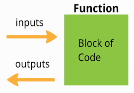
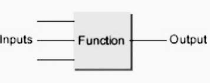
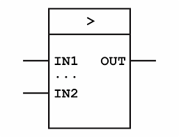
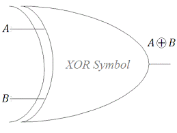
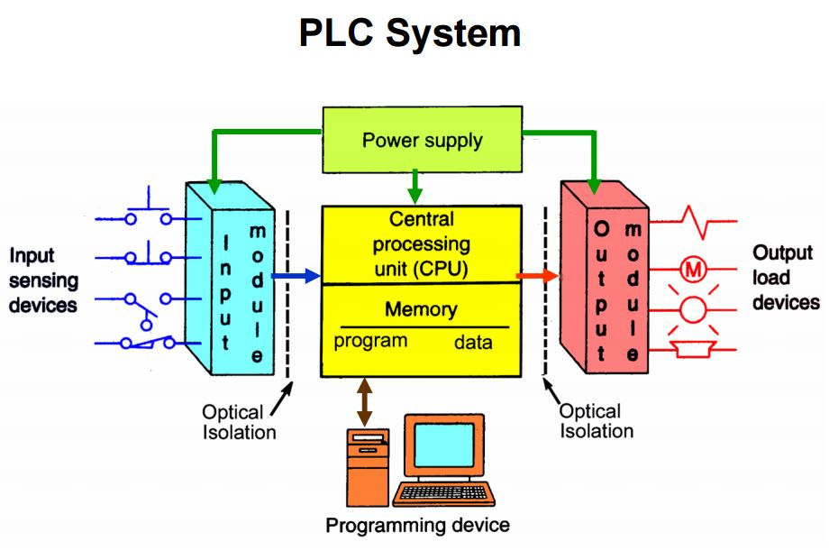
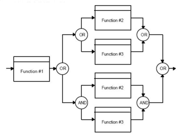
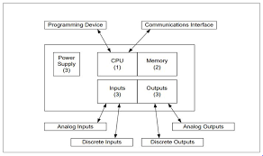

In this article, I'll introduce you to the concepts within industrial automation, the definition, the components and levels, and the different types of networks used in each level. We'll also go through the different types of controllers used in industry like PLC and the programming languages. We have a lot to cover, so folks, let's begin.

This article is to introduce you to the area of industrial automation. If you have ever wondered how many factoring automate their processes or how the robots in industrial automations are programmed or simply want to gain the knowledge by knowing the terminology and the different areas within industrial automation, this article is for you. No previous knowledge is required, as I will take you through the concepts, and you will be learning about what industrial automation is, the different levels and components within industrial automation, the programming languages used, and we'll be focusing on the common languages, ladder logic, and a block diagram. And finally, introducing the OPC and SCADA.

Industrial automation simply means the replacement with computers, robots, and machines to that of human thinking. In another words, they simply do the work instead of humans and operators within industrial settings. So the definition of industrial automation is the use of set of technologies and automatic control devices for control systems such as computers and robots. These devices are used for handling different operations and control of industrial processes without significant human intervention. The word automation means to act of oneself or to act unadvisedly and it's derived from the Greek words auto which means self and word matos which means moving. Automation therefore is the mechanism for a system that moves by itself. So automation industry replaces the human involvement with the use of logic programming commands and powerful machines to achieve the desired tasks. Industrial automation components include controllers including different types like Programmable Logic Controllers PLC, Distributed Control System DCS, field industrial devices, industrial communication and networking, Human-Machine Interface HMI, Supervisory Control and Data Acquisition SCADA, and personal computers. Industrial automation system can be very complex in nature having large number of devices working in synchronization with automation technology. However, to simplify the concept, there are three main levels within the automation system, field level, control level, management and information level. Field level are the devices used within the field. Control level is the different type of controller used. Management and information level is the upper level where the logic and design is done.

Industries are now using computers to control and monitor the sequence of machines. Any controller cannot hear, see, and monitor processes by themselves as operators do so industrial control systems use industrial sensors to help the control perform their tasks and capabilities. Sensors within industrial field level check whether parts are present, size of the part, color of the part, and whether or not the product is full or empty, good or bad. Sensors are also used to ensure safety of the equipment, product and operators. A common classification of sensors is contact and non-contact. One of the simple ways to identify it is, if the sensor must contact a part to sense it, the sensor is classified as a contact sensor. Non-contact sensors can detect the part without touching it physically. An example is using limit switch on a conveyor belt. When the part moves the level of the switch, the switch changes its state. This is an example of non-contact sensor, vision sensor. When the part moves on a conveyor belt, the sensor detects the part without touching it. Another way to classify sensors is by analog and digital. Digital sensor has two states, on 1, off 0. The output is either on or off. If a sensor senses the object, it gives an output of 1 and the output is usually connected to a PLC input. Light sensor is an example. Analog sensor can provide more information about the process. Temperature sensor is an example where a temperature sensor gives a wide range of reading. The analog sensor sense the temperature and send a current to the PLC. Pressure sensors and level sensors are examples of analog sensors and usually give an output of 4-20 milliamps. Here are examples of different types sensors used in industrial automation, temperature sensors, level sensors, proximity sensors, light sensors/fiber-optic sensors, displacement sensors, vision and photoelectric sensors.

There are many communication networks used with a control system in industrial automation. The networks are called industrial networks referring to the applications where they are used with an industry. Here are some of the industrial network types, DeviceNet, Modbus, HART Communication, PROFIBUS, Ethernet, ControlNet. The communication networks are based on the OSI, Open Systems Interconnection, reference model. The OSI model was introduced by the International Organization for Standardization, ISO, in 1984. It is a conceptual model of how various components communicate in database networks. It is a seven-layer model. Each layer represent a different level of communication and provide support to the layer above it. The layers are physical, data link, network, transport, session, presentation, and application. The OSI model is not itself a communication network standard like Ethernet, rather it's a framework under which the various network standards can operate. The OSI model specifies the characteristic of various network standards so it function as a standard for data communication standards. A common classification of industrial networks is having three main networks with industrial settings, device, control, and management network, the network that regulates the devices within the field level, the network that regulates the controllers, and the network that connects the application and management layer. The first category of industrial network is the one within information and management level. An example is Ethernet. Ethernet is the most widely used protocol at the application management level of communication networks due to the use of computers with industrial settings. Ethernet is a standard by IEEE known as IEEE Standard 802.3. Ethernet is popular because it's fast, inexpensive, and easy to install. Ethernet IP is a communication standard supported by Open DeviceNet Vendor Association, ODVA, and ControlNet International Association. Ethernet TCP/IP where TCP means Transport Control Protocol and IP means Internet Protocol. It is an application layer industrial protocol that is built on the standard of TCP/IP stack. Ethernet IP uses a standard Ethernet hardware and operates over Ethernet using the Common Industrial Protocol, CIP, ControlNet, and DeviceNet, and the TCP/IP protocol stack. Here's an example of how to implement Ethernet protocol and Ethernet IP with industrial settings where it's used to connect computer to the controller devices, a PLC as an example, and to connect to linking devices.

To continue the discussion about the three main networks within industrial settings, the second category is industrial network within the control level. An example of control level is ControlNet network. ControlNet is an open industrial network protocol for industrial automation applications, also known as Fieldbus. ControlNet is an open network that supports both field devices and control level communication used for real-time data transfer for time-critical and non-time-critical data between processors or input and output on the same link. ControlNet was developed by Allen-Bradley and managed by ControlNet International Organization of Vendors since 1997. Since 2008, ControlNet management is handled by Open DeviceNet Vendor Association, ODVA. For ControlNet, being an open network, hardware from many vendors can be purchased and connected to as a node to the network. It can connect up to 99 nodes. Each is having ControlNet communication interface. The nodes can be variable frequency devices, control valves, sensors, and controllers or PLCs. In ControlNet Fieldbus systems, only session layer is missing from the OSI model. ControlNet communication is a high-speed network used for transition of time-critical application. Here are examples of devices and products of ControlNet provided by Allen-Bradley.

The device level network, is the lowest level. It consists of a (inaudible) four devices. Many device level networks are available. DeviceNet is one of them. DeviceNet is an open network protocol based on CAN technology. It was introduced in 1994. DeviceNet is an implementation of the Common Industrial Protocol (CIP), for industrial communication networks. Developed originally by Allen-Bradley, and now DeviceNet is managed by a group called Open DeviceNet Vendors Association (ODVA). DeviceNet is an open network used mainly for the connection of industrial controllers and inputs and output devices. Low level devices, such as sensors, valves, push buttons, and variable frequency drivers. And because it's an open network, devices or nodes from many different manufacturers, can be used. Here are examples of devices and products of DeviceNet network provided by Allen-Bradley. A DeviceNet network can have up to 64 devices or nodes. Address is from zero to 63. The second example of industrial network is the HART Communication Network. HART Communication is bidirectional communication protocol that provides data access between field devices and controlled systems. Bidirectional communication is to send and receive from the devices. HART is an acronym for Highway Addressable Remote Transducer. HART uses Bell 202 frequency-shift keying standards, FSK, on top of 4-20 mA. The HART protocol is often called the hybrid protocol because it combines analog and digital communication. The HART protocol communicates without interrupting the 4-20 mA signal, and thus, allowing the master application to get more digital updates from the smart field device. This way helps enable two-way field communication from and to the device. Here's an example of connecting a Field HART pressure sensor device to a master application, a PLC, a DCS, for example, using a HART communication. The third communication protocol is a PROFIBUS communication. PROFIBUS is a protocol introduced by a fieldbus working group in 1987. It is supported by PI, PROFIBUS and PROFINET International. Using a single bus cable, PROFIBUS links a controller, or control systems, with decentralized field devices, an example is sensors or actuators on the field level, and also enables consistent data exchange with the higher ranking communication systems. There are two types within PROFIBUS protocol. PROFIBUS DP is a high-speed data network for factory automation. A PROFIBUS PA is a communication system for a PROFIBUS automation application. This is an example of how a PROFIBUS communication is structured. A PROFIBUS DP device is connected to the control system using a single cable. A PROFIBUS PA, however, uses a DP/PA coupler to be connected to the control system.

Control and management level. The basic function of industrial automation controllers is to examine the status of inputs and in response, control some processes or machines through outputs. Control level is the second level within an industrial automation system. It basically controls the flow of data from the device level to the management level according to certain logic or program. The logic combination on inputs to produce an output or outputs are called control logic. The common industrial controllers are: distributed control system (DCS), programmable logic controller (PLC), and PC-based control. Distributed control system (DCS). DCS is a platform for automated control system used to control complex, large, and geographically distributed applications in industrial processes. Where controllers are distributed through the entire planet area. A DCS combines the following into a single automated system: a human-machine interface (HMI), logic control and solvers, supervisory control, alarm management, and a common database. In DCS systems, controllers are distributed through the entire planet area. Programmable logic controllers (PLC). Programmable controllers are industrial computers which control devices by continuously monitoring the state of the input devices, and controlling the state of the output devices. Programmable logic controllers (PLC) and Distributed Control Systems (DCS). Programmable logic controllers and distributed control systems are used to send, receive, and process data from sensors, control valves, and actuators as part of the control system. Both systems share the following components: field devices, input and output models, controllers, human-machine interface (HMI), engineering supervisory control, and a business integration. DCS does not monitor items, it monitors a whole process, and it can monitor multiple processes at the same time. The response time is slow compared to PLC. The PLC, on the other hand, monitors discreet things. It has a high speed response compared to DCS. PC-based control. PC-based controllers are used for a simple control system where a computer can be used to control a device or multiple devices within an industrial area. Computer software programmers develop an application that can be used in the control system. One of the advantages of using computers due to their graphical capabilities, the software systems are easier to use in the development of the logic. The data collectives can be easily transferred to spreadsheets, word processors, or any other analysis software. It is also easier to connect computers to a LAN network within the area. Management level. Management level includes different types of software application programs for process control. The gathering of data in a real time from a remote location in order to control the process. The management level usually acquire data from remote devices such as valves, pumps, transmitters, etc., and provide an overall control remotely from the host software platform.

## Programmable logic controllers (PLC)
Programmable logic controllers, PLC. PLC is an acronym for programmable logic controller. PLC is an industrial computer control system which controls devices by continuously monitoring the state of input devices and makes decisions based on a logic program to control the state of an output device. Incoming control signal is called an input. A signal going out of the PLC to control a field device is an output. PLC is a special form of microprocessor base controller that uses programmable memory to store instruction to control machines and processes, sends, receives, and processes data from and to the field devices. PLC monitors discrete things. It has a high speed response, so usually they're used in applications where high speed response is required, like manufacturing processes, industrial applications, and some traffic systems. Basically any application that needs a regulation of an input and an output.

#### Main components
The main components of a PLC system are power supply; controller CPU; I/O system, inputs and outputs; and PLC programming software. Most PLCs need one or more power supplies for the CPU and sometimes for the inputs and outputs. Usually all the PLC manufacturers make a compatible power supply for their PLC. Controller, or Central Processing Unit, CPU, is the brain of the PLC. The CPU reads signals and follows the instruction that a programmer has stored in the PLC memory. According to the program, the PLC turns certain outputs or field devices. The CPU has different operating modes, programming and a run mode, and usually has LEDs or screen showing on the controller module within the PLC to show what mode is the PLC currently operating. In a programming mode, the CPU accepts and downloads logic from the PC. The CPU is then placed in a run mode so that it can execute the program and operates the process. I/O system includes the inputs and outputs for the PLC. Input section is connected to field devices that provide input data like sensors, limit switches, pressure devices, et cetera. Input devices can consist of digital and analog devices. Output section is connected to the devices that need certain logic according to the program within the PLC. Output devices can also consist of digital and analog types. Digital output card either turns a device on or off. Examples are lights, LEDs, small motors, and relays. Typical analog output signals can range from zero to 10 volts, four to 20 milliamps. Examples are mass flow controllers, pressure regulators, and position controllers. The I/O system provides the physical connection between the equipment's devices and the PLC. Software is the component where the logic is done to run the PLC. PLC simply follows instructions stored in the memory. These instructions are usually programmed by a PLC programmer and sent to the PLC during the programming mode. Two common methods for PLC programming, ladder logic, and a block diagram. PLC components are mounted on a chassis, rack, or baseplate where the power supply, CPU, inputs and outputs modules are placed. In a PLC the I/O and the components are plug-in type removable units called modules. Different type of modules for each specific task like inputs and outputs, communication, and power.

#### PLC programming languages
PLC programming languages. IEC 61131-3, international standard that defines PLC programming languages and concepts. This defines the specifications required for languages that operates the programmable logic controllers. Programming languages are divided into two main sections to represent the five main programming languages, a text-based and a graphical. Text-based, instruction list, structured text. Graphical, ladder logic diagram, function block diagram, sequential function chart. Two common methods for PLC programming is ladder logic and block diagram. So the standard explains the format, the syntax, and display for the five PLC languages available. Each language is used and best suited for certain types of applications.

#### PLC programming: Block diagram
Function Block Diagram, FBD. Function Block Diagram is a graphical programming language used for PLC programming base on functions and function block composition. It shows a graphical representation of executable code. It consists of a series of blocks representing instructions connected by lines called wires. A function block is represented as a rectangular block with inputs entering from the left and outputs emerging from the right. 

The function block type name is shown in the box where the block function name is written, as well. 
Examples, AND function block,

OR function block, 

XOR function block, 

notice the name and the different inputs and outputs for each block. This is an example of a ladder diagram program and equivalent function block diagram. You can see that it shows the same process but only using block instead. Here's an example of multiple blocks used to represent a logic within the programmable controller. 

The type of a block is written inside the box. The name of the function block in the system is shown above it and using wires to connect the outputs to the input of the next block. The way that you read the program is from left to right. Here's an example of a function block diagram within the software, notice the different blocks used to represent the whole process.

#### PLC programming: ladder logic
Ladder logic diagram is the primary programming language of a programmable logic controller. These symbols are interconnected by lines to indicate the flow of the current through the relay. The complete program looks like a ladder, but in reality, it represents an electrical circuit. The left and the right rails indicate the positive and the ground of the power supply. Electrical current flows from the left to the right. Each line is called a rung. The rungs represent the wiring between the different components and the electrical circuits. Ladder logic is a programming language that creates and represents a program through ladder diagram that is based on a circuit diagram. PLC program is set on instructions that are stored in the memory. Instructions tell the PLC what to do with the input signals and where to send the output signals.

#### Human machine interface(HMI)
An HMI is a software application that presents information to the users about the state of the process and also to accept the user and control instructions. HMI provides a graphical representation of the control system process and provides real time data acquisition. It monitors data and make it available to users, as well as provides an interface for inputs from the users. One of the advantages that HMI provides is that they provide an interface between the user and the machine within the factory floor, a centralized control unit and a local interface of the process for quick monitoring and adjusting. So as the name implies, HMI, human-machine interface allows humans and machines to interact. The size of HMI varies. It depends on the different locations, as well as the vendors. Here are some examples of human-machine interfaces provided by Allen Bradley and Siemens. 

This is an example of a built-in HMI interface used for monitoring a continuous process for a mixing project. This HMI takes inputs, the status of the valve and presents output like the level of the tank. HMI can be a small device or built-in within the system.

#### Open platform communication(OPC)
OPC stands for Open Platform Communications. OPC name was originally referred to OLE for Process Control, object linking and embedding for process control. Both names are still used in the industry, and mean the same thing. The OPC Foundation is responsible for the development and the maintenance of this standard. OPC is the standard for secure and reliable exchange of data in industrial automation and in other industries like industrial alternative things. It ensures the seamless flow of information among devices from multiple vendors. OPC is implemented in a server/client pairs. The OPC client and OPC server relationship is a parent/child one, where the server is the parent and client is the child. So let's see what an OPC client means. An OPC client is basically any device or software that the data are going to, either to be collected, analyzed, or to be sent somewhere else. An OPC server is a software application that has been written to one of the OPC specifications. An OPC server will respond to requests and provide data to one or more OPC clients. OPC clients can interface with and request data from any OPC server, regardless of the vendor. In a parent/child model, the parent application controls one or more other applications, the children. Once the parent/child relationship is established, the direction of control is always from the parent to the child, which means one OPC server will only transfer data to and from a data source if an OPC client commands it to. Again, OPC server is the parent and OPC client is the child. The OPC server is a software program that converts the hardware communication protocol used by a PLC into an OPC protocol. The OPC client software, on the other hand, is any program that needs to connect to the hardware, such as an HMI, for example. The OPC client uses the OPC server to get data from or send commands to the hardware. One of the main advantages of using OPC is the ability to connect different controllers from different vendors, and to enable the communication between them. So if a field device is connected to one or multiple controllers, for example SIEMENS or ABB, the data is transferred from the devices to the controller and from the controller to an OPC client where all data from different vendors are accessible using one place. The data collected from different vendors can then be used for different applications. HMI, SCADA, or just simply stored in database. One of the greatest uses of OPC protocol is to transfer data over a network and overcoming the security problems. So OPC communication protocol is a powerful tool that is used in an application where the need to access data from any data source and then present them in any other devices. The value of OPC is that it's an open standard, which means any OPC client can interface with and request data from any OPC server, regardless of the vendor. Connecting DataHub demonstrates the OPC connections in a simple way to understand, so let's go over the different scenarios that an OPC connection can happen. The first one is a typical OPC connection scenario where a single server client connection on a single computer. The second scenario is an OPC client connected to many OPC servers, and that's called OPC aggregation. When an OPC client is connected to an OPC server over a network, this is called an OPC tunneling. When an OPC server is connected to another OPC server to share data, this is called OPC bridging. In many cases, the controller has its own server, and can be used as an OPC server that can be demonstrated to an OPC client. So here's an example of using DeltaV system where DeltaV has its own OPC server, then using DataHub application to connect to another OPC client over a network.

#### OPC software
So let's take a look at some of the open source OPC Softwares that are used in industrial automation. Please note that usually manufacturers provide an OPC server to their products and applications. OPC Cogent DataHub is one of the OPC softwares. The Cogent DataHub can act as both OPC server and client at the same time. This means it can read from multiple OPC servers while acting as a client and make this data available to any OPC client while acting as a server. You can download a demo and it only runs for an hour if you'd like to try it. So here's an overview of what the software looks like. As you can see, this is a Cogent DataHub server. You can see the different OPC options, OPC UA, OPC DA, OPC A and E, WebView, Web Server, Database, and many other options. OPC A and E server stands for OPC Alarm and Events. Under the OPC A and E, you can select if you want the OPC to act as an client to many servers by checking the box under OPC Alarm and Event Client. You can configure an OPC A and E server by specifying the connection name, OPC server name, and data domain, and select the proper options for your application. To connect an OPC client to an OPC server over a network, tunneling across a network where you can specify the primary host, the secondary host, and the different ports needed as a remote server. Bridging when you want to connect an OPC server to another OPC server to share data. You need to configure bridges by specifying the source and destination. Then under the Transformation section, you need to select the proper options to your project. For transform, examples like Direct copy, Linear Transformation, and under the Direction section, you can specify whether it's a forward source to destination or inverse destination to source. Know that you can download a demo and it runs for an hour if you'd like to try it. More information about each function is available at the website. KEPServer is another example of an OPC software. KEPServer is provided by Kepware. This is how a KEPServer looks like. In Kepware server, different functions are available too like Alarm and Events, Data Logger, IoT Gateway, and many more. Under each project, there are many tasks like connectivity for example. This specifies the channels and each device connected to the server. When adding a new channel, different types of controllers are available to be used from different vendors. And when adding a new tag, you can specify the address of each tag used in order to save the data or to be sent out. One last note, you can use both servers on the same machine and configure each one separately. One as a server and one as a client or any other preferred method.

#### Supervisory control and data acquisition(SCADA)
SCADA is an acronym for supervisory control and data acquisition. The major function of SCADA is for acquiring data from remote devices, such as valves, pumps, transmitters, et cetera, and providing an overall control remotely from a SCADA host software platform. This provides process control locally so that theses devices turn on and off at the right time and a remote method for capturing data and events for monitoring these processes. SCADA host platforms also provide function for graphical displays, alarming, trending and historical storage of data. A typical SCADA system consists of SCADA master that is connected to either a remote location unit that contains controllers, remote terminal units or PLCs or connected locally to a local location unit that is connected to a control system. It could be either a PLC or DCS and off field devices. SCADA was traditionally used for data collection from PLC and floor controllers. SCADA systems were used for monitoring and supervisory control for processes. The role of SCADA now expanded. They are a vital part of many manufacturer information systems. They provide manufacturing data to many other software systems in a typical manufacturing settings.

#### SCADA components
SCADA components. SCADA systems consist of field data interface devices, communications network system, controllers like PLCs or DCS, et cetera, SCADA host software, and master terminal units. The basic SCADA architecture begins with any type of controllers like PLCs, or Remote Terminal Units, RTUs. PLCs and controllers are microcomputers that communicate with field devices to provide information to the computers within SCADA software. The SCADA software processes, distributes, and displays the data, helping operators and other users to analyze the data and make important decisions. So this is an example of a simple temperature control system, consists of a temperature sensor of a tank within a manufacturing setting. The temperature sensor is connected to a controller, PLC for example. A Rockwell Automation PLC takes input from the sensor and controls output, a heater in this example, to adjust the temperature. Usually the input connected to a PLC have an address. An example of an address to a PLC would be like I:3/15 to indicate slot three input 15. An output is O:7/8 which is an output in slot seven output eight. The data then gets sent to an application within the SCADA software for data analysis. It can be established as a client and server between the application and the controller. The data received by the SCADA application can be used in the same program or different other programs like Database, Excel, Access. And based on the algorithm, it sends an output as a response. The whole system represents a SCADA system with its components.