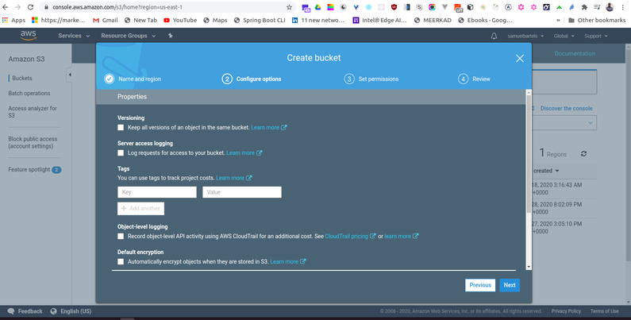

We are going to learn how to standup a filestore using AWS S3. We will be creating a simple bucket which will be using within our project for persistent image and media storage. 

We will start by opening our AWS management console. Here we will search for the S3 service


and lunch into our main console for S3


Very simply, we will create a bucket and we will give this bucket a name. This name has to be universally unique across the AWS cloud platform. So you might have to try a few things before it gives something that is like this. Let's go a head and say ```kojobartels```.  This will be our ``kojobartels`` bucket.


I am adding ``dev`` to the end of these resources because i want to have a separate set of infrastructure for our development system and for our production system.  When we finally ship our software, we will a second bucket stood up and a second database stood up for production. This ensures that if i break things which i do a lot, i won't break things for my active users. 

So let's go ahead and continue, we have our bucket name, we will select our region. I am fine with our default, and we are not copying any settings for this bucket.  



We won't have versioning but this is useful if you are expecting a lot of things to be changing and you want to be able to go back in time.  And we will not log access for this bucket but that might be helpful for you as well if you need to audit who is accessing data or if you have some kind of debugging although S3 is a little bit complicated to debug there is not much you can do within the actual S3 service.  We will also keep the default for ``object level-logging`` and we can add some encryption to our data. This is a really important feature that will help you to develop more secure enterprise level types of products. For now we will use ```AES-256``` which is just a standard encryption and that is very popular. 


For permissions, for now we will it as default as well. This will allow you to specify who can access the information and what they can do with it. Now we are standing up a bucket that we will be primarily be using from within our application and we don't want this to be publicly accessible. This would be a problem if we had a bucket with a public facing endpoint and anyone can just download the information. Instead we will be using a signed URL pattern to put new data into the bucket aand get information out of our bucket. 


Continuing, we can quickly review that everything looks happy and and i think we are good. 


Lets go ahead and create that bucket and that's it. 


We can click into our bucket and see its empty. 


We can also using the GUI, add or remove files.  Let's go ahead and click ``add a file`` and let's just add our README for the sake of showing how simple it is to work with this kind of system. Our item is now uploaded and its now accessible within this S3 bucket. Anyone else who is on our AWS system with IAM credentials and can access this bucket, now has permissions to see this file. 


Now, we need to do one additional thing thats a little bit complicated. In order to use our signedURL pattern, this is called CORS.  Cross origin resource sharing which i usually forget what it stands for but thankfully there is a little pop, defines a way for clients and web applications to talk with one another and rejects certain requests from outsiders. 

By default, your S3 bucket will not allow requests from any old domain, instead we have to add a CORS policy to allow certain hosts from accessing this type of information. 


We are going to go ahead and open our [basic server](https://drive.google.com/drive/folders/1RVOG76ka8QcGGOHg8kxy7wLJvoHtEtPo?usp=sharing) repo and i have given you an example CORS policy written in XML. So just in the root of the repo, we have ``s3_cors.xml``. You can go ahead and copy that file file's content 


And paste it into our cors policy. 


Taking a quick look at this file, we see we are allowing origin of ``*`` which is basically allowing any requests from whatever URL or whatever hosts to perform these actions; ``POST, GET, PUT, DELETE, HEAD``. We are also allowing different types of headers which would accompany that kind of request body. Lets go ahead and save that CORS configuration and that's it, we are good to go. 

We will now be able to consume this resource within our application using the signedURL pattern. 