There are so  much information out there on cloud computing and how to deploy app to aws elastic beanstalk, however, there is very little in terms of how you can get started with your first step. 

I've seen many students and professionals struggling and being overwhelmed when they're beginning to pursue their data cloud computing career. 

In this article, we will cover, how to deploy a web  application to AWS  using Elastic Beanstalk.

Pre-requisites:
 - AWS Account
 - DOWNLOAD THIS: [WAR file](https://drive.google.com/file/d/1NTr2LtxTfXdmPOj2QSdH8xTSKciqP7BN/view?usp=sharing) containing the web application code

## Steps:
1. Access Elastic Beanstalk service from AWS Management Console
    - On the AWS Management Console page type ```elastic beanstalk``` in the ```Find Service``` box and then select ```elastic beanstalk```.

      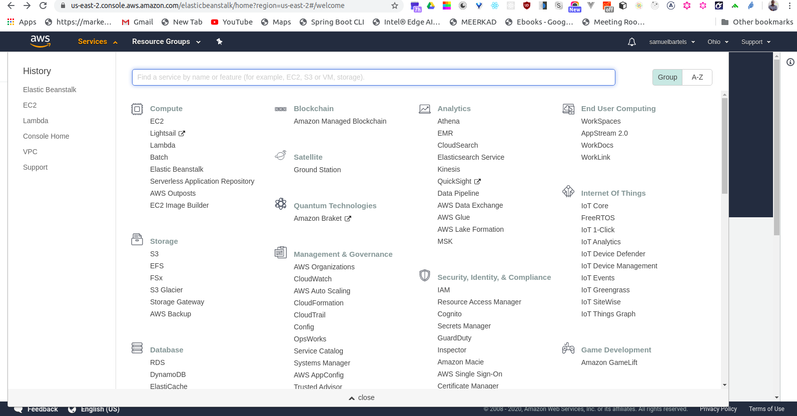

      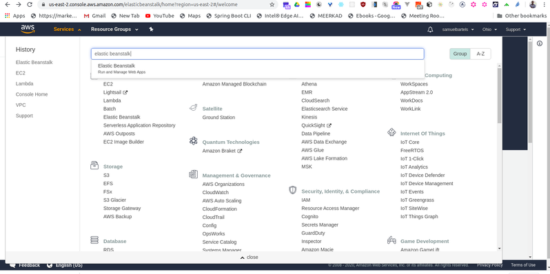
    
    - If this is your first time accessing Elastic Beanstalk, click the ```Get started``` button.

      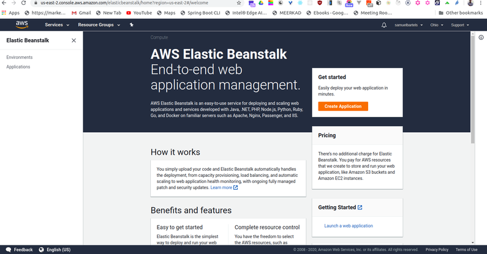

    - Enter an ```Application name```.

    - Under ```Platform```, click the dropdown for ```Choose a platform```. Select ```Tomcat```.

    - Under ```Application code```, select ```Upload your code```. Click the ```Upload``` button.

    - Under ```Upload your code```, make sure ```Local file``` is selected for ```Source code origin```.

    - Click ```Choose File``` and upload the downloaded WAR file (link above in pre-requisites), ```sam.war```.

    - Click the ```Upload``` button.

       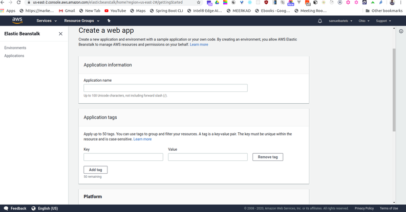

    - Click the ```Create application``` button. Important: It will take about 10 minutes for your application to be created. There are several resources that need to be spun up to support your application. Your application is created once you see a green check mark and the ```Health``` of your application is ```Ok```.

       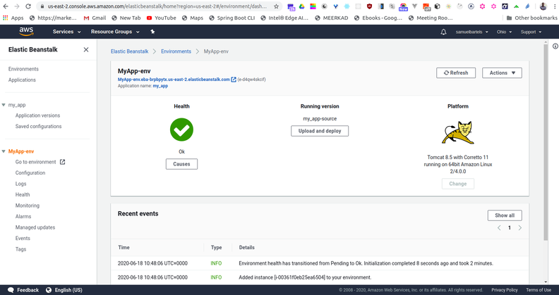

    - After the application is created, copy the application’s URL. Important: The URL can be found on the top of the page, to the right of your application’s name.

2. Test the deployed web application in a browser
    - Navigate to a web browser like Chrome or Safari.
    
    - Paste the application URL and append ```/message``` on the end of the URL.

    - Upon successfully accessing that URL, you will see the text ```Hello World``` in your browser window.

      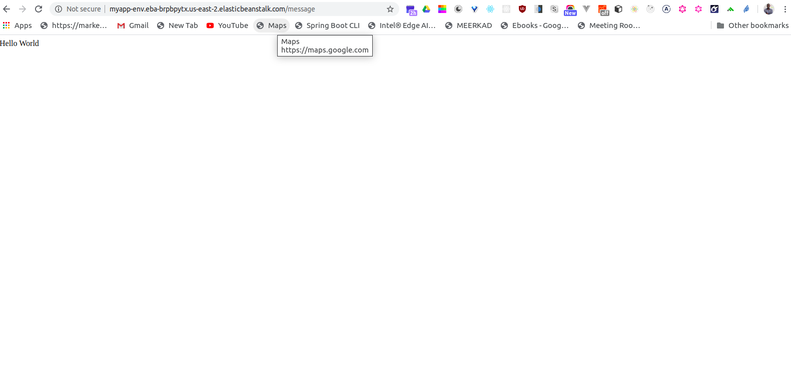

3. Inspect the EC2 instance created for you
    - Navigate to the EC2 console and inspect the instance that was created for you. The instance has the same name as your application. You can administer and manage this EC2 as if you created it yourself.

      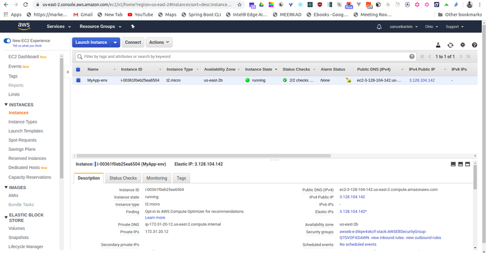

    - Cleanup and delete resources

    - To clean up the resources to avoid recurring charges, navigate back to the Elastic Beankstalk console.

      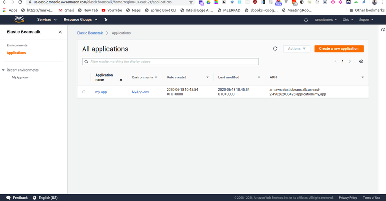

    - Select your application.

      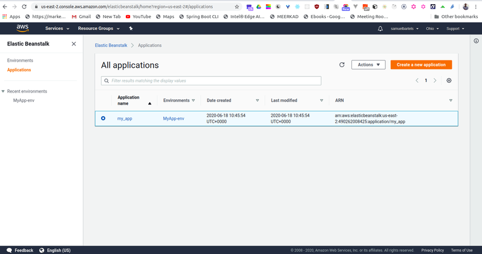

    - Select the ```Actions``` button in the upper-right hand corner.

      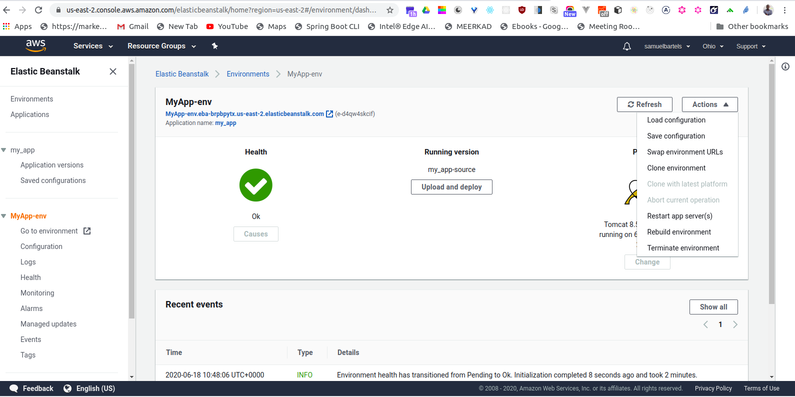

    - Select ```Terminate environment```.

      

    - Enter the name of the environment to be deleted.

      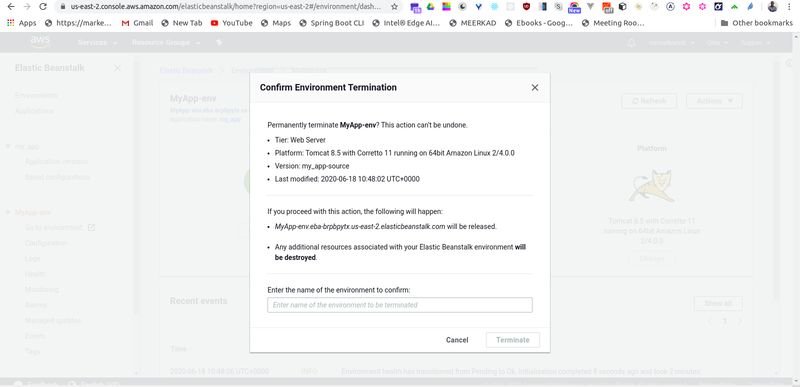

    - Click the ```Terminate``` button.

    - After the application is terminated, you will be brought to the main page for the application.

    - Click on the ```Actions``` button in the upper right-hand corner.

    - Select ```Delete``` application.

    - Enter the name of your application.

    - Click the ```Delete``` button.
