In this hands-on article, you will launch a virtual server in the cloud within a secure network. You will also manage additional storage options for your server.

## Prerequisites:
- AWS Account

By the end of this article, you will be able to:

- Launch a secure EC2 (Elastic Cloud Compute) instance within a VPC (Virtual Private Cloud)
- Manage an EBS volume

## Steps:
1. Access VPC service from AWS Management Console
    - On the ```AWS Management Console``` page, type ```vpc``` in the ```Find Services``` box and then select ```VPC```.
        
        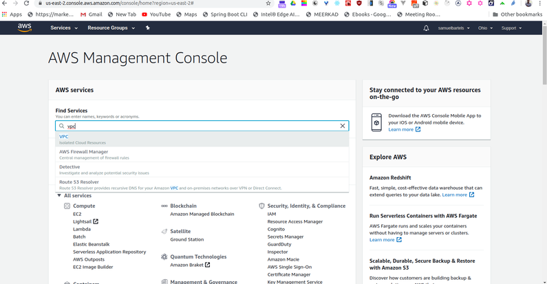

    - Click the ```Launch VPC Wizard``` button and select ```VPC with a Single Public Subnet```. Important: In the ```VPC Name``` text box, enter a name for the VPC, and then select the first AZ from the Availability Zone dropdown. Leave everything else as the defaults.

        

        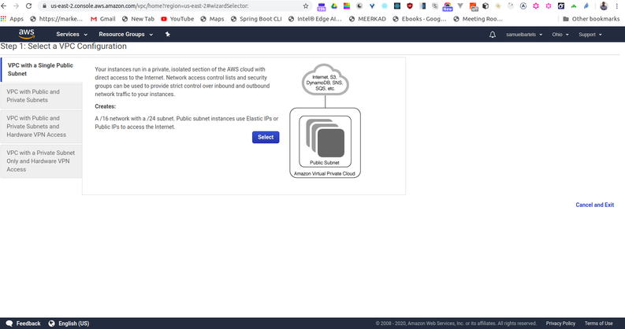

        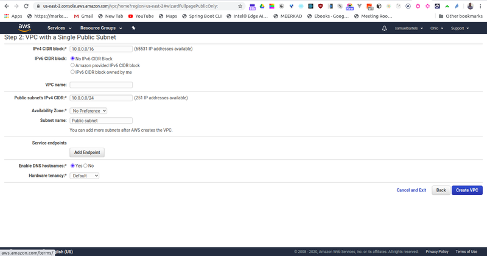

        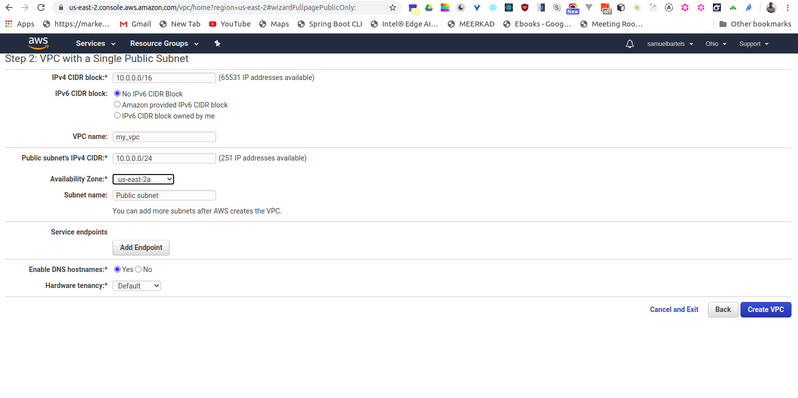

    - Select ```Create VPC``` button.

    - You should see the ```VPC Successfully Created``` page, click the OK button in the far right. Important: You should see a table that lists all of the VPCs, make a note of the one just created.

         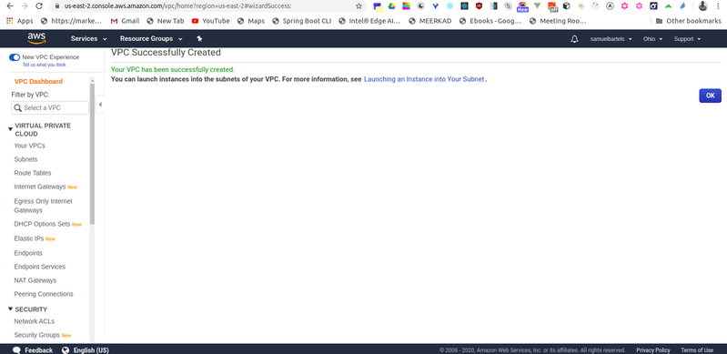

2. Launch an EC2 instance
    - Navigate to the EC2 console page, by clicking on ```Services``` in the upper left-hand menu. Type ```EC2``` in the text box and click on ```EC2``` found in the search results.

         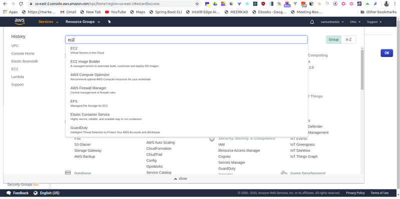

    - On the EC2 Dashboard page, click on ```Instances``` in the left-hand navigation.

         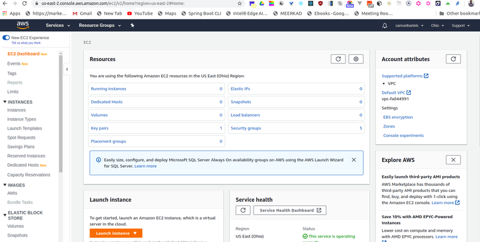

    - Click ```Launch Instance```.

         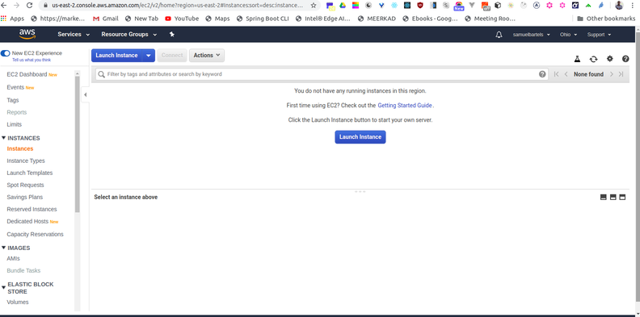

    - Select the ```Amazon Linux 2 AMI (HVM), SSD Volume Type Amazon Machine Image (AMI)```. Important: You are free to choose a different AMI, but to avoid excessive charges, pick one that says, ```Free Tier Eligible```.

         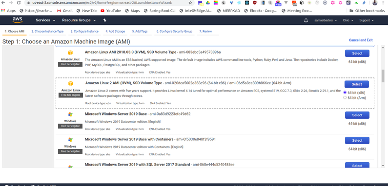

    - For the ```Instance Type```, select the free-tier instance type of ```t2.micro```.

         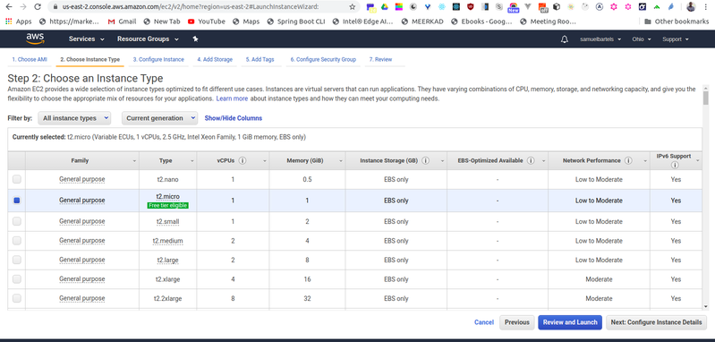

    - Click on ```Next: Configure Instance Details```.

         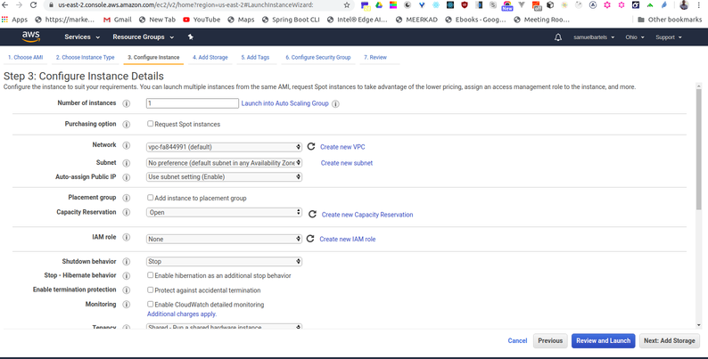

    - Enter the 1 for the ```Number of Instances```.

         

    - For Purchasing option, leave unchecked.

    - For Network, select the VPC that was created in the previous step, and then select the subnet in to which to launch the instance.

         

3. Attach an EBS volume
    -   Click on ```Next: Add Storage``` to attach an EBS volume. Important: Here we already see there is a root volume (or device) attached to your instance, this is an EBS volume. We are going to add additional storage.

         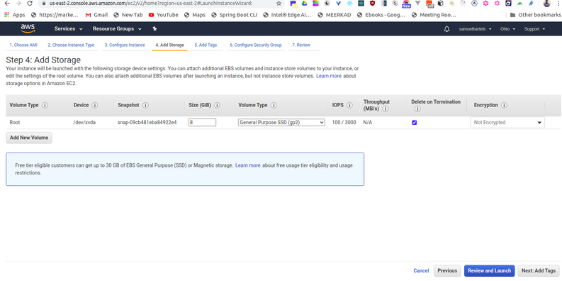

    - To attach additional storage, click on ```Add New Volume```.

    - Select ```Delete on Termination``` and keep the other default settings.

         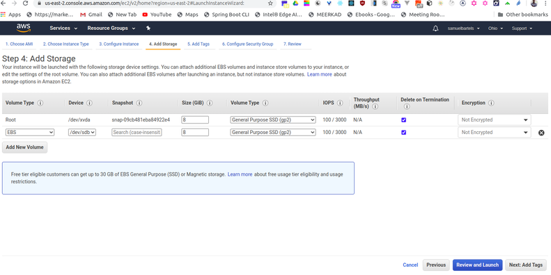

    - Click ```Review and Launch```.

         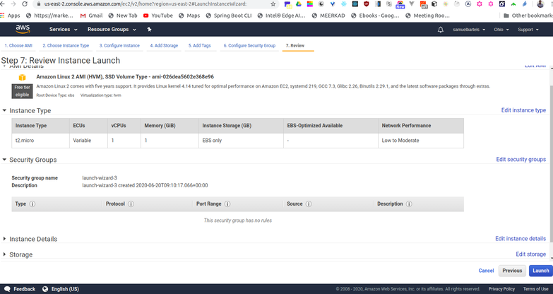

    - Click ```Launch```.

    - Generate and download a new key pair and then click ```Launch Instances```. Important: This will allow you to SSH into your instance from your local machine. This is a one-time process, so generate and download the new key pair now.

         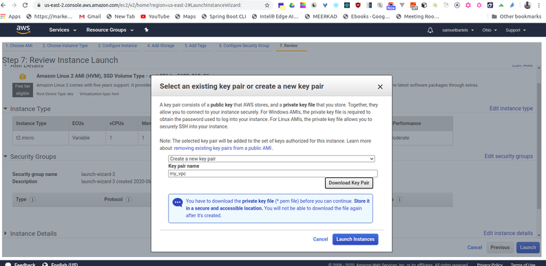

    - The launch will take a couple of minutes, select ```View Instances``` during the wait.

         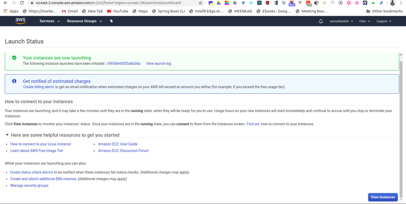

    - Check the instance state, it should say running.

         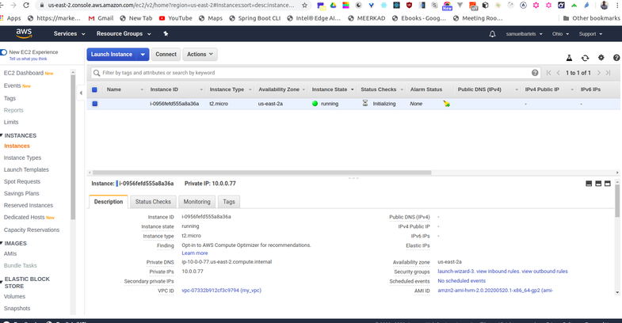

Congratulations! You’ve launched your first virtual server in the cloud.

4. Cleanup & Disable EC2 Instance To avoid recurring charges for leaving an instance running, let’s disable the EC2 instance and terminate the VPC

    - From the EC2 Dashboard, select the instance just created, click ```Actions```, then ```Instance State```, and then select ```Terminate```.

    - From the VPC Dashboard, select the VPC just created, click ```Actions```, then ```Delete VPC```.