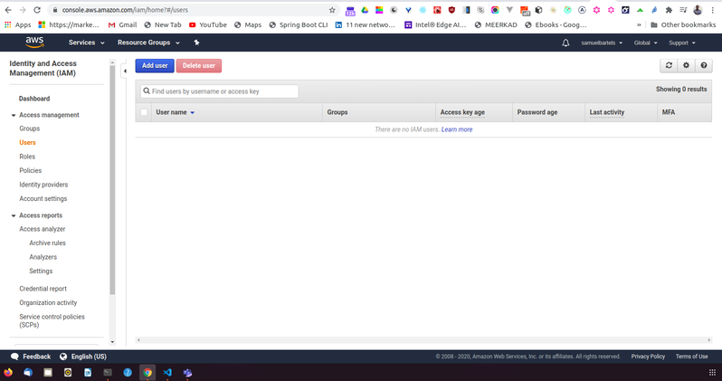
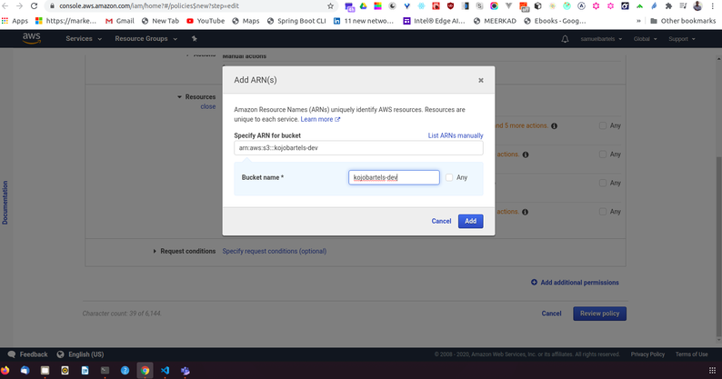

Lets open up the AWS management console and jump into the IAM service.


Here we have a few things to look at. First, AWS is doing a great job of helping us work through security and in a compliant way. And we are doing a great work yet but we will talk about some of the things that we will need to get to a good state. 

First, lets jump into users



We need to add a new user and even though i am just working working alone, it's usually a good idea to not use your root credentials for everything. Root credentials meaning just the username and password pair that you get when you signup with an AWS account. Instead even for ourselves, we should be assigning limited access just incase our main primary credentials that we use evryday are compromised, someone can go in and do ridiculous things. It's also a good idea to may be have multiple credentials for yourself, one that is for your development environment and one that allows you to access your production environment. By splitting up these user accounts, if one thing goes wrong, the other thing is fine. 

Let's go ahead and click ``Add  user``


We will type in our new name so i am going to say ``kojobartels-dev``. We can now choose between ``Programmatic access``. This will allow me to use things like the AWS CLI or other types of automatic systems that i don't necessarily need to log into the console for. If i do want to log into this console , i can also do by checking off the ``AWS management console access`` 


We can now add a user to a group, copy permissions from a user or attach policies directly. It's good practice to add your policies to a group so that multiple developers or multiple services with similar needs can simply be assigned to that group.  


So let's go ahead and try that. We can create a group and we will call this ``kojobartels-development``. We will be using this to store multiple credentials for various services in our development environment. Let's go ahead and add one. 


We are going to create a policy which is going to open a new tab and we are going to allow access to our [S3 bucket](https://kojobartels.com/creating-an-s3-bucket-in-aws/) that we have created in the previous article.

Now we only want this account to have access to that one S3 bucket. Not to our production bucket and not any other buckets that might exist within our AWS system. 


We choose our service which is ``S3``. For now we will choose all of our actions. 


And now we can specify specifically which bucket to add to. 

Amazon uses something called an ```ARN```; Amazon resource name, to control access to specific resources. We can go ahead and use our bucket that we have created earlier by navigating to our S3, choosing our bucket and copying that bucket name and pasting it in the field provided will generate our ARN for that bucket.  We can click ``add``. 




We can then select specifically if there are object restrictions or the items are documents within that bucket that we are allowed to access.


Then we need to enter our bucket name. And we will choose ``any`` so anything that is in this bucket we can access. 


For now we will leave request conditions as the default and we will review our policy. 


Give this a name so this will be ``kojobartels-dev-media-s3``. And we will just make sure everything looks good and create a policy. I will leave the description empty for now. 


Come back into our create group,  so back into our first tab, we can refresh and we can search for our policy for our bucket so this will be ``kojobartels-dev-media-s3``.


Now we can see our policy written in its native JSON format.


But for now we just hit ``create group``.


Now we are choosing to add only one policy to this group but we can add more than one policy as well. So as we begin to add more services for our development environment, we van add more policies to allow those groups to access those resources. Let's say for example, we had videos and we wanted to save that in a separate S3 bucket because that would be more organised for us, we can just add a new policy for that bucket to allow our development group to access that bucket. 

Similarly, we can have more diverse services if we have more different types of EC2 instances or RDS servers or whatever else we are using within our development environment, we can add policies directly to this group and any user that has access to this group will have access to those resources. 

And that's it, you've created your first AWS IAM user profile for your development environment. 


IAM is a super powerful tool and is a lot of options and features but you should begin to get into the habit of using it whenever to become a better cloud engineer. 