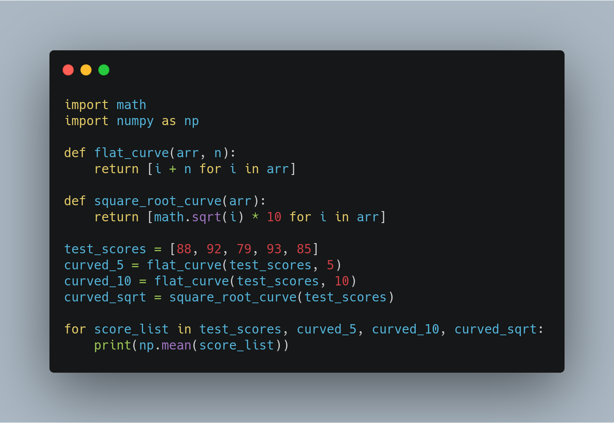
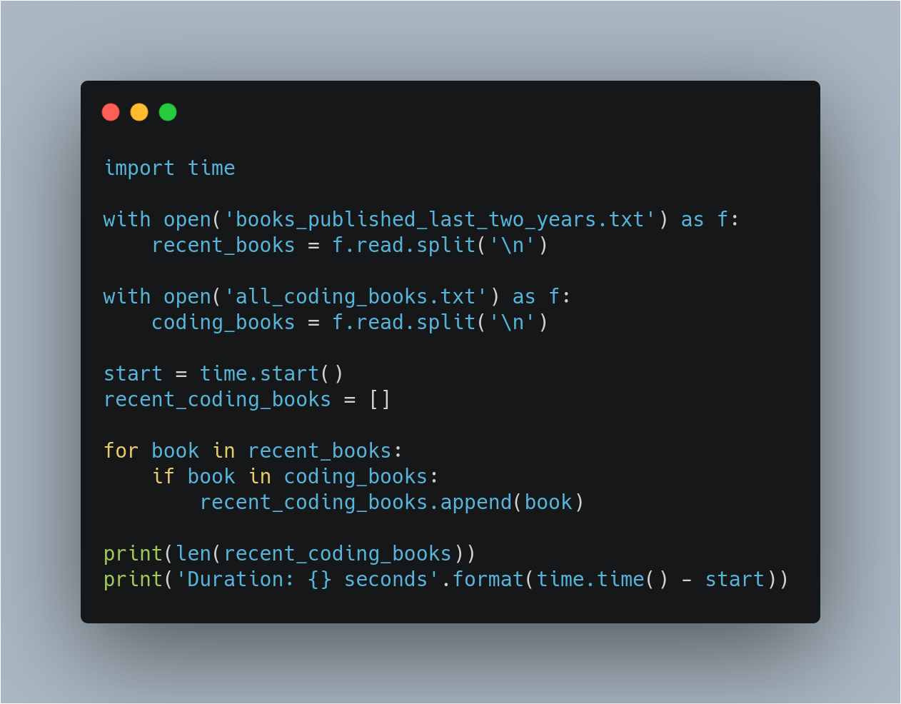

In this article, we will go over a few techniques that we can adopt as software engineers to be better developers and prepare for production level code.

We will learn how to write clean and modular code, improve your codes efficiency document effectively and use version control. These are all essential skills to develop as a programmer and will really help you when implementing production solutions.  In addition, software engineers often work side by side with data scientists and it is important you work well together. This means being familiar with standard practices and being able to collaborate effectively with others on code. Let's walk through each of these practices and learn how they are applied as a software engineer.

The first practice we will talk about is writing code in a way that is ``clean`` and ``modular``. Software engineers often struggle with this when they first start coding or even if they have been coding for years in a more research or academic setting. When you are working in industry, your code could potentially be used in production. Production code just means code that is run on production servers. For example, when you are on your laptop using software products like Gmail, the code that is running the servers you are using is production code.And ideally, code that is being used in production, should meet a number of criteria to ensure reliability and efficiency before it becomes public. For one, the code needs to be ```clean```. Code is clean when it's ``readable``, ``simple`` and ``concise``.  Here is an example in plain english of a sentence that is not clean. 
```
One could observe that your shirt
has been sullied due to the Orange color on your shirt
that appears to be similar to the color of a certain kind of juice
```
This sentence is terribly redundant and convoluted. Just reading this makes me frustrated. This can be re-written as 
```
It looks like you spilled orange juice on your shirt
```
And accomplish the same thing but this sentence is much more concise and clear. Writing clean code is very important in the industry setting. I am on a team that is constantly iterating over its work. This makes it much easier for yourself and others to understand and reuse your code. In addition to be clean, your code should be modular, meaning your program is logically broken up into functions and modules. In programming, a module is just a file. Similarly, to how you can encapsulate code in a function and reuse it by calling the function in different places, you can encapsulate code within a module or file and reuse it by importing it other files. We will see examples of this later. To get a better understanding of what modular code is, try to think of it as putting your clothes away. Sure, you could just put all of your clothes in a single drawer but it wouldn't be very easy to find anything and maybe because you can't ever find anything, you have multiple versions of the same shirts or socks because you repurchased them when you couldn't find them. It will be much better if instead you had a drawer for T-shirts, another one for just shirts, another for socks and so on. With this design, if you needed a nice outfit for an interview, you don't need to worry about buying one just because you couldn't find the right clothes. And if you need to tell someone else how to find the righ shirt, pants and pair of socks, it would be much easier with this design. The same is true in writing modular code. Splitting your code into logical functions and modules allows you to quickly find relevant peaces of code. You can often generalize these pieces of code to be reused in different places to prevent yourself from writing extra unnecessary lines of code. Abstracting out these details into these functions and modules can really help in improving the readability of your code.

When you first sit down to start writing code, or new idea or task, it's easy to pay little attention to writing good code and focus more on just getting it to work. So your code typically gets a little messy and repetitive at this stage of development. This is OK. It's hard to know what's the best way to write your code before it's finished. For example, it could be difficult to know exactly what functions would best modularize the steps in your code if you haven't experimented enough with your code to understand what these steps are. That's why you should always go back to do some refactoring after you have achieved a working module. Code refactoring is a term for restructuring your code to improve its internal structure without changing its external functionality. Refactoring gives you an opportunity to clean and modularize your code after you have produced code that works. In the short term you might see this as a waste of time since you could be moving on to the next feature. However, allocating time to refactoring your code really speeds up the time it will take you and your team to develop code in the long run. Refactoring your code consistently not only makes much easier to come back to it later, it also allows you to resuse parts for different tasks and learn strong programming techniques along the way. The more you practice refactoring your code, the more intuitive it becomes. You will start to find yourself writing more organized code on your first pass with rest to be organized when you go back.

Now that you understand the importance of developing in a clean and modular way, lets breakdown what this means in code. The first tip for writing clean code is to use meaningful, descriptive names for your variables and functions. This can help you explain most of your code, without comments. Take a look at this code that initialises a list of students test scores, prints the mean, curves each score by multiplying its square root by 10 and then prints the mean of the new curved test scores. 


With this code, you wouldn't know what was happening right away without the comments. See how this compares to this cleaner code which conveys the same purpose without the comments.


Now we what both of these lists stand for without the comments which will help us throughout the program wherever these variables are used. We also use the function with a descriptive name ``mean`` instead of running a calculation each time. This not only helps readability but follows the ``DRY principle``. That is important to providing modular code. In addition, we imported the ``math`` module to use its square root method instead of raising each score to 0.5** which isn't only more readable but also faster in python3. Try testing how effective your names are by asking a fellow programmer to guess the purpose of a function or a variable based on its name without looking at your code. Coming up with meaningful names often requires efforts to get right. Here are some guidelines: 
- Be descriptive and when appropriate try and imply the type of whatever you are naming. Notice we called this list ``age_list`` instead of ``ages``

    

    which helps us avoid confusing the integer ``age`` and list of ages later in this code. For boolean, it's often helpful to prefix the name with words like ``is`` or ``has`` to make it clear that it's a condition. You can also use parts of speech to imply types by using verbs for functions and nouns for variables. Normally, you don't want to use abbreviations unless the word would be used many many times. And you specially don't want single letter names. However, exceptions include names for counters such as ``i`` as well as common variable names using math like ``x``, ``y``, ``t`` and so on. Choosing when these exceptions can be made, can be determined based on your orient for the code. If you work with other software engineers, certain variables may be common knowledge. Whilst if you work with fullstack engineers, it might be necessary to provide more descriptive names in these cases as well. However, long names do not always mean meaningful names. You should be descriptive but not with more characters than necessary. 

    

    This first example is very robust. This function computes the number of unique values in a list regardless of what that list is. So we can generalise and remove ``of_names_list`` from the function name and replace the argument name with ``arr`` which is standard to represent arbitruary array. In addition, implementation details are unnecessary to include in a function name. So we can remove ``with_set`` from the function name as well. The resulting function is much more clean and concise whilst still being decriptive.

- Another tip for writing clean code is to use white space properly. Code with poor or inconsistent spacing is the worst. Take a look at this mess.
      
    If you were handed this code as a developer, the first thing you should do is to fix the white space and make it consistent. This is much nicer to read and work with:
    
    Organise your code with consistent indentation. The standard for python is using four spaces for each indent. Also be sure to separate sections with blank lines to make it easier to organise and read. And lastly, try to limit your lines to around 79 characters. 79 is the guideline given 

Writing modular code is a necessary practice in software development where you split your program into logical functions and modules. let's go over some guidelines to help you with this:
- Don't repeat yourself. Modularization allows you to reuse parts of your code. Let's go back to the example earlier on grading test scores
    
    Here, we have a list of test scores that we curved in three different ways. Say you are educator who gave out a question that was a little unfair. So you decide to figure out a way to your students scores. For the first two methods, we add a flat curve of `5.` sheet score and `10.` sheet score. In the third method, we applied a square toot curve where we find the square root of each score and multiply by 10. Right now it's difficult to understand what this code for and looks pretty repetitive. Let's use the tips we learned earlier on writing clean code and improve this with better naming and readable functions. We can represent the list of scores better with something descriptive like test scores.
    
    And use numpy to get the mean of each list. We can also use list comprehension to make this more concise and readable and use more descriptive names for the score and the resulting list. Our code is clear now but still needs more refactoring. First of all, the lines applying a flat curve of 5 and 10 look similar. We can generalise this in one function and we can also consolidate all of the print statements into a forloop
    
    This actually demonstrate the next tip. Abstract that logic to improve readability. Notice how abstracting out code into a function not only makes it less repetitive but also improves the readability with descriptive function names. Note that although your code can become more readable when you abstract out logic into functions, it's posible to over-engineer this and have way too many functions so use your judgement. This leads us to the next tip.

- Minimise the number of entities like functions, classes and modules. There are tradeoffs to having function calls instead of inline logic.
  If you've broken up your code into an unncessary amount of functions and modules, you'll have to jump around everywhere. If ypu want to view the implementation details for something that may be too small to be worth it, it's kind of the same as naming variables.  A longer variable name doesn't necessarily equate to increased readability, the same way creating more modules doesn't necessarily result in effective modularization. 
  Moving on to the next tip. 

- Make sure that each function you write, is focused on doing one thing. For example, you wouldn't want something like this: 
  
  This is the same thing we had before except now each curved function also prints the mean in addition to returning the adjusted list. Avoid having unnecessary side effects and functions and keep them focused. Even if you rename them this way to indicate that they are printing the mean, the functions are still doing multiple things and become more difficult to generalize and reuse. Generally, if there's an and in your function name, consider refactoring. 

- Another tip is that arbitrary variable names can be more effective in certain functions. 
  
  Notice that in these functions, we broke some rules on using descriptive variable names. This is because arbitrary names in general functions such as this, can actually make the code more readable. Flat curve doesn't actually have to for test scores, it can be used on any iterable that you want to curve up by a certain integer. While we are on the topic of writing simple and focused functions, another useful tip is to make sure that you no more than three arguments when possible. Of course, this is not a hard rule and there are times it's more appropriate to use many parameters, but in the vast majority of cases, it's more effective to use fewer arguments. Remember, we are modularizing to simplify our code and make it more efficient to work with. If your function has a lot of parameters, you may want to rethink how you're splitting this up. With that small example, you saw how functions can be used to abstract out parts of a program to make it more readable, clear and reusable. This becomes more essential, the more complex your algorithms are, especially in software engineering. 

When you refactor, it's important to improve the efficiency of your code in addition to making it clean and modular. There are two parts to making code efficient: reducing the time it takes to run, and reducing the amount of space it takes up and memory. Both can have a significant impact on a company or products performance. So, it's important to practice this. It's especially important if you will be working in a production environment. However, it should be noted that how important it is to improve efficiency is context dependent. Slow code, might be possible in one case and not another. For example, some batch data preparation processes, might not need to be optimized right away if it runs once every three days, for a few minutes. On ther hand, code used to generate posts to show on social media fed needs to be relatively fast, since updates happen instantaneously. Again, you may spend a lot of time refactoring to clean or optimize your code after you already ave something working. It's important to understand how valuable this is for your work and yourself as a developer. Each time you optimize your code, you'll pick new knowledge and skills which will make you a more efficient programmer over time. Let's see a few examples of inefficient code, and practice refactoring to optimize their performance. 



Let's go through an example scenario where we optimize some codes to be more efficient. Say you are managing books for a store and you want to find all the books published within the last two years about code. We have a file that lists all the IDs of books published in the last two years.


As well as a file for all coding books.


Since we want to find all the coding books published within the last two years, we would want to find the books IDs included in both of these files. Your co-worker came up with one approach and shows you this code 

to find the books in both files. After reading in the files, the strategy is to loop through each book in the first file, check to see if it's contained in the second file and if so add it to the final list. This makes sense and is an intuitive first approach. Let's see how long it takes to run. So that took about about 13.6 seconds. There are several things we can do to make this more efficient. Here are some tips:
- First, use vector operations over loops when possible. numpy and pandas are your best friends for this.
  
  There are many cases in which you can replace loops with numpy and pandas functions that use vector operations to make your computations a lot faster. Sometimes, there is a method that does exactly what you need. Other times, you need to be a little creative. This example in particular has a useful method you can use. Let me show you how i will approach this, no joke, i will google ``how to find common elements in two numpy arrays`` and here are the results i get. 
  
  Use ``numpy intersect1d`` method to get the intersection of the recent books and coding books arrays. 
  

- The second tip is to know your data structures and which methods are faster. 
  
  In addition to relying on numpy and pandas, it's often good to double check whether there is a data structure or method in python that you can use to accomplish your task more effectively. For example, in this case, do you recall a data struture in python that stores a group of unique elements and can quickly compute into sections and unions of different groups; sets. You can read more about why sets are more efficient than lists. Also, remember how i said i googled everything, last time i was googling how to find common elements in specifically numpy arrays. You can go even more general and google something like ``how to find elements in two lists python`` and you will see posts like this that generally compares different answers. 
  
  You can see ``set`` introduced. 
  

Documentation is additional text or illustrated information that comes with or is embedded in the code of software. Documentation is helpful for clarifying complex parts of your program making your code easy for yourself and others to navigate and quickly conveying  why and how different components of your program are used. There are several types of documentations you can add at different levels of your program. First, you can add documentation at the line level using inline comments to clarify your code. Second, you can documentation at the function or module level using docstrings to describe its purpose and details. Finally, you can add documentation at the project level using various tools such as README file to d document details about the project as a whole. 

The first mode of documentation we will talk about are inline comments. By now you've probably seen this many times; text following a hash symbol throughout your code. They are used to explain parts of your code and really help your contributors understand work. There are different ways comments are used and definite differences among great comments, OK comments and even useless comments. One way comments are used is to document the major steps of complex code to help readers follow. Comments are valuable for explaining where code can not. For example, the history behind why a certain method was implemented in a specific way. Sometimes an unconventional or seamingly arbitrary approach may be used because of some obsecure external variable causing side effects. These things are difficult to explain with code. 

Docstrings or documentation strings are valuable pieces of documentation that explains the functionality of any function or module in your code. Ideally, all of your functions should have dochstrings. Here is a function for population density.


A docstring is always surrounded by triple quotes. If you feel that this one one line of documentation is efficient enough for you to end the docstring at this point, single line docstrings are perfectly acceptable. If however, you think that the function is convugated enough to want a longer description, you can add a more thourough paragraph after the one line summary. The next element of a docstring is an explanation of the function's argument. Here, you list the arguments, state their purpose and state what types the arguments should be. Finally, it's common to provide some description of the output of the function. Every piece of the docstring is optional. However, docstrings are part of good coding practice. They assist you and feature users of your code in understanding the code you produce.  

Project documentation is essential for getting others to understand why and how your code is relevant to them, whether they are potentials users of your project or developers who may contribute to your code. A great first step in project documentation is your README file. It will often be the first interaction most users will have with your project.

Whether it's an application or a package, your project should absolutely come with a README file. At a minimum, this should explain what it does, list its dependencies, and provide sufficiently detailed instructions on how to use it. You want to make it as simple as possible for others to understand the purpose of your project, and quickly get something working.

Translating all your ideas and thoughts formally on paper can be a little difficult, but you'll get better over time and makes a significant difference in helping others realize the value of your project. Writing this documentation can also help you improve the design of your code, as you're forced to think through your design decisions more thoroughly. This also allows future contributors to know how to follow your original intentions.

Before you can deploy your code, it will need to be tested. Writing tests is a standard practice in software engineering. However, testing is often a practice many software engineers aren't familiar with when they first start in industry. Infact, sometimes the insights data scientists come up with which are supposed to be used for business decisions and company products are based on the results of untested code. This lack of testing is a complaint from other software developers working with data scientists. Without testing, not only do you run into execution errors in code due to software issues, you can also be dictating business decisions and affect products based on faulty conclusions. Today, employers are looking for data scientists with the skills to properly prepare their code for an industry setting which means tested code. 

It's pretty obvious when a software program crashes. You get an error and the program stops running. However, there are many problems that could occur in a data science process that aren't as easily detectable as functional error that crashes your program. All of your code can seem to run smoothly with you completely unaware that certain values will be encoded incorrectly, features will be used inappropriately or unexpected data will break assumptions that your statistical models are based on. These errors are more difficult to find because you have to check for the quality and accuracy of your analysis in addition to the quality of your code. Therefore, its essential that you add proper testing to avoid unexpected surprises and have confidence in your results. Infact testing has proven to have so many benefits that there is an entire development process based on it called test driven development. This is a development process where you write tests for task before you even write the code to implement those tasks. For now, we will get some practice writing tests, specifically unit tests. A unit test is a type of test that covers a unit of code usually a single function independent from the rest of the program. First, you will learn how to write unit tests in plain python and then how we can use additional tools to make them better. Finally, you will see examples of types of tests you will see in data science.

Lets say you wanted to test a function that finds the nearest pefect square less than or equal to a certain number. Your first approach might be testing it interactively in a terminal or jupiter notebook. 

Test driven development is when you write test before you write code that is been tested. This means your test will fail at first and you will know you've finished implementing a task when this test passes. This way of developing code has a number of benefits that's has made it a standard practice in software engineering. As a simple example, let's say you have to have a function that checks whether a string is a valid email address. You think of a few factors to consider such as whether the string contains and @ simple and a period [``.``], and write out a function that addresses them and then test it manually in your terminal. You input one valid and one invalid email address to make sure it works properly. You try a few more valid and invalid email addresses and one of them will definitely give back the wrong result. Instead of all doing all these back and forth, you can try to create a test that checks for all the different scenarios and edge cases you can think of before even starting to write your function. This way when you do start implementing your function, you can run this test to get immediate feedback on whether it works or not in all the ways you can think of as you tweak your function. If your test passes, you know your implementation is done. In the future, when you have refactored your function or make changes to other parts of your program, you can keep running the test to ensure your functions still behave as expected. This also helps ensure that your function behaviour is repeatable regardless of other external parameters such as hardware and time. When you first start writing test, you will be slow and you will be tempted to write implementation code before you write test. Stick with it though and through practice, you will get faster. Eventually, you will be able to write all kinds of tests in very little time. 

Being able to log well is a very useful practice in software engineering. And especially useful in data science. Imagine you are running a module every night and when you come in to work one morning, you see that it crashed or started creating poor results. You want to check the cause, the context and figure out how to address the issue. Since you weren't physically there to see and debug when the issue occured, its important to print out descriptive log messages to help you trace back your issue and understand what's happening in your code. 

Code review are a common practice that works and for good reasons. Reviewing each other's code can help catch errors, ensure readability, check that standards are being met for production level code and share knowledge among a team. They are beneficial for the reviewer, reviewee and the team. Ideally, software engineers' code is reviewed by another software engineer. 