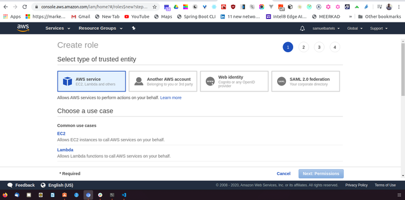

A different type of IAM credential that's equally important to use are for your servers and services within Amazon infrastructure. These are not people so we don't need have username or passwords but they will need to have policies attached so that Amazon knows what they can do on the system.

Roles are structured in a very similar way to users. There is a policy group with certain permissions or policies that are assigned directly to the role. The key difference is this role is consumed by a sever. 

The role sits on top of that server or service and allows it to perform action on other Amazon infrastructure within the Amazon platform.

let's quickly walk through how to create a role within the AWS console. In the IAM window of the AWS console, let's click on ```roles```.


Le's create a role



And let's pretend like we have a service running on EC2 that will need to access our S3 bucket. We can choose EC2 as our primary consumer. 

 

And let's find our previously developed [S3 dev group](https://kojobartels.com/creating-user-profiles-using-aws-console/)

 

Selecting this, clicking next 

 

And review

We can now give our role a name. In this case, we will call it ```kojobartels-dev-service-role```.  This way we know this is our service role that anything that our EC2 instances that are using our S3 bucket can use and we can go ahead and create the role. 

 


