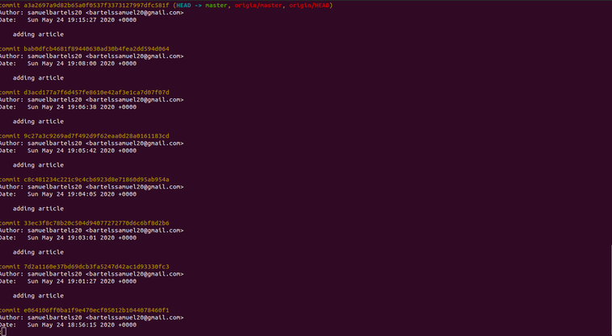

The Git source code manager is a powerful tool for tracking changes in your development projects. 

Three of Git's most powerful features are branching, merging and remotes. 

Branching and merging allow new features and experiments to be developed without impacting the main project code. Remotes allow many developers to collaborate on the same project. In this article, we will learn how to get the most out of each of these features. We will discuss the big picture concepts, as well as walk through step-by-step examples. Along the way, I'll share best practices and give you advice for using these techniques in real world situations. 

Git has helped me to manage complex projects and to collaborate with other developers. Git is designed to make experimentation and collaboration easy. It doesn't matter if your goal is to manage the code in your own projects, to collaborate with other developers on their projects or to join and contribute to opensource projects. These Git features are essential skills to learn and master. Let's get started learning about branches, merges and remotes.

Let's talk about what you should know before you read this article. Before you dive in, you should already have the fundamentals of working with Git. If you don't, there's another article in the library that can help you. It's called [git commands](/git-commands). In that article, we talk about the basic architecture of Git, the fact that it has three trees, the working directory, the staging index and the repository. We talk about SHAs and how they're used as identifiers and learn how Git generates them, and we talk about the importance of the HEAD pointer and the role that it plays. We also learn to make commits to track file changes. We learn to write commit messages, to add and to remove changes from the staging tree, and we learn to view a history of the commits and view details of a specific commit. We can compare commits using diff, and we learn how to undo changes either to make commit that undo changes or to get old versions of a file out of the repository. These are all essential Git skills, and you need to have them already before you read this article because this article is going to assume you have that basic knowledge so that we can build on it.

In this chapter, we're going to learn how to navigate the repository's commit tree. To do that, we need to start off by talking about the ways that we can reference commits. We've covered a few basic ways already And we should begin with introducing a new concept called tree-ish. 

A tree in Git is a directory which contains files and other directories. If you drew a picture of the directory Git uses the term tree-ish to refer to both trees and to identifiers which reference a tree. when that commit has been applied. If you go look up a Git command, it might say that you can use any tree-ish as a target of that command. 

In simple terms, a tree-ish is a directory, a commit, or a reference. Let's look at a few examples. You could have an SHA-1 hash, a tag reference, or the ancestry of one of those. There are more advanced examples, too, but these are the most common. We aren't ready to learn about branch and tag references, but let's look at the other three, starting with the SHA-1 hash and the HEAD pointer. 

We already know that Git takes a changeset along with all of its metadata and sends it into an SHA-1 hashing algorithm and the result is a 40-character string. 

We can refer to that as the identifier for a commit, so if we want to refer to a commit, we can use that 40-character string. But we don't have to type all 40 characters or even copy/paste them. We can use fewer and Git can still know which commit we're talking about. The minimum is four characters but a good rule of thumb to be unambiguous is eight to 10 characters, but that depends on the size of your project. On a small project, six characters might work. On a really large project, you might need to use more. And you can use them with your Git commands. 

So for example, git show, and here I've got eight characters representing the SHA-1 hash, often just called SHA. It's the SHA for this commit. Git keeps track of the most recent commit using the HEAD pointer. So the HEAD pointer is a reference to the tip of the current branch. It's similar to an analog tape recorder. It's where the play head is positioned for recording new commits. 

Usually it points to the commit that you made last, but it can be moved around, and we will be moving it when we learn about branches. Git keeps track of where the head is pointed by using some files in the .git directory, and there's a couple of files that come into play together. The first is .git/HEAD in all caps and that usually refers to something else but that's the place that Git goes first to find out what it refers to. Most of the time, if we're on the master branch, it'll tell you that it refers to another file which is stored in .git/refs/heads/master. 

Master is the default branch on a new project. So that's probably where the reference will be stored and if you went and looked inside that file, then it would contain a SHA that would point to a commit. Now we don't have to go through and follow that whole process every time. Git does it for us. It follows those references until Let's try these out. 

Here I am in my  samuelbartels.github.io project. So let's start by doing git log and let's see what commits are already there. Here is the top commit, the most recent commit. 

Notice it's SHA, and then it also says, HEAD and master here. That's letting us know that those are references that are pointing to this commit. It's very helpful. Type a Q so we can get back to the command line. 

Now let's just try referring to this SHA, I'm actually going to copy and paste the whole thing. I'll say git show, and then it will show me what's in that commit. 

Track samuelbartels.github.io directory. Now we made changes to the .git keep file in this commit, so there's nothing to really show us as far as content, but it is showing us this particular commit. Now we can erase some of these and refer to it by fewer, right? Shows us the same thing, if I hit the Up-Arrow and I remove a few more, the Up-Arrow and I remove a few more, I can do four and it works. But if I go to three, then it doesn't. It says, I don't know. It says, I don't know. That's too few, right? That's too few, right? And has to be four or more. And has to be four or more. And because the HEAD pointer refers And because the HEAD pointer refers to this commit, we can also just type, to this commit, we can also just type, git show HEAD, and get the exact same result. git show HEAD, and get the exact same result. It's a reference that points to the same commit. It's a reference that points to the same commit. These are all examples of this tree-ish type that you can use inside Git. 

In this chapter, we'll continue our discussion of how you can reference commits in Git by talking about ancestry. If you remember, when we make commits, they form a long chain and every commit links to the commit that comes before it. 

So most commits are going to have a parent commit, a grandparent commit, and even a great-grandparent commit. That's what we're talking about when we say ancestry. 

Let's start by talking about how you can refer to the parent commit. It's very easy. All you do is take a reference to a commit and then add a caret symbol after it. That's that upward-pointing arrow on your keyboard.

You may not use it very often, but it's useful here. It's a symbol to tell us that we want to take this commit and then go to its parent commit, the one that comes right before it in the chain. And we can do this with any kind of commit, an identifier. 

For example, we can use head. head followed by the caret sign says get the parent of the head commit, not the head commit, the one that comes before it. We haven't learned about branches yet, but we did touch on the fact that the default branch is the master branch. So if you want to ask for the commit that comes before the last commit in the master branch, you can also use that caret. There's another format. Instead of using the caret, you can use a tilde instead. So here you can see I'm using head and then tilde one and that says go and get the parent commit. Go back one generation. By default, that's also going to be one, if you don't put the number. 

So you could just have head and tilde and it has the same effect as head followed by a caret. But most developers don't use that. In this case, they would use the caret format instead. So you would have git show and then head with a caret after it. So that's the parents. If you want to go back to the grandparents, it's just as easy. You just add a second caret. This says go to commit de14621f and then go to its parent, and then go to its parent. And we can do the same thing with the head reference or any branch reference. We can use that tilde format as well. You would just use a two now because we want to go back two generations. And it's easy to see that we're talking about the number two as a shorthand for writing two carets, right? Two generations are represented in both cases. Again, most developers using this would probably still use the caret. Git show head and then two carets after it. If you want to go back to the great-grandparents, well then guess what you do? You add another caret. So you would have three in this case. Now here's where the tilde format starts to be useful, right? Because instead of having to type all those characters out, now it's shorter for us to start typing the tilde instead. So it's more common for developers to use git show head tilde three than it is to type all of those carets. And you can keep going back as far as you need, you just need to type more carets, or increase that number after the tilde. Let's try it. Here I am at my Explore California site. 

Let's just take a quick look. We'll use git log and let's take a look at what a couple of these are. 

I'll go into the queue, we see here's the main commit. That's where head and master both point. The parent to that commit is this one right here; ``adding article``, the one before that is this commit, ``adding article``, and the one before that is this one, add dot git ignore file. Okay, so now let's try referring to some of these. 

Let's start by just grabbing some of these characters here at the beginning and I'll copy those. Let's say git show. 

Now, we don't want to see this commit, we want to see its parent. So let's add a caret at the end and now we should see stop tracking changes to ``adding article``. 

That's what we'd expect. I'll hit the q to exit out of that, and let's add another one to see its parent. We went back one further to add database configuration file, and I'll add a third one to see add git ignore file. So I'm slowly walking up the change by looking at the ancestry. And I can do that by just adding those carets after the commit. Now, as I mentioned once you start getting to three, then it starts to be easier for you to type that tilde three instead, and it returned the exact same results. And we know we can do the same thing with other kinds of references. Git show head and its parent or we could use git show master and get its grandparent. We get the same thing every time. These are always to refer to the exact same commits. It's going to be useful for you to have ways to quickly find the information and git that you're looking for. To be able to refer to commits that you want to examine, that you want to compare against other commits, or that you want to pull into other branches or manipulate in other ways.

We know that a tree in Git is just a directory. In this chapter, I want us to see how we can list the contents of that directory from inside Git. The command that we're going to be using is git and then ls-tree, followed by the tree-ish that we want it to use and to list the contents of. If you start out by asking git help for information about ls-tree, you can find out more in all the different options that are there. It tells you, List the contents of a tree object. 

You can see here it even mentions the word tree-ish that we just learned about. Notice also that it tells you down here that what it does, it lists the contents of a given tree object like what bin/ls -la does in the current working directory. 

If you're used to using UNIX or the command line on MacOS, you know this ls -a is a way to just list the contents of a directory. If you're on Windows, it's similar to typing dir. Let's type Q to get out of this and let's just try typing git ls-tree on the command line with nothing after it. It'll complain because it's looking for a tree-ish as an argument. 

You can see it says here the usage; git ls-tree, then there's some options we could provide, and then tree-ish, and then optionally we could provide a path as well. But that tree-ish is the important thing that we're missing. We know what tree-ish's are now, Git ls-tree, and then a space. I'm going to use HEAD. That's a convenient way to always just go to the head, the last, most recent commit of the current branch I'm on. When I type that, it comes up and it gives me a listing for that directory. It looks a little different than the listings we would get in UNIX or Windows if we were listing out a directory. 

You can see that it has a number of identifiers here, and it says that some of these things are blobs and some of them are trees. As you might expect, a tree is a directory. Here's a directory called assets, here's a directory called explorers, and so on. The blobs are the things that are files. Blob is kind of a funny name, but it actually means binary large object. That's where it gets its name from; binary large object. That's what it's saying. It's just saying this is some kind of a binary object, in this case, a file. It's not a tree. 

For example, what we're seeing is a listing of the directories at the point of the latest commit, where HEAD is pointing to. If we want to go back and look at what it was further back in time, we know how to do that now using the ancestry, and it goes back one. It may take you a second to notice that there's a difference between the list. The last commit that we made was a commit that added the tracking of this directory here, samuelbartels.github.io. You remember when we typed git ls-tree without anything after it, it also told us there was this optional path at the end? We can put a space after the tree-ish and then specify the path that we want it to look at. That lets us look further into those directories. 

Let me just go back. Let's look at the head. There's our listing. Now let's do the same thing but I'll put a space, and then let's type assets. I'm not going to put anything after it right now. I'm just going to type assets and hit Return. What it's showing me is a pattern matching. It's showing me all of the things in the head that match this pattern. What I want to do is I want to see the files that are inside there, and to do that, I need to put a slash at the end that says I'm not interested in this tree, I'm interested in what's inside that tree. Now it shows me that inside there are three files called images, javascripts, and stylesheets. 

Each of those is also a tree, and so I could keep going further down to see all of the files and directories that are in there. Ls-tree is a good way to go back and examine the state of a project at a previous moment in time to see what files and directories were there so that you can explore them further. 

In this chapter, we're going to talk about how you can format the commit log so that you can better use that data. One of most useful things you can do with the git log is to look at the actual changes along with each commit, and we can do that with git log and then -p. 

P is for patch. It's another way of saying it's the change set. A patch is the same thing as a change set. What is the patch that would change it from one condition to another? So the -p option will show us each and every one of these. our commits in the commit log. 

The first few of these don't have a lot to view in them, so let's scroll down a bit. Let's hit the space bar or the f key and go forward. add gitignore file, right? and I can see the actual changes. The plus signs indicate what was added to the file. If we go a little further down, you can see that there's minus signs whenever we take something away from the file. So if we're changing something, then we're both removing one thing and putting a new thing in its place, so you have both a minus and a plus. 

So in this case, even though we're seeing two lines, to a single line where we're removing something and replacing it with something else. replacing it with something else. This can be very useful to allow you to see changes You can just kind of browse through them, Another useful one is git log and then follow it with --stat. This will show you statistics about what was changed in each commit. Let's hit return. Take a look. You can see here it gives us those pluses and minuses to tell us what was changed, but it doesn't give us the actual changes. It just gives us statistics about it. Two files were changed, one insertion, two deletions. Let's hit space so we can go down and see a few more of these. You can see resources here. There were three insertions and three deletions. Now we'd have to look at it to be sure, but this very well could be that there were three lines changed. Remember? Because a plus and a minus equal a change to a line. And if we scroll down just a bit further, you can see here I'm making a lot of changes to a lot of different files, and we see the results of all those changes lined up here. So it really gives me an idea of what was changed and how much was changed in each of these files. So it gives me an idea of which files were changed and by how much. We can also just change the general format of our log using git log --format. And then an equal sign and then a key word saying what format we want to put it in. 

By default, medium is going to be what it is. If we use medium, that's the same as if we didn't specify anything at all. If we use short, then we get a shorter format. Notice that that's a little different. That's just a regular git log. You'll see that there's a little bit more information there. See the date appears, and if I go up and do it with short format, you see the date disappears. This is a list of the options, the key words that you can provide to format. You can have oneline, short, medium, which is the default, full, fuller, email format, and raw. Each one of those is going to provide a slightly different format. 

Let's take a look at oneline real quick. I'll just change this to oneline. I'll clear my screen. And you can see, if I expand my window here, we get a nice one line view of all those changes. Now that's taken up largely by this huge 40 character hash, the shah at the beginning of each one. And that's useful, but we don't need all 40 characters and it's taking up a lot of room, so there's also another version that's very handy called git log --oneline, and this adds in another line which shortens that hash. 

So if you want one line, you may be better off using this one instead. You can see the exact same information, but we're just getting those first seven characters of the hash. Another nice format feature is graph, so git log --graph, and you'll see that it graphs out all of my commits. You can see this line running down here, down the side. 

Now right now, my graph is pretty simple because I just have one branch. We're going to be talking about branches in this course, and once we start branching off code, merging back in code, then this graph begin to show us the path that our code takes. Even better than just graph on its own is to use git log --graph--all and then - -oneline and then --decorate. 

Using all four of those together gives you a nice, simple map and if you have other branches coming in, if you have other branches coming in, you'll be able to see where you'll be able to see where they weave in and out of your code. they weave in and out of your code. Using these techniques to format the commit log  will help you to be able to see  what your code is doing so that what your code is doing so that you can better understand it  and extract the information from it that you're looking for. 

In this chapter, we're going to learn how to create branches. Before we create our first branch, let's just start by looking at the branches that are there currently. If I type git space branch then it will show me a list of the branches. When I hit return, you see it comes up and there's only one branch. It's the master branch and by default, that's the name that every git project gives when you first initialize the project. It says alright all commits are going to be on one master branch. That's the starting point. Notice that there's also an asterisk over on the far left and that it's colored green. That's to indicate that this is the current branch or the currently checked out branch. 

At the moment, there is only one branch but once there are several, only one of them will be designated as the current branch. Okay, now let's create a branch. I told you that creating branches was very easy, it really is, git branch and then a space, and then the name of our branch. I'm going to call mine new underscore feature. Branch names should not have any spaces in them. They can contain letters, underscores and numbers. When I hit return, then it creates my new branch for me. Didn't give me feedback that it did, but if I type git branch, now you can see that there's two branches where before there was only one. Notice that master is still the currently checked out branch. New feature exists but I'm not switched over to it. We'll talk about switching branches in the next movie. 

Before we do that, let's investigate a little bit further what happened here. How does git know which is my currently checked out branch? Well, remember we have that head pointer and we know that we can look at the contents of the file in the git directory called head and it'll tell us where the head points. The head points at the tip of the master branch. That's how it knows, that's how it decides to put that asterisk and color it green is based on what's in this file right here and we also saw that this refs head that's being referred to here is actually a directory as well. 

And we can look at the contents of that directory L-S dash L-A on Unix will do it dot git slash refs heads and let's not type master, let's stop there at heads and this will be the directory. We'll hit return and you'll see a list of the files that are in the directory. So we've got master and new feature. Two different files, two different branches. 

That's where it's going to store the references to the head of each branch, the tip of the branch, and then that head file all it has to do is change its reference. Instead of saying refs heads master, it just has to change to refs heads new feature and then it'll point at that new branch. Let's look at the contents of each of these files the master and new feature file. Cat get refs heads master and you can see that it points to a commit that starts with D-E-1-4-6-2. If I do the same thing for new feature, it points to the same commit. 

At the moment, they point to the same place but eventually they won't. Eventually, new commits will be made to one of these two branches and it will advance the tip of that branch will move to another commit and the other one will not, it'll stay the same. Let's use our newly learned command git log dash dash one line and we can see those commits and see that that is currently the tip of the branch. It even tells us that the head points to master, but new feature also points to the same place. So, head, master and new feature all refer to the same commit right now. Okay, now I think we're ready to learn how to switch branches. 

Now that we know how to create a branch, let's see how we can switch to it. In the last chapter, we learned to use the Git Branch Command, both to view a list of the branches and also to create a new branch and we created a new feature branch. And then we can see both of those here and we can tell that master is the currently checked out branch, the branch that we're currently working with. 

If we go to our working directory, that's the code that we're going to see. If we want to use the new feature branch instead, well then we need to check it out. So we use the command, git checkout and then the name of the branch that we want because we may have many of them. 

So git checkout new_feature, now, it says Switched to branch new_feature. Type git branch again and you can see that it is changed and now my current working directory is new_feature. That means that the head pointer is now pointing at new_feature. And if I make commits, they'll go on the new_feature branch, not on the master branch. We can confirm that if we take a look at that file, cat .git/head, and you can see now, head points to the new_feature branch. So let's try making a commit there. If we switch over to our project, and let's take our project and let's just drag the whole thing into the Atom Text Editor, so looking at the project, we see it, we'll have all the files we can work with and let's make a change here. After Welcome to samuelbartels.github.io in the title, let's just add a bit of text that says - Affordable Outdoor Tours and let's save that file. 

Now we've got some changes. Let's come back over here and let's commit those changes. We can use git status to see the changes that we have. And we should already know that we can check those in with git, and then commit, -a for all changes that are in my directory with m to provide a message and let's make the message Modifies title of index.html. All right, so now we have a new commit. Let's use git log --oneline and we can take a look at those. 

Now notice it tells me here that my master branch is on this commit, but my HEAD and new_feature branch are now on this new commit. Let's go back and switch to our master branch. We can use git checkout again, and this time we'll use master. So now it's switched to the master branch. So we now know how to create branches and we know how to switch between them. And hopefully you can already see, that it's a very efficient way to work with your code. That's why it's called a Source Code Manger, because it effectively manages your code.

In the previous two chapters, we learned how to create branches, and we learned how to switch branches. We don't have to do them as two separate steps though, we can actually do them all together. And that's what I want us to see how to do in this chapter. The first thing you want to do, is figure out which branch you're on currently. Because if we're going to make another branch, it matters which branch we're on, where the head is pointing to, because it will branch from that point. So if I'm on the master branch, git log dash dash oneline, it's going to branch from this command. If I'm on the new_feature branch, then it's going to branch from the tip of that which that additional commit we made and we made a change to the title of the index.html page. That's what's in that additional command. So let's say that this new branch that I want to create, I want to make use of what's in new_feature. So I really want to branch off of there. So the first thing I need to do is make sure that I check out the new_feature branch. 

Now when I type git branch, it tells me that I'm on the new_feature branch and when I create a new branch from here, it will include that additional command right here. D4f3, and so on. 

Now, we already know how to create a branch off of Master and creating a branch from here is the exact same way. Git and then branch and then the name of the branch we want to create. So let's call it shorten_title. Now if I did this just like this and hit Return, it would create a branch. But it would not switch us to it. That's what we saw before. So in order to switch us to it, we're going to change it and instead of branch, we're going to use checkout but with a dash b option. So it's going to checkout a new branch called shorten_title. It'll do it all in one step. It creates the branch and checks it out. So I'll hit Return, switch to a new branch called shorten_title, so we know it created it. It didn't exist before, now it does. Git branch will show us that it now exists and we switch to it at the same time. So what we're essentially saying here is check it out as a new branch called shorten_title. So let's make a change to the shorten_title page. I'm going to go back to the Atom text editor. You can see that that code is there, Affordable Tours. Let's take out this part here, Welcome to. 

Let's just make it samuelbartels.github.io dash Affordable Outdoor Tours. So I'm going to save that, now we have an uncommitted change. We can see that with git status, here it is. We can use git add to add it and notice here that it says after we use git add, use git check out with a dash dash with the file name if we want it to discard those changes. Checkout has another meaning here. It's not just for checking out branches. 

This is saying checkout from the current branch, a file, checkout, the branch. Just notice that. Checkout is used in both contexts. What we're really saying to git is go get these set of changes and bring them into my working directory. So let's commit these with git commit dash m, shorten the title of index.html. Now it's committed. Get log dash dash oneline. And we can now see that there are three branches. Master points to this commit. New_feature points to this one and shorten_title and HEAD both point to this one. Most developers use checkout with the dash b option to both create and switch at the same time because most of the time, as soon as you create it, you're going to want to start working with it so it makes sense to just do it in one step.

