React is one of the most popular Javascript libraries for creating user interfaces, and is a vital skill for many front-end and full stack developers. 

In this article, I'll introduce the React library, using the most modern syntax, and today's best practices for creating React components. I'm excited to say that React is the most stable and most robust it's ever been. And since so many companies from Fortune 500 to startups have adopted React in production, now is the time to learn it. So let's jump in and learn React.

This article will introduce you to the React library, but to be best prepared there are a few things that might be helpful to know. First, React does JavaScript, so you'll want to know some JavaScript. If you've never been introduced to JavaScript, I'd recommend taking JavaScript Essential Training. To use React in the most modern way, we'll also be using some ECMAScript, or ES6 Syntax. I'll introduce these concepts like arrow functions, destructuring, and class syntax as they come up. Finally, we'll install some packages using npm, the Node package manager.

React is a JavaScript library that's used to build user interfaces. With React we create reusable components, and these components display data as it changes over time. React was created at Facebook and was released initially in March, 2013, and since then React has expanded beyond the web with React Native, a tool that allows you to create native mobile applications using React. Another reason to like React is that they have very useful documentation. If you head over to reactjs.org and click on the Docs link, you'll see a bunch of resources for getting started as well as an official tutorial that the React team has created. React is an increasingly-popular library with tens of thousands of stars on GitHub and used in production by huge companies like Uber, Netflix, and Twitter. Throughout this article my goal is to demonstrate how the approach of React is different, and why it make your work as a developer easier, faster, and more fun.\

Let's go ahead and install the React Developer Tools. The React Developer Tools are a browser extension that you can install to explore sites, your own or other people's, that use React. So let's go ahead and find these. I'm just going to search Chrome for Chrome extensions. This is typically the fastest way to bring us to the Chrome Web Store. 

And then, once I click on this link, we should see the option to search here on the left-hand side. I can say React Developer Tools and the first option here is what we want to add. 

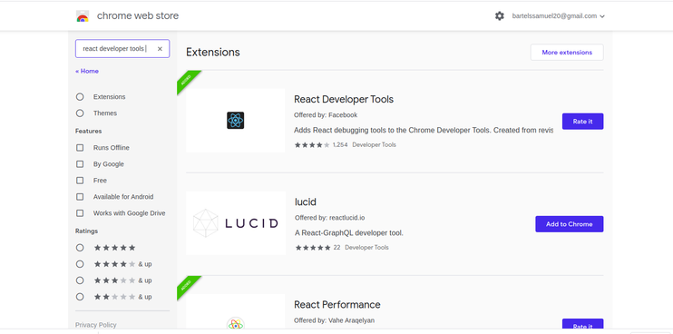

So if I say Add to Chrome and we allow it to add the extension, it lets us know that React Developer Tools has been added to Chrome. If you're a Firefox user, I have some good news for you, too. You can install the React Developer Tools as add-ons. In the next article, we'll use these dev tools to further inspect a site that uses React.

In this chapter, we'll take a closer look at the React tools that we previously installed. Here, I've navigated to Airbnb. 


Airbnb is a site that uses React, and I know this, because I see the React developer tools icon highlighted here in our tab. So what I can do to inspect this, is similar to what I do to inspect any HTML on a page when I'm using Chrome. I'm going to open up the developer tools. So I can open up Command + Option + J, using my Mac, or if you're using a PC, you can hit F12, or Ctrl + Shift + J. So once I do this, I'm going to see the Console. 

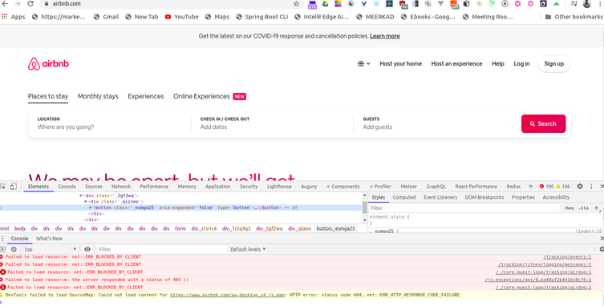

Now, if I go next door to our Elements tab, I'll see all of the different HTML elements that make up the page. Then, if I go to the right arrow over here, and I select React, I can see all of the different components that make up this page. So a React page is just a collection of components, and the React developer tools show us where these components live in the component hierarchy. 

So we're going to be using these developer tools quite a bit throughout the article, in order to inspect our pages that will have a few fewer components than something huge like Airbnb. But this'll give us a sense of how these pages are put together, and you should know that you can always go inspect any websites that are using React, using your React developer tools.

Create React App is a tool that will allow you to set up a React project without any build configuration. 

In other words, you don't have to set up Babel in order to use the latest JavaScript syntax. That's built in to create React app. You also don't have to set up Web Pack or any other tools. Create React App does it for you, so you can just focus on your code. 

So, I love Create React App, and I use it for pretty much every React project that I start, so let's show you how to install Create React App on your computer. 

Now, the first thing I want to do is open up our terminal. 

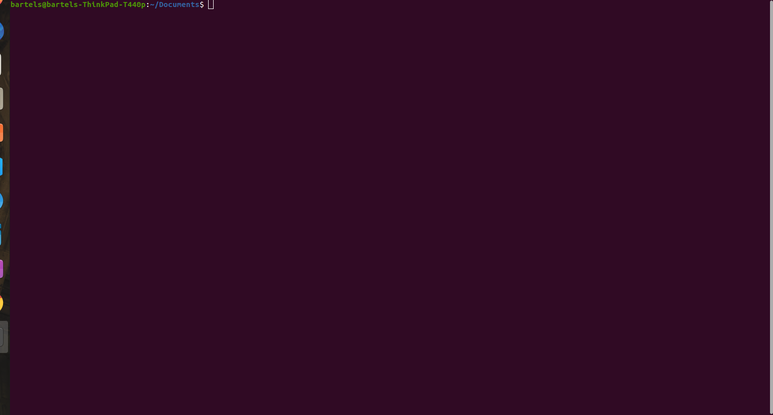

To get started with Create React App, all you need to do is install Create React App as a global dependency, using NPM. So we've opened our terminal or command prompt, and then from any folder you can run the following: ```sudo npm install --g create-react-app```.

So the sudo command just runs this as an administrator, the dash G means this will be installed globally, so you can use Create React App for any project. 

So let's go ahead and do this. We will need to enter our password. Now, if you're on a PC, you can just run ```npm install create-react-app```, in your command prompt as an administrator. So now that we have Create React App installed, we will be ready to go, and in the next chapter, we'll look at how we can use this to generate a project.

Now that we have create-react-app installed, we can use the package to generate our own React project. 

So in the terminal or command prompt, we want to navigate to a folder where we can generate the project, and work with it throughout the article. 

Okay, so let's get into that folder. We'll look at the desktop. We'll get into reactjs. So now I can run the command ``` npx create-react-app react-essential```. 

Now this command is going to generate a project, and it'll generate the project by name, so we'll pick a name here, react-essentials, that'll be our Hello World, to get us started. And as soon as I hit enter, it'll set to work, installing all of these packages. 

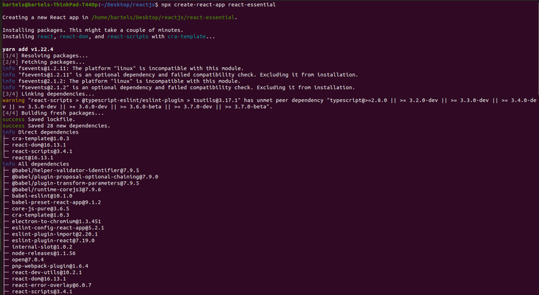

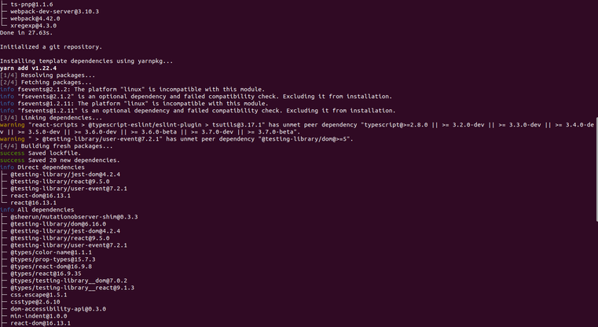

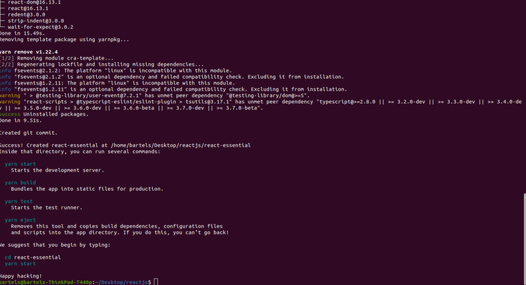

Okay, so create-react-app gives us a few instructions here. The first instruction is to navigate into the react-essential directory, and then we can run npm start. Now once I run npm start, this is going to open up a browser window, where our React project will be running at localhost:3000. So it might take a second to load up, but we'll see that the spinning React logo means that this is now working correctly, and we should be ready to start our development. 

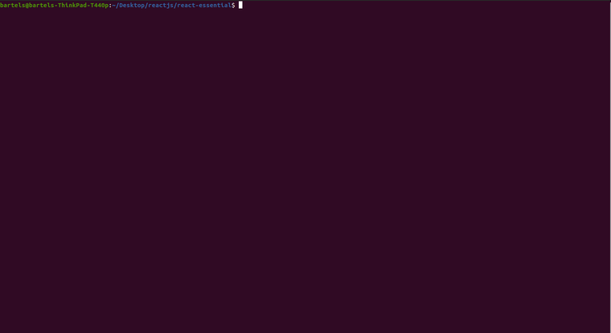

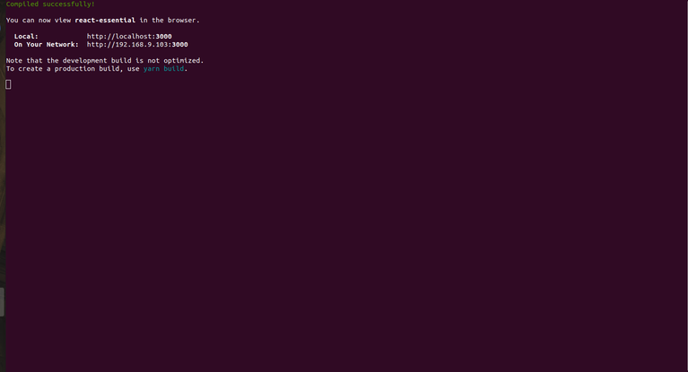

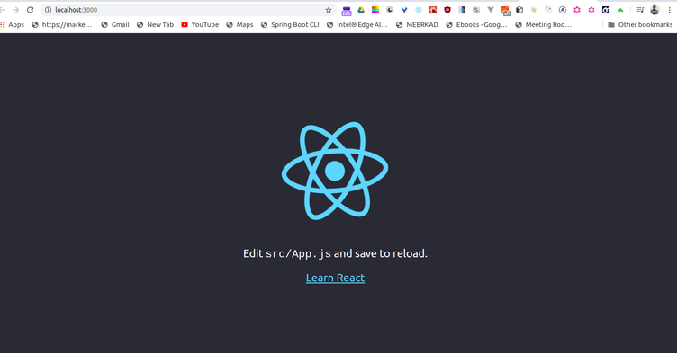

So with our project running, we can open the files. I'm going to do so using VS Code. So let's explore what is going on here. If I open our package.json file, you'll see that there are a few dependencies installed. 

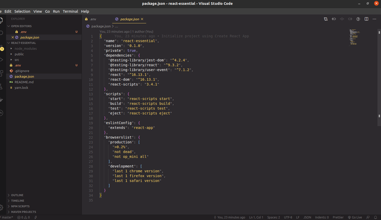

There's react, there's react-dom, and there's react-scripts. Now react is what will allow us to create components and use the React library. React-dom will be everything needed to take those components and place them in the dom, so to actually render them to the page. React-scripts is where some of the magic happens. This is what's handling all of our transpiling of new syntax into browser compatible syntax. We also have webpack going on, and all sorts of stuff behind the scenes. So react-scripts is taking care of that for us. 

Now what's responsible for rendering that spinning React logo to the page? Well, that can be found in the src folder. 

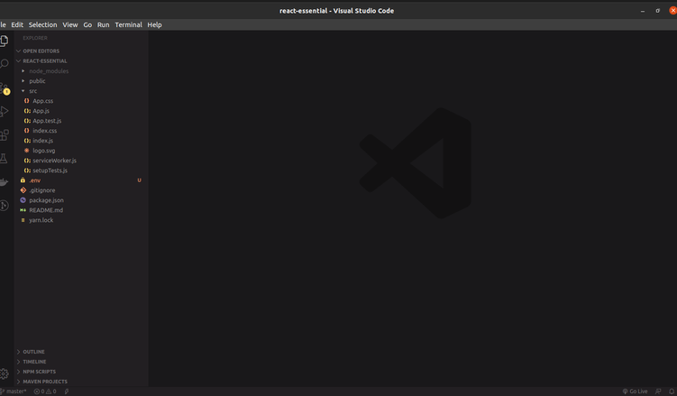

So everything that is in the src folder is really where we're going to work. This is where we're going to make any changes to the React files that we need to make, and this is where we'll create our components. So our project is set up, and in the next chapter, we'll actually start writing some React code.

Let's go ahead and create our first react element. Now, I'm in react-essential and I've opened the index.js file.

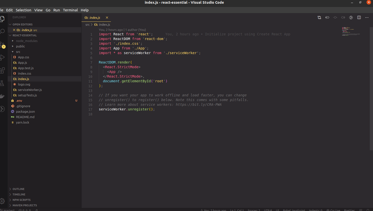

Now, I'm going to highlight everything here and do something kind of bold. I'm going to delete everything and let's create this absolutely from scratch. 

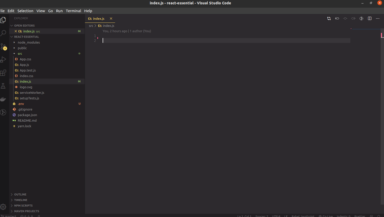

Now the first thing that we'll do is we'll import React from 'react'. This is pretty important. We need to import the React Library in order to use it. The second that we'll import is ReactDOM and this is going to provide us with a render method that we can use to render our react component, our react element to the DOM. So we'll say import ReactDom from 'react-dom'. Now, the next thing I want to do is create my React Element. So we'll call it title and we'll use React.createElement and this is going to take in three different arguments. 

The first is the type of element we want to create and that's an h1. The second is any attributes that we want to provide so we'll say title and we'll give it a class name of header and finally, after we close that curly brace, finally we want to display any child elements. So if we wanted to create another element here, we could or we could just add some text, which will be displayed as the child of the h1. So Hello World. Now we need to render this title to the DOM. So we'll use ReactDom.render and we'll pass in two arguments here. The first is what do we want to render? We want to render our title element so that's a simple one there. The second one we need to specify is where do we want to render this? If you look at the index.html file that's provided with Create React App, you'll see that it includes this div with an ID of "root" so in most React projects, kind of because of Create React App, you're going to render everything to an element called "root", but this could be called anything. You could call it react-container. You could call it pancake. You can call it whatever you want to. We're just using some simple DOM selection, using JavaScript. Alright, so, let's go back to index and here we're going to say document.getElementbyId and where we want to render this is the root. 

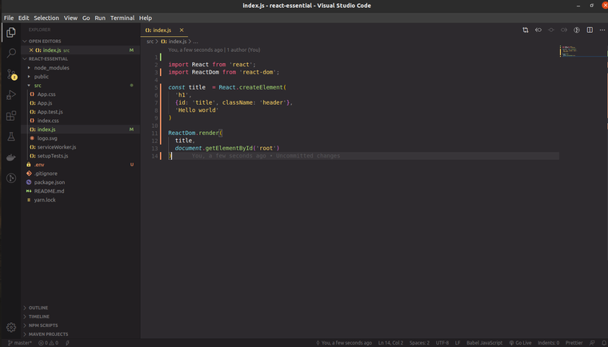

So if you still have your project running, that's great. It will automatically reload any changes immediately, but I need to restart mine so I'm going to say npm start in this folder. It'll go through the process of rendering this for me and as this refreshes, we should see that the Hello World is now present. How cool is that? We've just rendered our first element to the DOM. So let's open up our developer tools to see what's going on here. If I go to the React Developer tools, we'll see that an h1 has been rendered and look, I have an ID and a className that I've specified and then the child of this h1 is just that text, Hello World. 

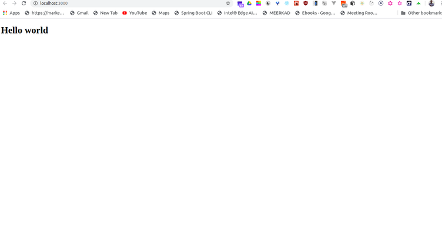

Let's add another quick feature here. I'm going to create a variable called style and we're going to specify some CSS styles that we want to apply to this element. So we'll say backgroundColor is orange. We'll give it a color. In other words, a text color, white. And a fontFamily of Arial. And I'll place this here in the Properties. So I'll say style is style. 

As soon as I hit save on that, we should see that automatically refresh. Thank you Create React App for doing that for us and you'll see that the Style Property has been applied, background color, color, and font family. 

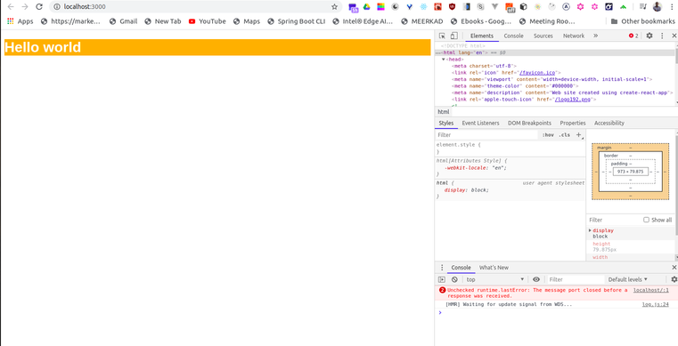

So this is the simplest way to create an element using React. We'll use the Create Element Call to create our title. In the next chapter, we'll look at a syntax that makes this even cleaner, called JSX.

In the previous chapter, we looked at how to render a React element to the DOM. Let's make some adjustments to this to instead render a unordered list. 

So I'm going to change the h1 to an unordered list, and then I'm going to need to render list items inside of the UL. So this becomes a child of that, so I'm going to add this here as the third argument, React.createElement, L, I. We'll skip out on properties. And then we'll say list items should be called item on our list.

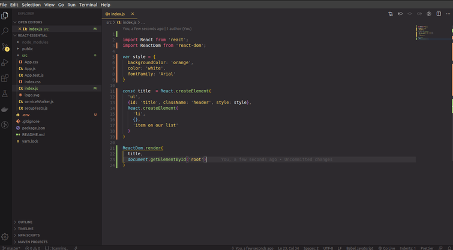

Now, as soon as I look back at the browser, I should see this item on our list. 

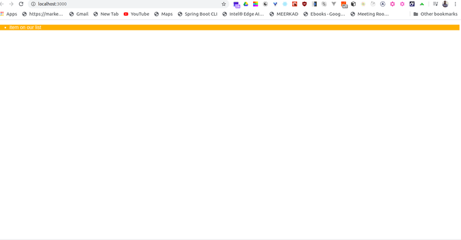

Now, this is pretty good, this is working well, we're rendering list items, it's pretty cool, but let's think about how we might simplify this a little bit. And what React provides us with is a different syntax called JSX, or JavaScript as XML, which is a tag-based syntax that we can use to create React elements. 

So instead of having to do all of these create element calls, we can instead use JSX syntax to make this a little cleaner. So let's go ahead and do this. I'm going to get rid of our title. And instead we're going to work with ReactDOM.render to render this to our DOM. So what we're going to do is this, I'm going to say h1 and we'll say Hello World! and I'll give that a save, and we should see our Hello World! being rendered to the DOM. 

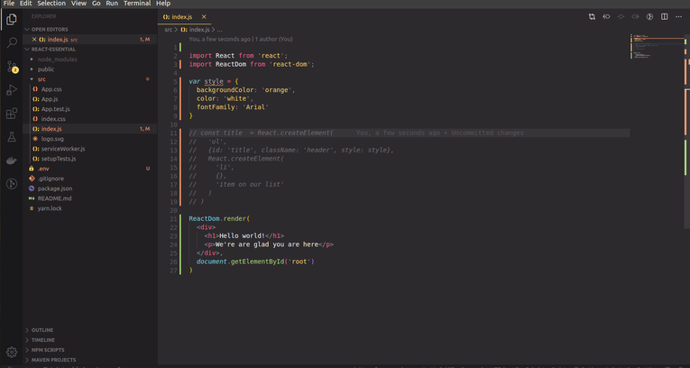

Let's go ahead and add some additional tags here. So I'm going to create a div. I'm going to add our h1 here and then I'm going to add a paragraph next to it. I'll say We're glad you're here! So as soon as I do this, we're rendering this div to the DOM. 

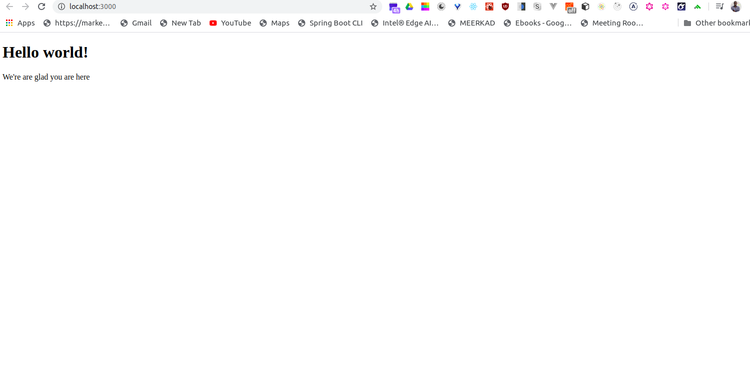

Checking this out in our React Dev Tools, we should see our div, and our h1, and our paragraph. This is JSX, so this is a tag-based syntax that we can use to render elements to the DOM. 

And then we can mark it up like we would with any HTML. So let's say we wanted to give our div a style, we could use syntax that looks like this. As soon as I do that, all of our style will be applied. We just set the attribute, and then using these JSX curly braces, we pass in the name of the variable that we want to use for the style. You can also use just simple IDs. So you could say id heading-element. And then this would apply that heading element to that particular element. So if we go down to the h1, we should see an ID of heading-element. So JSX, we'll go over some tips and tricks throughout the rest of the article, but this should get us started. It's a tag-based syntax that we can use to skip out on all of those create element calls and instead use this much cleaner tag-based syntax.

So far, rendering a few JSX elements to the DOM has gone pretty well. We've even added a style attribute using JSX attribute syntax. The reason that React has become so popular though is due to its component based structure. We create a user interface simply by creating and nesting a collection of components. Let's go ahead and create our first component. So the first thing I'll do is get rid of our style object and then we'll create a component using React's class syntax so I'm going to say class Message extends React.Component and then I'm going to use a ES6 class to define this component. 
Now the most important method, the most critical thing to understand about React components is all of them have a render method. The render method describes what we want to render to the DOM. So within our render method, we're going to add a return and then I usually like to wrap our return, wrap all of our JSX elements with these parentheses that helps us save bugs a little bit later. Now the next thing I want to do here is add a couple of elements, the first being a div and the second being an h1 that just says Hello Everyone. And from here, we can render this component to the DOM. So I'm going to replace our divs here on line 15 with our message component.


Now the message component is going to be self-closing and then we see that it will render that immediately to our DOM, pretty cool stuff. 

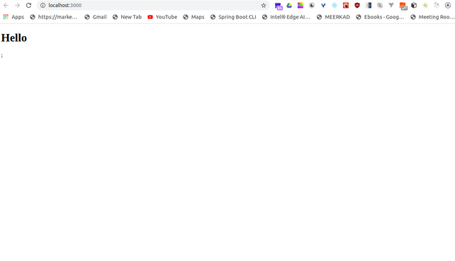

One thing I want to note is all of our components should be capitalized so if I give that a save and I open up our console, we're going to see that the tag message is unrecognized. If you meant to render a React component, start its name with an uppercase letter. So this is a change in the most recent versions of React. There needs to be a way to distinguish between just regular JSX elements like our div in the h1 and our components so we always want to make sure to capitalize them. So once I change that back, we should see that rendering appropriately.

Currently, we're rendering our message component to the root, Div, but what if we wanted to make this message dynamic? To do this, we'd use React Props. 

Now, the first step in working with Props is to pass data to the message component. So I'll do that here on line 15. Here, I'll add a message, and the message should say, how are you? All right, so when I hit Save on that, nothing happens, because we haven't used that property yet. 

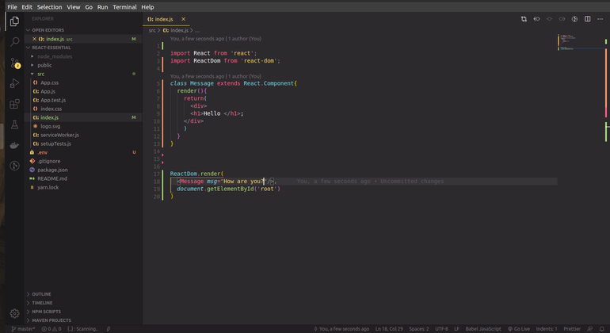

The place I'll use it is here in the H1. So, let's use a JSX expression, the curly braces, and we're going to use those to wrap the name of the property that we want to render. So we'll access them via the this, dot, props object, and then we'll access it by key. So message, message, should be able to see that rendered in the output. And I do, so the Props object can contain as many properties as you'd like, and in a class component, you'll reference them via this, dot, props, dot, whatever the name of the property is. 

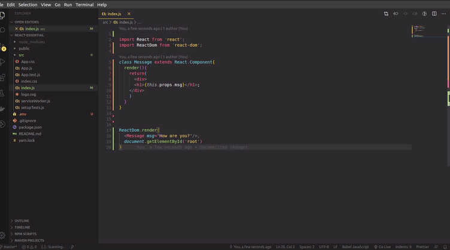

To get a look at this, we can console log the this, dot, props object, and then, if we check out our console, hitting command, option, J, we should see the Props object, with message as a key. And then however many properties I add here, I can do so directly in the message component, so I could say, age, 50, and as soon as I hit Save on that, we're going to see the age key added to this object. Now, let's try adding another property to do something even a little more exciting. The first thing I'll do is, I'll replace age with color, equals, blue. And somehow I want to take this color, and I want to change the color of our text. Now, the way that I can do this, is I can use a style attribute on the H1. So we can say, H1, style, equals, and then let's hit Enter on this so that we can see everything.

So, again, we're going to use our JSX curly braces for our JSX expression. The tricky thing here is I need to pass an object, a style object, into this expression, so hence the two sets of curly braces. So here we'll say, color, this, dot, props, dot, color, again, accessing that color property off of the Props object, and then we're good. We should be able to render that content to the page. 

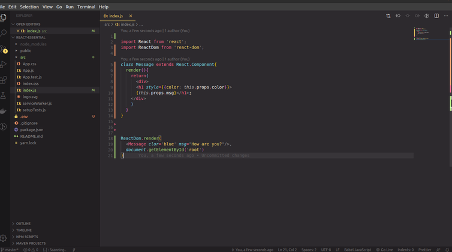

Now, the final thing I want to show here is, let's add another paragraph tag, and the paragraph tag should have the following: we should write, I'll check back in this, dot, props, dot, minutes, minutes. And if we scroll out a little bit, at this point it's just going to say I'll check back in blank minutes.

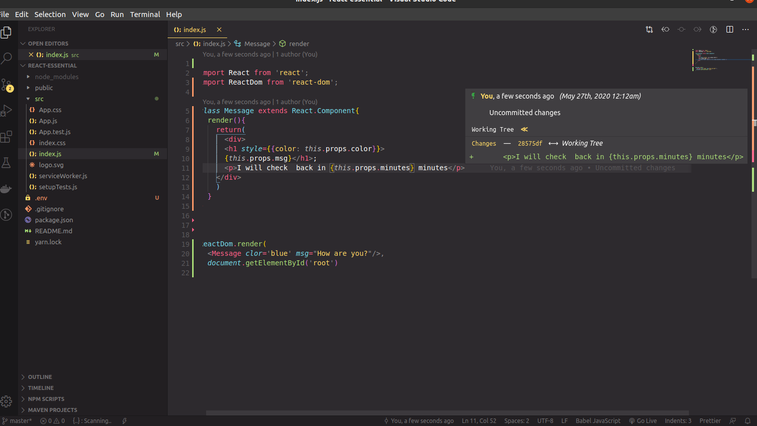

Now, I can send this as a property to the message. The tricky thing here though is, and we saw it a second ago when I used the age property, whenever we're passing in a number or a Boolean, something that's not a string, we need to use that JSX expression. So if we add our property for minutes, we need to wrap it in the expression, and then we're going to pass in the number. So JSX allows us to access dynamic data by using the this, dot, props object.

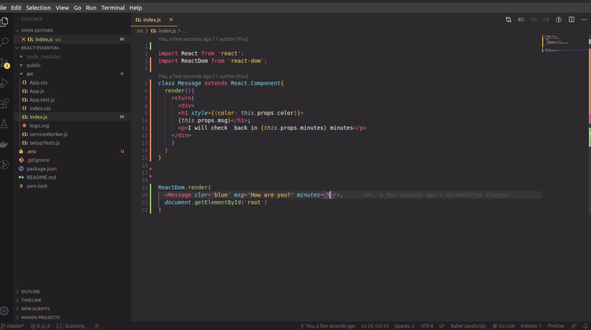

Let's update our project to include a slightly more robust example. So, I live in a ski town and I'm obsessed with skiing. So, I want to build a page that will count my ski days for the year. You can customize your data to count anything you want, days you've exercised, books you've read, National Parks you've visited, whatever, whatever you're most passionate about. 

So, I'm going to go ahead and add this data here to line four, and I'm going to call it skiData. And we'll just create an object here with a few numbers. We'll have a total number of ski days, a number of powder days, hopefully a lot, a number of backcountry days when we're skiing outside of the resort, and then a goal, so the number of days I'd like to be able to ski per year. 

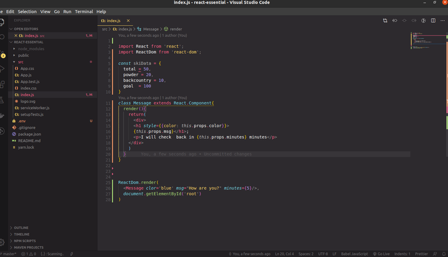

Now, the next thing I want to do is create a component called a SkiDayCounter. So, we'll go ahead and replace the message component with that. So SkiDayCounter is again going to extend React.Component. And let's go ahead and render the following. We'll just simply render a section with Ski Days. And then instead of rendering the message, let's render the SkiDayCounter component, SkiDayCounter. And we'll use that self-closing tag. 


Awesome. So the component is rendering okay, but we want to be able to render some data. So let's pass some props to the SkiDayCounter component. If I zoom in a little bit, I'm going to add a few different properties, the first is total. And we're going to find that data from our object, skiData.total. We then will say powder equals skiData.powder, backcountry and goal. Cool.

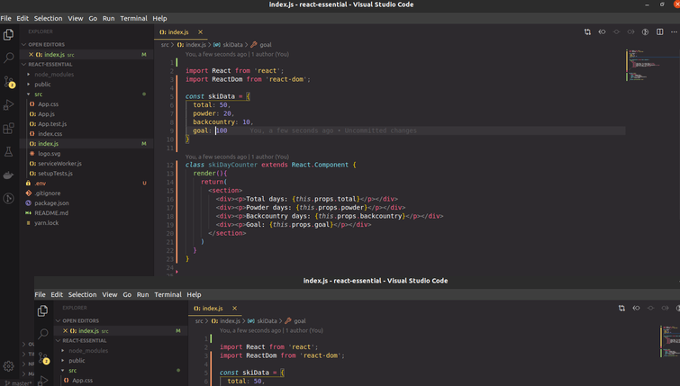

So now what I can do is add these tags to the section. So let's display some data here. The first thing I want to display is our total. So let's display all of these in a paragraph, we'll say Total Days, this.props.total. And then I'm going to create four different divs for my four different data points. So I'll just copy and paste all of them. We'll call this Powder Days, and we'll say this.props.powder; we'll add another div, we'll say Backcountry Days, this.props.backcountry; and finally, our Goal, cool. 


So on Save I should see all of our data rendering properly. Now, one little thing that we can do to make our code a little bit more concise is something you'll see a lot of folks do. I can destructure our component. So now our dynamic data is displaying. Now, one thing I want to do to kind of shorten up our code, make it a little bit more concise, and also to match a lot of syntax that you'll see in other tutorials or in documentation, is this. So, I'm going to add a comma here and I'm going to destructure Component from React. This means that I can get rid of react.component here, and just instead use the component. Now, it used to be the case that you could get away with getting rid of React. 

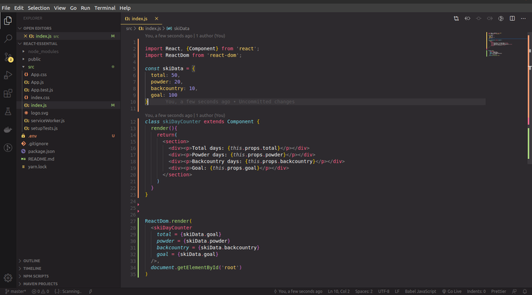

If I hit Save though, we're going to see an error pop up right away, a pretty gnarly error, which says that React must be in scope when using JSX. So you always need to import React in any file that's using JSX. Now, the next thing I want to do is we can import render from ReactDOM. So here on line 32, I can get rid of ReactDOM. So, that's just up to you if you'd like to do that. 

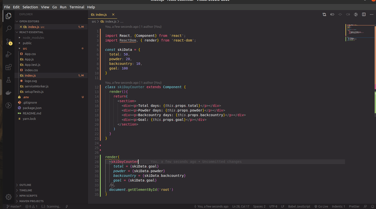

The final thing I want to show you is we can use a slightly shorter syntax for destructuring this.props. So I could say const, our props are total, power, backcountry and goal, equals this.props. And this means that I can replace this.props here, here, here, here. 

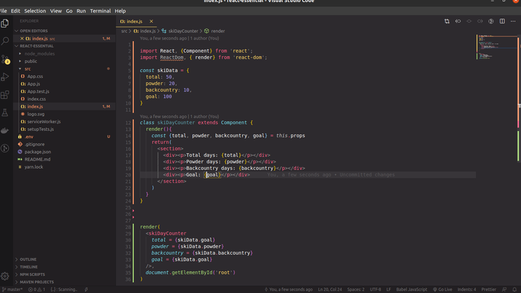

I guess I'm not really replacing it, I'm just removing it, because we've already imported all of these from props. So through Destructuring, ES6 Destructuring, we're able to use the slightly shorter syntax which means that every reference to any of these properties will be a little more terse. So, that's just an option, and one that will make our code a little easier to read.

In addition to properties, we can add methods that are local to these components. Currently, we're displaying our goal value, but I actually want to calculate how far I am toward reaching my goal. Am I 50% there, 10%, how am I doing so far? So to do this, let's create those methods here within our class component. Now, the first one is going to be called getPercent, and getPercent is going to take in a decimal, and it's going to return the following, we're going to say return decimal times 100, and then we'll concatenate on a percentage symbol. Next, I'm going to create another one called calcGoalProgress. And calculate goal progress is going to take in the total number, the goal number, and it's going to create a percent. So here, we'll say return this.getPercent, and we'll divide total by the goal. Now we can use this within the component. So we'll say, this.calcGoalProgress, and we're going to pass in total and goal, as our arguments. This is going to return that percent. Now the final thing I can do, is I can say goal progress, so we can have a little more clarity on what we're trying to do there. So this is how we would add custom methods to a React component, using an ES6 class. We're using these custom methods, right here within the context of the component.

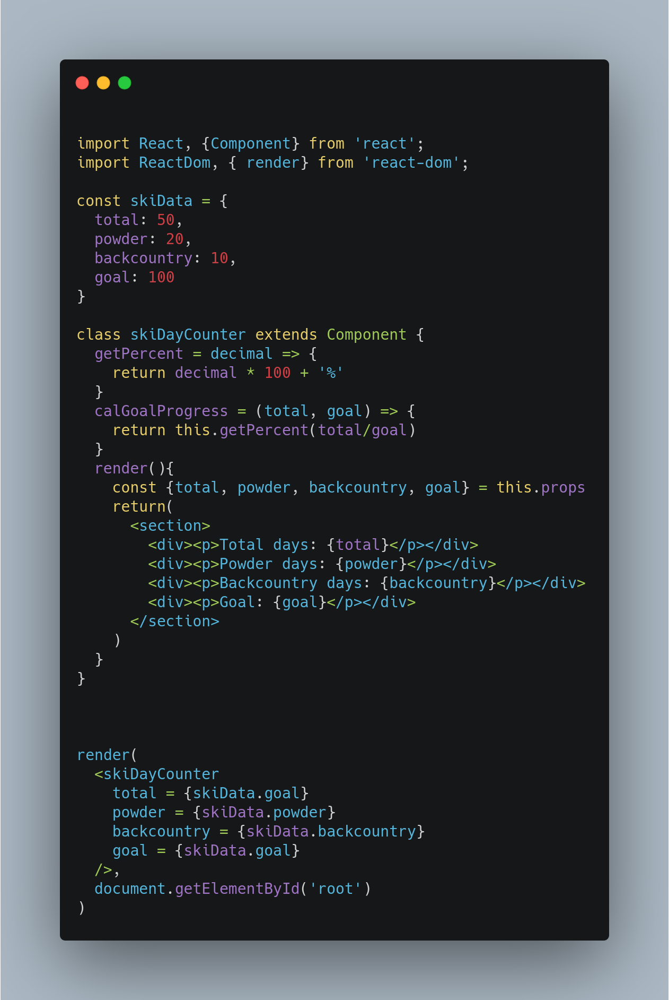


