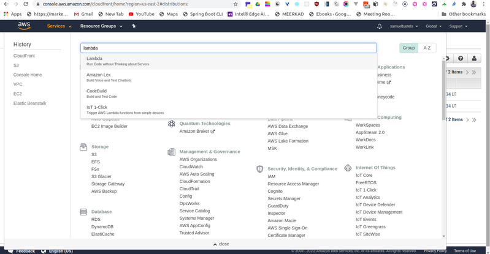
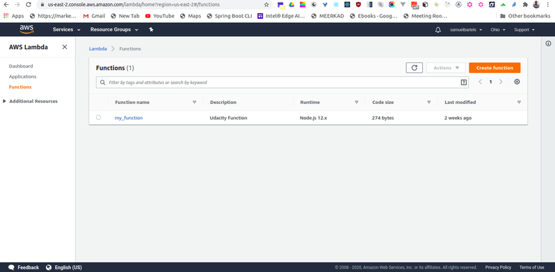
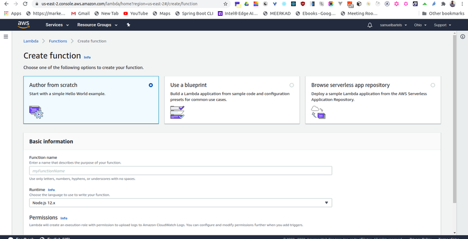
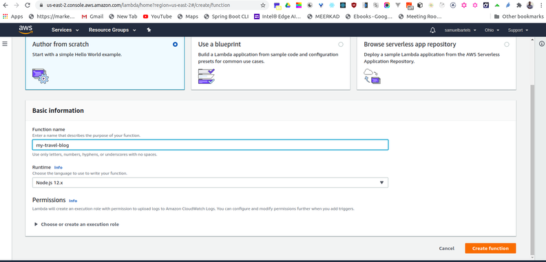
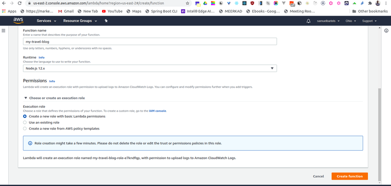
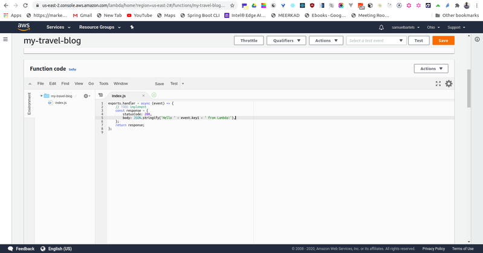
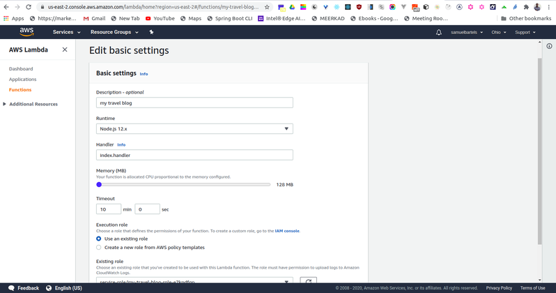
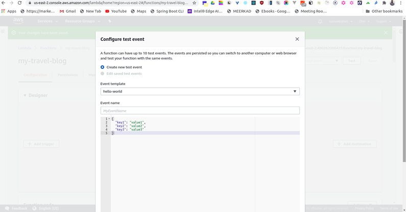
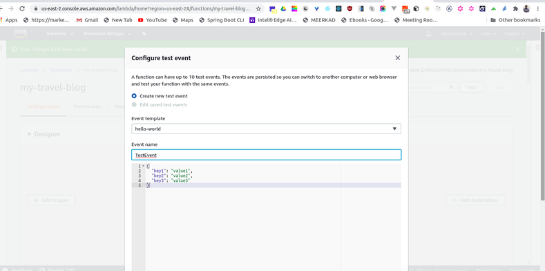
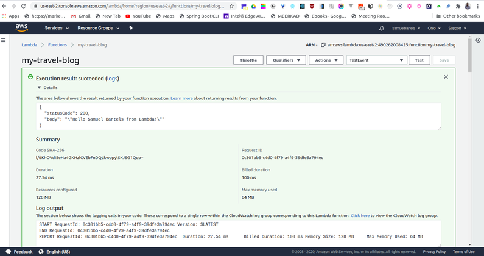

In this hands-on article, you will write your first Lambda function using Node.js.

## Prerequisites:
- AWS account

By the end of this article, you will be able to:
- Author a Lambda function using Node.js via the console
- Test a Lambda function via the console

## Steps:

1. Create a Lambda Function
    - On the AWS Management Console page, type ```lambda``` in the ```Find Services``` box and then select ```Lambda```.

        
    
    - Click the “Create function” button and select ```Author from scratch```.

        

        

    - Enter a Function name and select ```Node.js 8.10``` as the runtime.

        

    - For Permission, click ```Choose or create an execution role```, and select ```Create a new role with basic Lambda permissions```.

        

    - Click ```Create function```.

2. Modify a Lambda Function
    - Scroll down to the code for the Lambda function.

    - Replace the code on Line 5 with the statement below:
        ```
        body: JSON.stringify('Hello ' + event.key1 + ' from Lambda!'),

        ```

    - 

    - Click the ```Save``` button in the upper right-hand corner.

    - Scroll down to the ```Basic Settings``` section
        - For the Description, enter ```my travel blog```.

        - Change the ```Timeout``` from 3 seconds to 10 minutes.

            

3. Test a Lambda Function
    - Click on the ```Test``` button in the upper right-hand corner.
        

    - Ensure the ```Event template``` is ```Hello World```.

    - For the ```Event name``` enter ```TestEvent``` ***Important***: The name cannot contain spaces.

        

    - Update the JSON to the statement below, replacing the statement with your name.

        ```
        {
            "key1": "Place your name here"
        }
        ```

4. Click ```Create```.

5. Click the ```Test``` button in the upper right-hand corner again.

6. Scroll up to see the output in the ```Execution Results``` pane.

    
