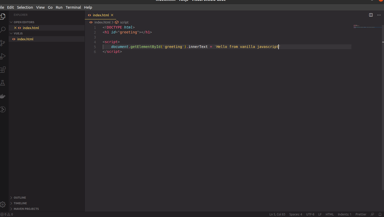

You've likely heard quite a bit about JavaScript frameworks recently. Perhaps you've already worked with Angular, React or some other framework but never really felt quite at home. It's possible that Vue is what you've been looking for. 

And if you've never worked with a JavaScript framework before, Vue is a very approachable one and a great place to start. Vue is known as the progressive JavaScript framework. This description is reflected in the way that you can easily add the core script to any page and then immediately start augmenting your HTML markup with powerful data binding features. 

There's also a thriving ecosystem of development and build tools, plugins, and components for more complex applications, all supported by a vibrant community. 

In this article, we'll cover the basics of data binding and event handling with straightforward examples using a simple HTML form. Then we'll use a third party API to learn about control structures and essential techniques for working with real data in Vue. We'll look at some of the ways that Vue can help us use advanced CSS features like transitions and animations. Finally, we'll take a look at Vue's rich component system for modularizing applications and managing complexity, as well as the fantastic command line tool, Vue CLI, and its recent 3.0 release. There's a lot for us to talk about, so after some brief words about prerequisites, I'll see you in chapter one.

To get the most out of this article, you should be familiar with basic HTML and CSS. 

Vue helps us manage these concerns, but it won't control them completely, and if you're not comfortable manipulating HTML elements and CSS properties, you'll want to become familiar with those things first. You should be comfortable writing JavaScript. Depending on when you started learning JavaScript, you might actually be more familiar with ES6 and later versions of the standard, rather than the ES5-based code that's used in most of this course. As at the time that this course is being recorded, the official Vue.js guide still uses ES5 code for most of its examples. 

I wanted to match that but also support the ever-dwindling group of older browsers still in use that can't run ES6 and later JavaScript code. At the end of chapter four, I'll show you a modern JavaScript development environment with build tools and code that uses ES6 features, but in a way that will still work with browsers that only support ES5. Don't get scared away when I mention the command line, we'll be using it to set up that advanced development environment. You  don't need to be familiar with any particular commands but you should know how to launch some available shell or terminal on your particular operating system. 

Finally, you should have access to some type of code editor or IDE. I'll be using Visual Studio Code in this course, and if you decide to follow along, you can use its Integrated Terminal feature for access to the command line.

Before we start looking at Vue, I wanna talk about one of my primary motivations for using a Javascript framework. In Visual Studio code, I'm gonna create a new file with Control + n, and then save it right away as hello.html, so that I can get the html syntax highlighting right off the bat. And then I'm gonna enable Auto Save from the file menu so I don't have to keep remembering to type Control + s. So now, let's imagine that we're building a simple webpage, and the first thing we wanna do is dynamically set the text of an H1 element. We can skip most of the boilerplate HTML tags, but it's a good practice to at least include the doc type. 

In the past, even as recently as a few years ago, I might have created a level one heading tag like this, and given it an id of greeting. And using this id, it's now easy to access this element with Javascript and set its inner text to anything I want. 

Again, a few years ago, I probably would've used a library called jQuery to do this, but before we even go there, let's look at how we could do it with Javascript code that's already supported in your browser, without having to include any other libraries or frameworks. So here, I'm using the getElementById method of the document object to select a certain element and set its innerText. If I right-click the tab up here, and select Reveal in Explorer, I can then open this in Chrome, and we can see that, it does in fact do a fine job of accessing the inner text property of that element and setting its value. 

But, the really explicit and imperative nature of this code can lead to having to write a lot of it in a real application where dozens or even hundreds of elements need to be updated. 

Let's comment this line out now with Control + slash and look at the jQuery method of doing this. 

Right on the home page of the jsDelivr content delivery network, we can find a url for the jQuery library that we can use in our webpage without having to download any files. Once I have jQuery loaded like this, I can do the same thing as before, but in a slightly less-verbose way. jQuery can definitely save you some keystrokes, especially when it comes to handling events on your page. But here, it still involves having to setup this id in my markup, which creates what can sometimes be a really tight, but fragile coupling between the Javascript code and the html, because you're utterly dependent on certain elements or ids existing in the dom. Sometimes nested in a very specific way. But a good framework will allow me to focus almost exclusively on my data, in this case, the actual text of the greeting, instead of having to always worry about which properties of which dom elements need to be updated. With Vue, we can take advantage of something called reactivity. Here's a simplified version of what we're gonna see in the next video. But imagine we have a template like this where greeting is a Javascript variable name, setting a new value for the variable is all we need to do to update the html, because Vue will actually track changes to this variable and make the dom react to them. I'll always be a fan of libraries like jQuery because they once made my work so much easier. But these days, even for the simplest bits of dynamic behavior, I'm more likely to reach for Vue. So next, let's see what our example page would look like using Vue's reactivity system.