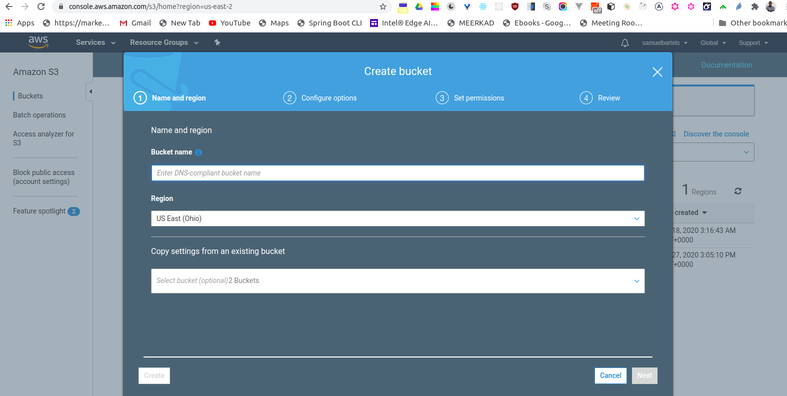

The cloud is perfect for hosting static websites that only include HTML, CSS, and JavaScript files that require no server-side processing. 

In this article, you will deploy a static website to AWS. 

First, you will create a S3 bucket and upload the website files to your bucket. 

Next, you will configure the bucket for website hosting and secure it using IAM policies. 

Next, you will speed up content delivery using AWS’ content distribution network service, CloudFront. Lastly, you will access your website in a browser using the unique CloudFront endpoint.

## Prerequisites:
- AWS Account
- [my-travel-blog starter code](https://drive.google.com/drive/folders/1MVOjWHZS1p3qPdXTBgLL49o1eibCZWvn?usp=sharing)

## Topics Covered:
- S3 bucket creation
- S3 bucket configuration
- Website distribution via CloudFront
- Access website via web browser

## Dependencies

Cloud Services

- Amazon Web Services S3 - Resource hosting and deployments
- AWS CloudFront - CDN for SPA
- AWS EKS - Backend API
- AWS DynamoDB - Persistent Datastore
- AWS Cognito - User Authentication

Performance Tracking and DevOps Tools:
- AWS CloudWatch - Performance and Health checks
- Sentry
    - Alternates:
    - TBD
- Google Analytics - Usage Reporting
    - Alternates:
    - Mixpanel
  - Travis (CI/CD)

Frameworks:
- Ionic (Javascript) (Frontend)
- Node.js (Javascript) (Backend)

## Create S3 Bucket
1. Navigate to the “AWS Management Console” page, type “S3” in the “Find Services” box and then select “S3”.


2. The Amazon S3 dashboard displays. Click “Create bucket”.


3. Enter a “Bucket name” and click “Next”. Note: Bucket names must be globally unique.



4. Click “Next” again to skip over “Step 2: Configure Options”.
5. On “Step 3: Set Permissions”, uncheck “Block all public access”.


6. Click “Next” and click “Create bucket”.
7. Once the bucket is created, click on the name of the bucket to open the bucket to the contents.


## Upload files to S3 Bucket

8. Once the bucket is open to its contents, click the “Upload” button.


9. Click the “Add Files” button and drag and drop files and folders from your local computer to the S3 bucket and select “Upload”. Note: Upload the downloaded my-travel-blog starter code files.


## Secure Bucket via IAM

10. Click on the “Permissions” tab.


11. Click on “Bucket Policy” and enter the bucket policy below replacing “my-travel-blog20” with the name of your bucket and click “Save”.

```
{
  "Version":"2012-10-17",
  "Statement":[
    {
      "Sid":"AddPerm",
      "Effect":"Allow",
      "Principal": "*",
      "Action":["s3:GetObject"],
      "Resource":["arn:aws:s3:::my-travel-blog20/*"]
    }
  ]
}
```


You will see warnings about making your bucket public, but this step is required for static website hosting.


## Configure S3 Bucket

12. Click on the “Properties” tab and then click on “Static website hosting”.


13. Click on “Use this bucket to host a website”.


14. For both “Index document” and “Error document”, enter “index.html” and click “Save”.

## Distribute Website via CloudFront

15. Select “Services” from the top left corner and enter “cloud front” in the “Find a service by name or feature” text box and select “CloudFront”.


16. From the CloudFront dashboard, click “Create Distribution”


17. For “Select a delivery method for your content”, click “Get Started”.


18. Under “Origin Settings”:
      - Under “Origin Domain Name”, select the S3 bucket that you just created.
      -  Under “Origin Path”, enter “/” to indicate the root level.


19. Leave the defaults for the rest of the options, scroll down, and click “Create Distribution”.

***Note***: It may take up to **10 minutes** for the CloudFront Distribution to be created.

20. Once the status of your distribution changes from “In Progress” to “Deployed”, copy the endpoint URL for your CloudFront distribution found in the “Domain Name” column.


In this example, the Domain Name value is d2jrxsg5m3zhq.cloudfront.net, but ***yours will be different***.

21. Open a web browser like Google Chrome and paste the copied endpoint URL and append “/index.html” on the end, as shown below.

